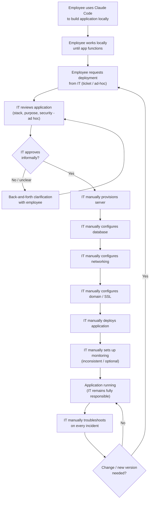
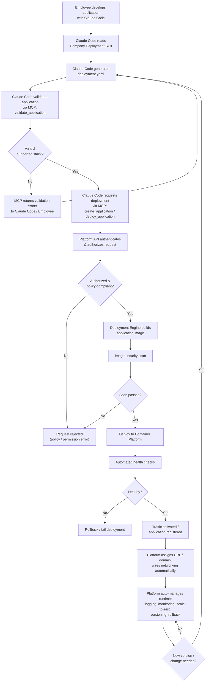

# Business Requirements Document (BRD)
## Company AI Application Deployment Platform

---

## Table of Contents

1. [Document Control](#1-document-control)
2. [Executive Summary](#2-executive-summary)
3. [Background](#3-background)
4. [Problem Statement](#4-problem-statement)
5. [Business Opportunity](#5-business-opportunity)
6. [Business Objectives](#6-business-objectives)
7. [Project Goals](#7-project-goals)
8. [Project Scope](#8-project-scope)
9. [Out of Scope](#9-out-of-scope)
10. [Stakeholders](#10-stakeholders)
11. [User Personas](#11-user-personas)
12. [AS-IS Process](#12-as-is-process)
13. [TO-BE Process](#13-to-be-process)
14. [Business Requirements](#14-business-requirements)
15. [Functional Requirements](#15-functional-requirements)
16. [Non-Functional Requirements](#16-non-functional-requirements)
17. [Business Rules](#17-business-rules)
18. [Security Requirements](#18-security-requirements)
19. [Compliance Requirements](#19-compliance-requirements)
20. [Data Requirements](#20-data-requirements)
21. [Integration Requirements](#21-integration-requirements)
22. [Deployment Requirements](#22-deployment-requirements)
23. [Scale-to-Zero Requirements](#23-scale-to-zero-requirements)
24. [Monitoring Requirements](#24-monitoring-requirements)
25. [Logging Requirements](#25-logging-requirements)
26. [Backup and Recovery Requirements](#26-backup-and-recovery-requirements)
27. [Availability Requirements](#27-availability-requirements)
28. [Disaster Recovery Requirements](#28-disaster-recovery-requirements)
29. [Audit Requirements](#29-audit-requirements)
30. [Permission and RBAC Requirements](#30-permission-and-rbac-requirements)
31. [Resource Quota Requirements](#31-resource-quota-requirements)
32. [Application Lifecycle](#32-application-lifecycle)
33. [Deployment Lifecycle](#33-deployment-lifecycle)
34. [Environment Management](#34-environment-management)
35. [Error Handling](#35-error-handling)
36. [Notification Requirements](#36-notification-requirements)
37. [Reporting Requirements](#37-reporting-requirements)
38. [Administration Requirements](#38-administration-requirements)
39. [Assumptions](#39-assumptions)
40. [Constraints](#40-constraints)
41. [Dependencies](#41-dependencies)
42. [Risks](#42-risks)
43. [Risk Mitigation](#43-risk-mitigation)
44. [Success Metrics / KPIs](#44-success-metrics--kpis)
45. [Acceptance Criteria](#45-acceptance-criteria)
46. [Future Enhancements](#46-future-enhancements)

---

> ### ⚠️ Decision Required
> This document intentionally leaves a number of business decisions **TBD** rather than inventing answers on behalf of the business — including exact SLA/RPO/RTO figures, budget, IdP/SSO vendor, notification channel(s), compliance/regulatory scope, and cold-start latency targets. These items are tracked as formal open decisions in **`17_Decision_Log.md`** (Decision IDs `DEC-001..`) and must be resolved before the corresponding requirements can be finalized for build. Reviewers should treat every "TBD — see Decision Log" marker in this document as an action item, not an omission.

---

## 1. Document Control

| Field | Value |
|---|---|
| Document Title | Business Requirements Document (BRD) — Company AI Application Deployment Platform |
| Document ID | 01_BRD |
| Version | 0.1 (Draft) |
| Date | 2026-08-28 |
| Author | Senior Business Analyst / Solution Architect — *[Name TBD — Document Owner placeholder]* |
| Status | **Draft for Review** |
| Classification | Internal — Confidential |
| Approvers | *TBD — Platform Sponsor, IT Director, Security Administrator, Management/Auditor representative* |
| Distribution | IT Leadership, Platform Administrators, Security Administration, Application Owners/Department Heads, Solution Architecture, Development community representatives, Internal Audit |
| Related Documents | 02_Functional_Requirements.md, 03_Non_Functional_Requirements.md, 04_Business_Rules.md, 06_System_Requirements.md, 07_MCP_Requirements.md, 10_System_Architecture.md, 11_Security_Requirements.md, 12_Data_Requirements.md, 16_Risk_Register.md, 17_Decision_Log.md |
| Revision History | v0.1 — Initial draft for cross-team review |

---

## 2. Executive Summary

The Company AI Application Deployment Platform is a proposed internal, self-service platform that allows employees who use AI coding agents (Claude Code) to build, validate, and deploy **approved internal applications** without requiring manual, one-off intervention from IT for each deployment. Employees already use Claude Code to author small internal tools across varied stacks; today, every one of those tools still has to be deployed, configured, and operated by IT staff, which does not scale.

This platform standardizes deployment around a fixed, IT-governed set of supported technology stacks and a declarative application contract (`deployment.yaml`). Employees interact with the platform indirectly: Claude Code reads a **Company Deployment Skill**, generates the deployment contract, and calls a purpose-built **Company Deployment MCP** exposing only high-level, business-capability operations (e.g., validate, deploy, check status). The MCP calls a **Company Platform API**, which enforces authentication, authorization, policy, and resource governance independently of the AI agent, and drives a **Deployment Engine** that provisions the application on a shared **Container Platform**. Employees and their AI agents never touch Kubernetes, Docker, networking, TLS, DNS, or container security directly — these remain entirely IT-governed and abstracted away.

Key business outcomes targeted by this platform are: (1) drastically reduced IT operational workload per application, (2) fast, predictable, self-service deployment for employees, (3) consistent security, policy, and cost governance across all deployed applications, and (4) infrastructure efficiency through automatic scale-to-zero for idle stateless workloads. This BRD is the master business requirements document for the initiative; detailed functional, non-functional, security, data, and architectural specifications are delegated to sibling documents referenced throughout, so that this document remains the authoritative, board-readable statement of *why* and *what*, while the sibling documents own the detailed *how*.

---

## 3. Background

Employees across the company have begun using AI coding agents (Claude Code) to build small, internal, purpose-specific applications — internal dashboards, approval workflows, reporting tools, data utilities — largely without formal software engineering support. This is a positive trend: it increases employee productivity and reduces backlog pressure on central engineering teams. However, it has occurred organically, with no standardized deployment path.

Today, once an employee has a working application on their local machine, the only way to make it available to others is to ask IT to deploy it. Because each employee (and each AI agent session) may choose a different frontend framework, backend language, database technology, or ad-hoc deployment approach, IT has no consistent process to follow — each request effectively becomes a bespoke infrastructure project: provisioning a server, configuring a database, wiring up networking, obtaining a domain and TLS certificate, and setting up monitoring, by hand, per application.

The number of these "citizen-developed" internal tools is expected to keep growing as AI coding agents make application authorship dramatically easier for non-engineers. Without a structural change to how these applications reach production, IT's operational burden will grow roughly in proportion to the number of applications employees choose to build — a trend that is already visible and is expected to accelerate.

---

## 4. Problem Statement

Employees can already build working applications quickly using Claude Code, but they cannot get those applications into a usable, shared, running state without manual, non-scalable IT effort. Specifically:

- **No standardized deployment path.** Every application may use a different stack, so there is no repeatable deployment procedure.
- **IT is a bottleneck.** Every deployment requires IT staff to manually provision servers, configure databases, networking, domains, TLS, and monitoring — work that does not scale with the number of employee-built applications.
- **Inconsistent security posture.** Ad-hoc, manually configured deployments risk inconsistent application of security controls (network isolation, secret handling, access control, image hygiene) because there is no enforced policy layer.
- **No governance over "shadow" infrastructure.** IT lacks a single system of record for what internal applications exist, who owns them, what they access, and how they were deployed.
- **AI agents have no safe deployment surface.** Claude Code has no sanctioned, safe way to deploy an application on the employee's behalf; if it were given direct infrastructure access (kubectl, Docker socket, SSH), it would become an uncontrolled security boundary, which the business explicitly wants to avoid.
- **Resource inefficiency.** Applications that are deployed today run continuously regardless of actual usage, even though many of these internal tools are used sporadically, wasting compute capacity.

The net effect is that a capability that should reduce organizational workload (AI-assisted app development) is instead shifting a large, growing operational burden onto IT at the deployment and operations stage.

---

## 5. Business Opportunity

By inserting a standardized, policy-enforced, self-service deployment layer between "employee has a working app" and "app is running in production," the company can capture the productivity upside of AI-assisted development without a corresponding increase in IT operational load. Specifically, the platform creates the opportunity to:

- Convert deployment from a **bespoke IT project** into a **standardized, automated, self-service transaction**.
- Let IT shift effort from **manual, repetitive deployment/operations work** to **platform governance, policy design, and capacity planning** — a higher-leverage activity.
- Give the business **a single governed catalog** of internal applications, owners, and their security posture, improving auditability and reducing shadow-IT risk.
- Reduce infrastructure cost through **scale-to-zero** for idle applications, so the company only pays for compute that is actually being used.
- Establish a **reusable pattern** (AI Agent → MCP → Platform API → Controller → Infrastructure) that can extend to future AI-agent-driven operational capabilities beyond deployment, without exposing agents to raw infrastructure.
- Improve **time-to-value** for business units: an approved internal tool can go from "working locally" to "running with a URL, monitored and secured" in a self-service flow instead of a multi-week IT ticket queue.

---

## 6. Business Objectives

The platform is expected to deliver the following business objectives:

| # | Objective |
|---|---|
| 1 | Standardize how internal applications are deployed across the company, regardless of author or team. |
| 2 | Reduce IT operational workload per deployed application to near-zero for routine, approved cases. |
| 3 | Provide employees a self-service path from "working application" to "running, reachable application." |
| 4 | Support and formalize the existing employee practice of using AI coding agents (Claude Code) for application development. |
| 5 | Provide a Company Deployment Skill that teaches Claude Code how to package and request deployment of an application correctly. |
| 6 | Provide a Company Deployment MCP that exposes only safe, high-level, business-capability deployment operations to AI agents. |
| 7 | Enforce a governed, extensible set of supported technology stacks; reject unsupported stacks before deployment. |
| 8 | Enforce security and infrastructure policy centrally, independent of and not trusting the AI agent or the employee's local environment. |
| 9 | Automatically provision the compute, storage, and database resources an approved application needs, with no manual IT provisioning step. |
| 10 | Automatically configure networking (service wiring, reverse proxying, internal routing) without employee or agent involvement. |
| 11 | Automatically assign and configure a reachable URL/domain per application without manual DNS/TLS work by the employee or agent. |
| 12 | Automatically run health checks on every deployment before it is considered live. |
| 13 | Provide built-in logging and monitoring for every deployed application by default, with no separate setup. |
| 14 | Support application versioning, so each deployment is traceable to a specific build/version. |
| 15 | Support rollback to a previously known-good version when a deployment or release proves faulty. |
| 16 | Enforce resource limits and quotas per application/department to prevent runaway consumption and control cost. |
| 17 | Automatically scale stateless application workloads to zero when idle, and back up on demand, to reduce infrastructure cost. |
| 18 | Keep databases and other persistent/stateful infrastructure isolated from the scale-to-zero lifecycle of stateless application containers. |
| 19 | Prevent AI coding agents from directly manipulating infrastructure (no kubectl, Docker socket, host filesystem, or arbitrary resource creation) under any circumstance. |
| 20 | Hide all low-level infrastructure detail (containers, orchestration, networking, TLS, DNS, container security) from employees and from the AI agent, so neither needs infrastructure expertise to ship an approved application. |

---

## 7. Project Goals

1. Deliver a working, IT-governed self-service deployment platform that supports the v1 stack set (React, Next.js, Vue front ends; Go, Node.js, Python back ends; PostgreSQL database; Redis cache).
2. Deliver a Company Deployment Skill + Company Deployment MCP integration that lets Claude Code drive the entire deployment flow using only the 12 approved MCP tools (see Section 21 and 07_MCP_Requirements.md).
3. Ensure the Company Platform API is the single, independent enforcement point for authentication, authorization, and policy — the AI agent is never trusted as a security boundary.
4. Demonstrate materially reduced IT hands-on-keyboard time per deployment versus the AS-IS process (see Section 44 KPIs).
5. Demonstrate working scale-to-zero behavior for representative stateless workloads without disrupting stateful services (databases, caches).
6. Establish the governance model (ownership, RBAC, audit trail, resource quotas) needed for IT and Security to trust the platform enough to reduce manual review over time.
7. Produce a complete requirements and architecture documentation baseline (this BRD plus its sibling documents) sufficient to move into detailed design and build.

---

## 8. Project Scope

**In scope for the platform (v1 and near-term roadmap):**

- Self-service registration and deployment of **approved internal applications** built with the v1 supported stack (Section 15/Module F, and full detail in 02_Functional_Requirements.md).
- A **Company Deployment Skill** consumable by Claude Code that teaches the correct deployment contract and workflow.
- A **Company Deployment MCP** exposing exactly the 12 approved high-level tools (Section 21).
- A **Company Platform API** and **Deployment Engine** that independently validate, authorize, build, deploy, and operate applications.
- Standardized application contract (`deployment.yaml`) describing application-level requirements only.
- Automated provisioning of compute, an isolated database (PostgreSQL) and/or cache (Redis) per application where declared.
- Automated networking, internal routing, and URL/domain assignment for internal-visibility applications.
- Automated health checking, logging, monitoring, and basic metrics per deployed application.
- Application lifecycle management: versioning, rollback, restart, suspend, delete.
- Scale-to-zero for stateless web/API/worker workloads, with configurable idle timeout.
- RBAC, application/department ownership, secret management, resource quotas, network/database isolation, and audit logging for all platform actions.
- Notification of key deployment/lifecycle events to employees and IT (channel(s) TBD — see Decision Log).
- Administration and reporting capability for IT/Platform Administrators and Management/Auditor roles.

**Scope is bounded by the fixed actor list, fixed MCP tool list, fixed FR module list (A–AB), and fixed system module list (MOD‑01..19) defined in the shared project contract; see 02_Functional_Requirements.md, 06_System_Requirements.md, and 07_MCP_Requirements.md for full detail.**

---

## 9. Out of Scope

The following are explicitly **out of scope** for this platform (v1), unless a future decision changes this (see Section 46 and Decision Log):

- Supporting arbitrary/unapproved technology stacks — only the IT-governed supported stack (Section 15/Module F) is deployable; unsupported tech fails validation by design.
- Giving AI coding agents or employees direct access to Kubernetes/K3s, Docker, the Docker socket, host filesystems, arbitrary container exec, arbitrary networking configuration, or arbitrary Kubernetes resource creation, under any circumstance.
- Deploying or hosting **external customer-facing production systems** — this platform is scoped to **internal** applications (visibility model covers internal vs. more restricted; public/external exposure is TBD — see Decision Log).
- Replacing the company's core enterprise applications, ERP, or systems of record.
- General-purpose CI/CD platform functionality for professional engineering teams' large-scale production systems (this platform targets employee-built internal tools, not the company's primary software products).
- Selection/implementation of the specific container orchestration technology as a business requirement — Docker+Compose, K3s+Kubernetes, K3s+Knative, and Managed Container Platform are implementation **options** evaluated by 10_System_Architecture.md, not requirements of this BRD.
- Definitive selection of IdP/SSO vendor, notification channel vendor, exact SLA/RPO/RTO numbers, budget, and applicable compliance/regulatory regime — all marked TBD in this document and tracked in 17_Decision_Log.md.
- Non-application infrastructure (corporate network, end-user devices, email systems, etc.) outside the deployment platform itself.

---

## 10. Stakeholders

| Stakeholder Group | Interest / Stake |
|---|---|
| Employees / Application Developers | Want a fast, simple way to get approved internal apps running without learning infrastructure. |
| AI Coding Agent (Claude Code) users community | Rely on the Deployment Skill/MCP to be accurate, stable, and safe to use autonomously. |
| IT Administration | Bears current deployment/operations burden; primary beneficiary of reduced manual workload. |
| Platform Administration (platform engineering) | Owns and operates the platform itself; responsible for its reliability, extensibility, and roadmap. |
| Application Owners / Department Heads | Accountable for the applications deployed under their department; care about cost, uptime, and compliance of their apps. |
| Security Administration | Owns security policy, secret management standards, and incident response for platform-hosted applications. |
| Management / Auditors | Need visibility, reporting, and assurance that deployments are compliant, governed, and cost-controlled. |
| Executive Sponsor(s) | TBD — see Decision Log. Owns budget approval and strategic prioritization. |
| Internal Audit / Compliance | Needs a complete, immutable audit trail of deployment and access actions. |

---

## 11. User Personas

This section defines the seven target actors used consistently across all project documentation. Each persona is described in terms of Responsibilities, Goals, Permissions, Limitations, Main Workflows, and Risks. Detailed role/permission matrices and RBAC data model are owned by 02_Functional_Requirements.md (Module B/C), 04_Business_Rules.md, and 12_Data_Requirements.md (ENT‑01 User, ENT‑03 Role, ENT‑04 Permission).

### 11.1 Employee / Application Developer

- **Responsibilities:** Build internal applications using Claude Code; ensure the application meets the supported stack and declares accurate requirements; request deployment; respond to validation feedback; maintain the application post-deployment (within permitted actions).
- **Goals:** Get an approved application running quickly, without needing infrastructure expertise; understand deployment status and logs for apps they own.
- **Permissions:** Register applications they own; trigger validation and deployment for owned apps (subject to environment policy); view status, logs, and metrics for owned apps; request rollback/restart for owned apps; manage their own application's declared configuration within `deployment.yaml` limits.
- **Limitations:** Cannot access infrastructure directly (no kubectl/Docker/host access); cannot deploy unsupported stacks; cannot bypass validation or policy; cannot access another employee's application, secrets, or database; production deployment may require approval (see Section 34).
- **Main Workflows:** Develop app locally with Claude Code → Claude Code reads Deployment Skill → generates `deployment.yaml` → validates via MCP → requests deployment via MCP → monitors status/logs/metrics → requests rollback if needed.
- **Risks:** Misdeclared resource/stack requirements; attempting to deploy non-compliant applications; over-reliance on AI agent output without review; accidental exposure of secrets in source code.

### 11.2 AI Coding Agent / Claude Code

- **Responsibilities:** Read and follow the Company Deployment Skill; generate a correct `deployment.yaml`; call only the 12 approved MCP tools on the employee's behalf; surface validation/deployment results and errors back to the employee; never attempt operations outside the sanctioned tool surface.
- **Goals:** Successfully help the employee deploy an approved application with minimal friction and correct-by-construction configuration.
- **Permissions:** Invoke the fixed set of MCP tools (Section 21) using the authenticated employee's identity/context; read platform capability metadata (supported stacks, requirements).
- **Limitations:** No access to kubectl, Docker daemon/socket, host filesystem, arbitrary network configuration, or arbitrary Kubernetes/infra resource creation; cannot act as, or substitute for, a security/policy boundary — the Platform API independently re-validates and re-authorizes every request the agent makes, and never trusts agent-supplied claims about identity or authorization.
- **Main Workflows:** Discover platform capabilities (`get_platform_info`, `get_supported_stacks`, `get_deployment_requirements`) → generate/validate `deployment.yaml` (`validate_application`) → register/create application (`create_application`) → deploy (`deploy_application`) → poll status (`get_deployment_status`, `get_application_status`) → retrieve logs/metrics on request (`get_application_logs`, `get_application_metrics`) → perform lifecycle actions on request (`rollback_application`, `restart_application`, `delete_application`).
- **Risks:** Prompt injection or malicious instructions attempting to induce out-of-contract behavior; hallucinated/incorrect `deployment.yaml`; over-trust of agent output by employees; agent attempting undocumented or deprecated tool calls that must be rejected by the Platform API.

### 11.3 IT Administrator

- **Responsibilities:** Operate and support the platform's day-to-day infrastructure; monitor platform and application health; handle escalations; manage supported-stack catalog changes (with Platform Administrator); support incident response.
- **Goals:** Minimize manual, per-application deployment work; maintain platform stability; ensure applications remain healthy and within policy.
- **Permissions:** View all applications/deployments across departments; access platform-wide logs, metrics, and audit trail; intervene on deployments (restart, rollback, suspend) when necessary; manage infrastructure-level configuration (not exposed to employees/agents).
- **Limitations:** Still bound by platform RBAC and audit logging for their own actions; does not bypass Security Administrator-owned policy without appropriate authorization; not expected to hand-configure individual applications under normal operation (that is the point of the platform).
- **Main Workflows:** Monitor platform dashboards → triage alerts/incidents → review flagged deployments → adjust quotas/policy within mandate → support Application Owners with escalations → contribute to the supported stack roadmap.
- **Risks:** Alert fatigue from a growing application count; escalations reverting the platform to a manual-support model if self-service guardrails are insufficient; privileged access misuse if not tightly audited.

### 11.4 Platform Administrator

- **Responsibilities:** Own the Deployment Platform product itself (Platform API, Deployment Engine, MCP Server, Skill content, Admin Portal); manage supported stack catalog and extensibility; manage global resource tiers/quotas; own platform capacity planning and roadmap.
- **Goals:** Keep the platform reliable, secure, extensible, and aligned with evolving business needs (e.g., adding a new supported stack without redesigning the platform).
- **Permissions:** Full administrative access to platform configuration, stack catalog, resource tiers, global policy defaults, and platform-level monitoring/audit; can manage MCP tool contracts and Skill content versioning.
- **Limitations:** Security policy authorship remains with the Security Administrator; Platform Administrator implements/enforces, and should not unilaterally weaken security controls; all administrative changes are audited.
- **Main Workflows:** Define/extend supported stacks (Module F) → configure resource tiers and quotas (Module M) → manage platform releases → review platform-wide health/capacity dashboards → coordinate with Security Administrator on policy changes → manage MCP/Skill versioning (Modules Y/Z).
- **Risks:** Platform becoming a single point of failure; configuration drift between documented policy and enforced policy; extensibility debt if the stack catalog is not designed for growth.

### 11.5 Application Owner

- **Responsibilities:** Accountable business owner for one or more applications (may or may not be the developer); approves production deployment/changes where required; manages application-level access and department attribution; responsible for the application remaining within policy and quota.
- **Goals:** Ensure their application(s) are reliable, secure, cost-appropriate, and correctly attributed to their department/budget.
- **Permissions:** View and manage ownership, environment permissions, and configuration for owned applications; approve/deny production deployment requests where approval gating applies; view cost/resource consumption for owned applications.
- **Limitations:** Cannot override platform-wide security policy or resource ceilings set by Security/Platform Administration; cannot access other departments' applications.
- **Main Workflows:** Review deployment/approval requests for owned apps → monitor application status, cost, and usage → manage application ownership/department transfers → respond to policy violations or quota breaches concerning owned apps.
- **Risks:** Ownership ambiguity if an application changes teams; approval bottlenecks if Application Owners are unavailable; accountability gaps for "orphaned" applications.

### 11.6 Security Administrator

- **Responsibilities:** Define and maintain platform security policy (authN/authZ rules, network/database isolation rules, secret management standards, image scanning policy, privileged operation prohibitions); review/approve exceptions; lead incident response for security events.
- **Goals:** Guarantee that no application deployed through the platform can violate the core security invariants (Section 18), regardless of what the AI agent or employee attempts.
- **Permissions:** Define/modify security policy enforced by the Platform API and Deployment Engine; access full audit trail; access security-relevant logs/alerts across all applications; can suspend/quarantine an application suspected of violating policy.
- **Limitations:** Operates within compliance/regulatory constraints that are themselves TBD (Section 19); does not perform day-to-day platform operations (that is IT Administrator/Platform Administrator).
- **Main Workflows:** Author/update security policy → review high-risk validation failures or policy violation alerts → investigate audit trail on incidents → approve/deny production deployment where security review is required → periodic policy and access review.
- **Risks:** Policy lag behind new stack additions; false sense of safety if the MCP/agent boundary is not actually enforced server-side; insider risk from over-privileged administrative roles.

### 11.7 Management / Auditor

- **Responsibilities:** Oversee organizational use of the platform from a governance, cost, and compliance perspective; consume reporting on deployment activity, ownership, and incidents.
- **Goals:** Confidence that internal application sprawl is governed, costs are visible, and the audit trail supports compliance and investigation needs.
- **Permissions:** Read-only access to reporting, audit trail, and platform-wide summary dashboards (Modules W/AB); no operational or configuration permissions.
- **Limitations:** Cannot perform deployment, configuration, or lifecycle actions; consumes aggregated/summary and audit data only.
- **Main Workflows:** Review periodic reports (deployment volume, self-service rate, incident summary, cost by department) → query the audit trail for specific investigations → validate compliance posture ahead of audits.
- **Risks:** Reporting gaps if audit/reporting modules lag platform functionality; compliance exposure if the audit trail is incomplete or tamperable.

---

## 12. AS-IS Process

Today, deploying an employee-built application is a linear, manual process that runs entirely through IT staff after the employee has a working local application.

**AS-IS narrative:**
1. Employee uses Claude Code to build an application locally, iterating until it works on their machine.
2. Employee requests deployment from IT (typically via a ticket or ad-hoc request), since they have no self-service path.
3. IT reviews the application (stack, purpose, rough security posture) — often for the first time, with no standardized intake contract.
4. IT manually provisions/configures a server, sets up the database, configures networking, and obtains/attaches a domain and TLS certificate.
5. IT manually deploys the application onto the configured environment.
6. IT manually sets up monitoring (if any) and remains responsible for ongoing troubleshooting.
7. Any change (new version, bug, scaling need) routes back through IT, repeating much of the manual effort.



**Key AS-IS characteristics:** no standardized application contract; no automated policy enforcement; per-application bespoke infrastructure work; IT is on the critical path for every deployment and every subsequent change; security posture depends on the diligence of whichever IT staff member handles the request; no consistent audit trail; no automatic scale-to-zero (idle applications keep consuming resources indefinitely).

---

## 13. TO-BE Process

In the TO-BE state, the employee still uses Claude Code to build the application, but deployment becomes a governed, largely automated, self-service flow mediated by the Company Deployment Skill, Company Deployment MCP, Company Platform API, and Deployment Engine — with IT/Platform/Security Administration setting policy up front rather than executing each deployment by hand.

**TO-BE narrative:**
1. Employee develops the application with Claude Code as before.
2. Claude Code reads the Company Deployment Skill to learn the deployment contract and workflow.
3. Claude Code generates a standardized `deployment.yaml` describing only application-level requirements.
4. Claude Code validates the application via the MCP (`validate_application`), catching unsupported stacks or malformed configuration before any deployment attempt.
5. Claude Code requests deployment via the MCP (`create_application` / `deploy_application`).
6. The Platform API independently authenticates the request, authorizes it against RBAC/ownership/policy, and re-validates — never trusting the agent's claims.
7. The Deployment Engine builds the application, scans the resulting image, and deploys it to the Container Platform.
8. The platform automatically runs health checks before activating traffic.
9. The platform registers the application in the catalog, provisions an internal URL/domain, and wires up networking automatically.
10. The platform takes over ongoing lifecycle management: logging, monitoring, scale-to-zero, versioning, and rollback — without further manual IT involvement for routine operation.



### 13.1 AS-IS vs TO-BE Comparison

| Dimension | AS-IS (Today) | TO-BE (Target Platform) |
|---|---|---|
| Deployment initiation | Manual IT ticket / ad-hoc request | Self-service via Claude Code + MCP |
| Application intake | No standard format; informal review | Standardized `deployment.yaml` contract |
| Stack governance | Uncontrolled — whatever the employee chose | Enforced supported-stack catalog; unsupported stacks fail validation |
| Provisioning (server, DB, network, domain, TLS) | Manual, per-application, by IT | Automated by Deployment Engine / Platform API |
| Security policy enforcement | Ad-hoc, dependent on individual reviewer | Centrally defined and automatically enforced, independent of the AI agent |
| AI agent role | None (agent only used for local dev) | Structured participant via Skill + MCP, restricted to 12 high-level tools |
| Health checking | Inconsistent / manual | Automated, gating traffic activation |
| Monitoring & logging | Optional, inconsistently set up | Built-in by default for every deployment |
| Versioning & rollback | Manual, often absent | Standard platform capability |
| Resource governance | None / informal | Quotas and resource tiers enforced per app/department |
| Idle resource usage | Runs continuously regardless of use | Scale-to-zero for stateless workloads after configurable idle period |
| Database lifecycle | Coupled to server management | Isolated; never auto scale-to-zero with app containers |
| Audit trail | Largely absent | Full deployment/access audit trail (Module W) |
| IT effort per deployment | High, repeated per app and per change | Minimal for routine, approved cases |
| Time to production | Days–weeks (ticket queue dependent) | Minutes–hours (self-service, policy-gated) |

---

## 14. Business Requirements

The following high-level Business Requirements (BR) express *what the business needs*, independent of implementation. Each BR is elaborated into detailed, testable statements with formal `BR-xxx` identifiers in **04_Business_Rules.md**; the numbering and full rule text are owned there. This section states intent only.

- **BR — Self-Service Deployment:** The business requires employees to be able to deploy approved applications without submitting a manual IT request for each one.
- **BR — Stack Governance:** The business requires that only IT-approved technology stacks can be deployed, and that this list can be extended over time without redesigning the platform.
- **BR — AI Agent Safety Boundary:** The business requires that AI coding agents can request deployments but can never directly manipulate infrastructure; all policy/security enforcement happens server-side, independent of the agent.
- **BR — Ownership & Accountability:** The business requires every deployed application to have a traceable owner and department.
- **BR — Security & Isolation:** The business requires strict isolation between applications (network, database, secrets) and prohibits privileged/host-level access from application containers.
- **BR — Cost Efficiency:** The business requires idle stateless workloads to automatically scale to zero, while stateful infrastructure remains stable and available.
- **BR — Operability:** The business requires every deployed application to have logging, monitoring, health checks, versioning, and rollback by default, with no extra setup by the employee.
- **BR — Governance & Audit:** The business requires a complete, tamper-resistant audit trail of deployment and access actions, and reporting sufficient for management/audit oversight.
- **BR — Environment Control:** The business requires differentiated policy between lower environments (e.g., dev, which may auto-deploy) and production (which may require explicit approval).

Full detail, acceptance-level phrasing, and the authoritative `BR-xxx` numbering scheme are in **04_Business_Rules.md**.

---

## 15. Functional Requirements

Functional requirements are organized into 28 modules (A through AB), fully specified with sequential `FR-001..` identifiers in **02_Functional_Requirements.md**. This BRD summarizes the business intent of each module; **full detail in 02_Functional_Requirements.md**.

| Module | Name | Business Intent (Summary) |
|---|---|---|
| A | Authentication | Verify the identity of employees and system actors (including the AI agent acting on their behalf) before any platform action. |
| B | User Management | Maintain employee accounts, roles, and profile/department association. |
| C | Organization/Department | Model departments/business units for ownership, quota, and reporting attribution. |
| D | Application Registration | Allow an approved application to be registered into the platform catalog with a standard contract. |
| E | Application Ownership | Track and manage accountable ownership of each application. |
| F | Stack Management | Maintain the governed, extensible catalog of supported frontend/backend/database/cache technologies. |
| G | Deployment Configuration | Define and validate the structure/content of `deployment.yaml`. |
| H | Deployment Validation | Pre-flight validation of an application against stack, policy, and quota rules before any build/deploy work occurs. |
| I | Build Management | Build application artifacts/images from source in a controlled, repeatable way. |
| J | Deployment Management | Orchestrate the end-to-end deployment lifecycle (Section 33). |
| K | Application Lifecycle | Manage application state transitions (Section 32). |
| L | Scale-to-Zero | Automatically scale stateless workloads down to zero on idle and back up on demand (Section 23). |
| M | Resource Management | Enforce resource tiers and quotas per application/department. |
| N | Database Management | Provision and isolate databases per application, independent of app container lifecycle. |
| O | Secret Management | Securely store and scope secrets/credentials per application; prevent cross-application access. |
| P | Domain Management | Assign and manage reachable URLs/domains per application automatically. |
| Q | Networking | Automatically configure internal routing/network isolation without employee/agent involvement. |
| R | Health Check | Run automated health checks before activating traffic to a new deployment. |
| S | Logging | Provide default, centralized logging for every deployed application. |
| T | Monitoring | Provide default metrics/monitoring for every deployed application. |
| U | Version Management | Track application versions/builds for traceability and rollback. |
| V | Rollback | Support reverting an application to a prior known-good version. |
| W | Audit Log | Record an immutable trail of platform and deployment actions. |
| X | Notification | Notify relevant actors of key lifecycle/deployment events. |
| Y | MCP Integration | Expose the 12 approved high-level tools to AI coding agents via the Company Deployment MCP. |
| Z | Claude Code/AI Agent Integration | Define how Claude Code discovers, authenticates, and uses the Skill + MCP correctly. |
| AA | Administration | Provide administrative capability for IT/Platform/Security Administrators. |
| AB | Reporting | Provide reporting/dashboards for Management/Auditor and administrative roles. |

Cross-reference: functional requirements reference system modules **MOD-01 through MOD-19** (Section 38 and 06_System_Requirements.md) as their implementing components, and the 12 MCP tools (Section 21 and 07_MCP_Requirements.md) as the AI-agent-facing interface for Modules G–L primarily.

---

## 16. Non-Functional Requirements

Non-functional requirements (performance, scalability, reliability, usability, maintainability, security-adjacent quality attributes, portability, extensibility) are fully specified with `NFR-001..` identifiers in **03_Non_Functional_Requirements.md**. This BRD states the business-level categories that must be addressed there:

- **Performance:** Deployment and platform API operations must feel responsive to an employee working interactively through Claude Code (exact latency targets TBD — see Decision Log and 03_Non_Functional_Requirements.md).
- **Scalability:** The platform must support a growing number of applications and departments without redesign, including growth in the supported-stack catalog (Module F extensibility).
- **Reliability/Availability:** The platform control plane and deployed applications have distinct availability expectations (see Section 27); exact SLA figures TBD.
- **Usability:** The primary "user experience" is Claude Code's interaction with the MCP and Skill; error messages and validation feedback must be clear enough for the AI agent to self-correct and for the employee to understand the outcome.
- **Maintainability/Extensibility:** Adding a new supported stack, resource tier, or MCP tool must not require redesigning the platform (aligns with Business Objective 7/Module F).
- **Security (quality-attribute level):** See Section 18 and 11_Security_Requirements.md for full threat-model-level detail; this BRD only states the business requirement that security is non-negotiable and independently enforced.
- **Portability:** Business requirements must not lock the platform to a specific container orchestration technology; infra candidate options (Docker+Compose, K3s+Kubernetes, K3s+Knative, Managed Container Platform) are implementation choices evaluated in 10_System_Architecture.md.
- **Observability:** Logging/monitoring/audit are first-class, default-on qualities, not optional add-ons (Sections 24, 25, 29).

Full quantified targets and testable NFR statements are owned by **03_Non_Functional_Requirements.md**.

---

## 17. Business Rules

Detailed, numbered business rules (`BR-001..`) governing eligibility, validation, ownership, approval gating, quota enforcement, and lifecycle transitions are fully specified in **04_Business_Rules.md**. Representative categories of rules that document will define include:

- Stack eligibility rules (what counts as a "supported" combination; how unsupported tech is rejected — Module F/H).
- Ownership rules (an application must always have exactly one accountable owner/department — Module E).
- Environment/approval rules (which environments auto-deploy vs. require explicit approval — Section 34, Module J).
- Quota and resource tier rules (Module M).
- Scale-to-zero eligibility rules (which workload types are/are not eligible — Section 23, Module L).
- Secret and data isolation rules (Module O/N).
- Lifecycle transition rules (which state transitions are valid — Section 32, Module K).

This BRD references these rules by category/name only; **04_Business_Rules.md** owns the authoritative `BR-xxx` numbering and full rule text.

---

## 18. Security Requirements

Security is a foundational, non-negotiable requirement of this platform, not an add-on. Full threat modeling and control-level detail live in **11_Security_Requirements.md**; this section states the business-level security posture that all downstream documents must satisfy.

**Core security principle:** *Never trust the AI agent as a security boundary.* The Company Deployment MCP exposes only high-level, business-capability tools (Section 21); the Company Platform API independently authenticates, authorizes, and validates every request regardless of what the AI agent claims or attempts.

**Applications deployed through the platform must never be able to:**
- Expose internal databases directly to the network.
- Run as privileged containers.
- Access the host filesystem.
- Access the Docker socket (or equivalent container-runtime control surface).
- Modify platform infrastructure.
- Access another application's secrets or database.
- Store production credentials in source code.
- Bypass platform policy through any path (including the AI agent).

**Business-level security requirement categories** (full detail in 11_Security_Requirements.md):

| Category | Business Requirement |
|---|---|
| Authentication | Every actor (employee, AI agent on the employee's behalf, administrator) must be authenticated before any platform action. |
| Authorization / RBAC | Every action must be authorized against role- and ownership-based permissions (Section 30). |
| Application/Department Ownership | Security scope is bound to declared ownership; cross-ownership access is denied by default. |
| Secret Management | Secrets are stored and scoped per application; never embedded in source or shared across applications. |
| Network Isolation | Applications are network-isolated from one another by default. |
| Database Isolation | Each application's database is isolated from other applications and never directly internet-exposed. |
| Container Security | No privileged containers, no host filesystem access, no Docker socket access. |
| Image Security Scanning | Every built image is scanned before deployment; failures block deployment (Section 33). |
| Audit Logging | Every security-relevant and deployment action is logged immutably (Section 29). |
| Policy Enforcement Point | All policy is enforced server-side in the Platform API / Deployment Controller, never client-side or agent-side. |

Production deployments may require explicit human approval (Application Owner and/or Security Administrator, per policy TBD); dev environments may be configured to auto-deploy (Section 34).

---

## 19. Compliance Requirements

The specific regulatory/compliance regimes applicable to this platform (e.g., data privacy regulations, industry-specific frameworks, internal corporate compliance standards) are **TBD — see Decision Log**, pending confirmation of what categories of data internal applications will process and which jurisdictions apply.

Independent of the specific regime, the platform must satisfy the following generic compliance-supporting capabilities so that whichever framework(s) ultimately apply can be satisfied without platform redesign:

- A complete, immutable audit trail of who did what, when, to which application (Section 29).
- Clear application/data ownership attribution at all times (Module E).
- Ability to demonstrate access control and isolation between applications and departments (Sections 18, 30).
- Ability to demonstrate that unsupported/non-compliant technology cannot be deployed (Module F/H).
- Data residency and cross-border data handling requirements: **TBD — see Decision Log** (dependent on chosen infrastructure hosting location(s), evaluated in 10_System_Architecture.md).
- Retention periods for logs, audit records, and backups: **TBD — see Decision Log**.

---

## 20. Data Requirements

The platform's data model is fully specified as 20 entities (`ENT-01` through `ENT-20`) in **12_Data_Requirements.md**. This BRD summarizes the entities to establish shared vocabulary; **full detail in 12_Data_Requirements.md**.

| ID | Entity | Business Purpose (Summary) |
|---|---|---|
| ENT-01 | User | Employee/administrator identity record. |
| ENT-02 | Department | Organizational unit used for ownership, quota, and reporting. |
| ENT-03 | Role | Named permission bundle (maps to the 7 actor personas and finer-grained roles). |
| ENT-04 | Permission | Individual grantable capability used to build roles. |
| ENT-05 | Application | The registered internal application itself. |
| ENT-06 | ApplicationOwner | Association between an application and its accountable owner(s)/department. |
| ENT-07 | ApplicationVersion | A specific buildable/deployable version of an application. |
| ENT-08 | Deployment | A specific deployment instance/attempt of an application version. |
| ENT-09 | DeploymentHistory | Historical record of deployments for traceability/rollback. |
| ENT-10 | Environment | Dev/staging/production (or equivalent) context an application runs in. |
| ENT-11 | Service | An individual component (frontend/api/worker) within an application. |
| ENT-12 | ResourceProfile | The resource tier/limits assigned to an application or service. |
| ENT-13 | Database | Provisioned database instance associated with an application. |
| ENT-14 | Secret | A securely stored, scoped credential/config value. |
| ENT-15 | Domain | The URL/domain assigned to an application. |
| ENT-16 | AuditLog | Immutable record of platform/security-relevant actions. |
| ENT-17 | DeploymentApproval | Record of an approval decision for a gated deployment. |
| ENT-18 | MCPClient | Registered AI-agent/MCP client identity used for authentication. |
| ENT-19 | APIKey/Credential | Platform API credential associated with a user or MCPClient. |
| ENT-20 | Notification | Record of a notification sent to an actor about a platform event. |

---

## 21. Integration Requirements

The platform must integrate with the following systems/interfaces. Detailed contract-level specification of the MCP tools is owned by **07_MCP_Requirements.md**; architecture-level integration detail is owned by **10_System_Architecture.md**.

**1. Claude Code / AI Coding Agent integration**
The platform must be usable by Claude Code via a Company Deployment Skill (instructional content) and the Company Deployment MCP (tool interface). The AI agent must be able to complete the entire develop → validate → deploy → operate flow using only the sanctioned tool surface below.

**2. Company Deployment MCP — 12 approved tools (fixed list, full contract in 07_MCP_Requirements.md):**

| # | Tool | Purpose |
|---|---|---|
| 1 | `get_platform_info` | Discover platform capabilities/metadata. |
| 2 | `get_supported_stacks` | Discover the governed, extensible supported stack catalog. |
| 3 | `get_deployment_requirements` | Discover what a valid `deployment.yaml` must contain. |
| 4 | `create_application` | Register a new application in the platform catalog. |
| 5 | `validate_application` | Pre-flight validate an application's configuration/stack. |
| 6 | `deploy_application` | Request deployment of a validated application. |
| 7 | `get_application_status` | Check current application status. |
| 8 | `get_deployment_status` | Check status of a specific deployment. |
| 9 | `get_application_logs` | Retrieve application logs. |
| 10 | `get_application_metrics` | Retrieve application metrics. |
| 11 | `rollback_application` | Roll back to a prior known-good version. |
| 12 | `restart_application` | Restart a running application. |
| — | `delete_application` | Remove an application from the platform. |

**3. Company Platform API** — the single backend integration point behind the MCP; owns authentication, authorization, policy enforcement, and orchestration of the Deployment Engine/Container Platform. Full API-level detail in 06_System_Requirements.md / 10_System_Architecture.md.

**4. Container Registry** — the platform must integrate with a container image registry for storing scanned, built application images (registry selection/hosting detail owned by 10_System_Architecture.md).

**5. Identity Provider / SSO** — the platform must integrate with the company's identity provider for employee/administrator authentication. **Specific IdP/SSO vendor: TBD — see Decision Log.**

**6. Notification Channels** — the platform must notify actors of key events (Section 36). **Specific channel(s) (e.g., email, Slack, Microsoft Teams): TBD — see Decision Log.**

**7. Monitoring/Logging backends** — integration with centralized logging/monitoring infrastructure (specific tooling is an implementation decision, evaluated in 10_System_Architecture.md).

---

## 22. Deployment Requirements

- Every deployable application must be described by a standardized `deployment.yaml` describing **application-level requirements only** — never raw Kubernetes/Knative manifests, nginx/reverse-proxy configuration, TLS/DNS configuration, or infrastructure secrets/credentials. Example shape (illustrative, full schema in 02_Functional_Requirements.md Module G):

```yaml
app:
  name: overtime
  owner: HR
services:
  frontend:
    runtime: react
  api:
    runtime: golang
    port: 8080
database:
  type: postgres
scaling:
  min: 0
  max: 3
resources:
  tier: small
domain:
  visibility: internal
```

- Only applications composed entirely of the governed, extensible **supported stack** (Section 15/Module F: React, Next.js, Vue frontends; Go, Node.js, Python backends; PostgreSQL database; Redis cache — v1) may be deployed. Any unsupported technology must fail validation **before** any build or deployment step is attempted (Module H).
- Deployment must follow the fixed **Deployment Lifecycle** (Section 33) with mandatory gates: authentication, authorization, validation, security check, build, image scan, registry push, deployment, health check, traffic activation, monitoring.
- Deployment requests must always flow through the sanctioned path: **AI Agent → MCP → Platform API → Deployment Controller → Infrastructure**. No alternate path that bypasses the Platform API is permitted.
- Every deployment must be versioned and traceable to a specific application version/build (Module U).
- Production deployments may require explicit approval; dev environment deployments may be configured to auto-deploy (Section 34).
- Failed deployments (at any gate) must fail safely, leaving no partially-provisioned, insecure, or orphaned infrastructure, and must produce actionable error feedback to the employee/agent (Section 35).

---

## 23. Scale-to-Zero Requirements

Scale-to-zero is a major business requirement, driven by the cost-efficiency objective (Section 6, Objective 17) of not paying for idle compute for sporadically used internal tools.

- **What must scale to zero:** Stateless web/API/worker application workloads must automatically scale from zero replicas to N replicas in response to incoming traffic, and back down to zero after a **configurable idle period**, with no manual intervention.
- **What must never scale to zero (or auto-scale down uncontrolled):** Databases and other persistent/stateful infrastructure (Module N) must **not** be subject to the same scale-to-zero lifecycle as their associated stateless application containers — a database must remain available independent of whether its application's web/API containers are currently scaled down.
- **Static frontends:** Purely static frontend assets should **not** necessarily be treated as scale-to-zero container workloads at all — they are a different serving concern (e.g., served as static content) and must not be forced through the same idle/cold-start model as stateful compute workloads. Exact serving treatment is an implementation decision (10_System_Architecture.md).
- **Idle timeout configurability:** The idle period after which a stateless workload scales to zero must be configurable (per application/resource tier), not hardcoded. Default value(s) and configuration bounds: **TBD — see Decision Log**.
- **Cold-start behavior:** When a scaled-to-zero application receives new traffic, it must automatically scale back up and serve the request. Exact cold-start latency targets/expectations are **TBD — see Decision Log** and must be defined in 03_Non_Functional_Requirements.md once acceptable user experience thresholds are agreed with business stakeholders.
- **Scaling bounds:** Minimum and maximum replica counts are declared per application via `deployment.yaml` (`scaling.min` / `scaling.max`), enforced against platform-wide/department resource quotas (Module M, Section 31).
- **Implementation independence:** Scale-to-zero is a business requirement, not a lock-in to a specific technology; whether it is realized via K3s, Kubernetes, Knative, or another mechanism is an implementation decision owned by 10_System_Architecture.md.

---

## 24. Monitoring Requirements

- Every deployed application must have basic monitoring/metrics available **by default**, with no separate setup required by the employee or AI agent (Module T).
- Monitoring must cover both the **platform control plane** (Platform API, Deployment Engine, MCP Server availability/health) and **individual applications** (health, resource usage, request metrics).
- Application metrics must be retrievable programmatically by the AI agent via `get_application_metrics`, and by humans via the Administration Portal/reporting surfaces.
- Monitoring must feed alerting for IT Administrator and Security Administrator roles on abnormal conditions (e.g., repeated health-check failures, quota breaches, security policy violations).
- Exact metrics catalog, retention, and alerting thresholds: full detail owned by 03_Non_Functional_Requirements.md and 06_System_Requirements.md (MOD-13 Monitoring).

---

## 25. Logging Requirements

- Every deployed application must have centralized logging available **by default** (Module S), with no separate setup required by the employee or AI agent.
- Logs must be retrievable programmatically by the AI agent via `get_application_logs`, scoped strictly to applications the requesting employee/agent is authorized to view.
- Logging must be separated from the **audit log** (Section 29) — application logs capture runtime application output; the audit log captures platform/security-relevant actions. Both are required, and both must be tamper-resistant.
- Log retention periods: **TBD — see Decision Log** (dependent on compliance regime, Section 19).
- Cross-application log isolation must be enforced — an employee/application must never be able to view another application's logs.

---

## 26. Backup and Recovery Requirements

- Application databases (Module N) provisioned by the platform must be backed up on a regular basis to support recovery from data loss.
- **Recovery Point Objective (RPO) and Recovery Time Objective (RTO): TBD — see Decision Log**, pending business input on acceptable data-loss/downtime windows per resource tier.
- Backup scope, frequency, retention, and restoration procedures are implementation detail owned by 10_System_Architecture.md and 06_System_Requirements.md, once RPO/RTO targets are decided.
- Platform configuration/control-plane state (application registry, ownership, audit trail — Modules B–E, W) must itself be backed up, as loss of this data would be more severe than loss of any single application's data.

---

## 27. Availability Requirements

Availability must be considered at two distinct tiers, which may carry different targets:

| Tier | Description | Target |
|---|---|---|
| Platform Control Plane | Platform API, MCP Server, Deployment Engine, Admin Portal — must be available for employees/agents to develop, validate, and deploy applications, and for IT to operate the platform. | **Exact SLA % TBD — see Decision Log.** Conceptually, this tier should be treated as higher-priority than any individual application, since its unavailability blocks all deployment activity company-wide. |
| Individual Deployed Application | A specific internal application's own uptime, subject to its resource tier, whether it is scaled to zero at a given moment (Section 23), and its own reliability. | **Exact SLA % TBD — see Decision Log**, and may reasonably vary by resource tier/criticality — an internal tool used by one team does not need the same guarantee as a company-wide dependency. |

Availability targets, error budgets, and maintenance-window policy are to be finalized in 03_Non_Functional_Requirements.md once business stakeholders confirm acceptable risk levels (see Decision Log).

---

## 28. Disaster Recovery Requirements

- The platform must define a disaster recovery (DR) strategy covering loss of the control plane (Platform API, Deployment Engine, application registry/catalog) and, separately, loss of underlying compute/hosting capacity.
- **Specific DR strategy, failover approach, secondary-site/region requirements, and DR-specific RTO/RPO: TBD — see Decision Log**, pending the infrastructure hosting decision made in 10_System_Architecture.md.
- At minimum, the platform must be able to reconstruct the application catalog, ownership records, and audit trail from backups (Section 26) in a DR scenario, since this data underpins governance and compliance obligations even before individual applications are restored.
- DR testing cadence and responsibility (Platform Administrator vs. IT Administrator) to be defined once the DR strategy is finalized.

---

## 29. Audit Requirements

- Every platform action with security, deployment, or ownership significance must be recorded in an **immutable audit trail** (Module W, ENT-16 AuditLog), including: authentication events, authorization decisions (grants and denials), application registration/ownership changes, validation results, deployment requests and outcomes, rollback/restart/delete actions, secret access, and administrative/policy changes.
- Audit records must capture: actor (including whether the action was AI-agent-initiated on behalf of an employee), timestamp, action, target application/resource, and outcome.
- The audit trail must be accessible (read-only) to Security Administrator, IT Administrator (scoped as appropriate), Platform Administrator, and Management/Auditor personas, consistent with Section 30 RBAC.
- The audit trail must be tamper-resistant; audit records themselves must not be editable or deletable through normal platform operation.
- Audit log retention period: **TBD — see Decision Log** (dependent on compliance regime, Section 19).

---

## 30. Permission and RBAC Requirements

- The platform must implement Role-Based Access Control (RBAC) mapped to the 7 actor personas (Section 11) and any finer-grained roles needed operationally (ENT-03 Role, ENT-04 Permission).
- Permissions must be scoped by **application ownership** and **department**, not just role — e.g., an Application Owner's permissions apply only to applications owned by them/their department (Module E).
- Every MCP tool call and every Platform API call must be authorized against the authenticated actor's role and ownership scope; authorization is enforced server-side and independently of what the AI agent requests (core principle, Section 18).
- Cross-application and cross-department access must be denied by default; explicit grants are required for any exception, and such grants must be auditable (Section 29).
- Environment-scoped permissions must exist — e.g., an employee may be permitted to auto-deploy to dev but require approval to deploy to production (Section 34).
- Full role/permission matrix is owned by 02_Functional_Requirements.md (Module B) and 04_Business_Rules.md.

---

## 31. Resource Quota Requirements

- The platform must enforce resource quotas at both the **application** level (via `resources.tier` in `deployment.yaml`) and the **department** level, to prevent any single application or team from consuming disproportionate platform capacity (Module M).
- Resource tiers (e.g., small/medium/large — exact tier definitions and limits TBD, owned by 06_System_Requirements.md and 10_System_Architecture.md) must be a governed, IT-managed catalog, analogous to the supported-stack catalog.
- Scaling bounds declared in `deployment.yaml` (`scaling.min` / `scaling.max`) must be validated against the assigned resource tier and department quota before deployment is permitted (Module H).
- Quota breaches must be surfaced to the Application Owner and IT Administrator (Section 36) and must block further resource consumption rather than silently degrading platform stability.
- Quota consumption must be reportable by department for cost attribution and capacity planning (Module AB).

---

## 32. Application Lifecycle

The platform enforces a fixed application lifecycle state model:

```
Draft → Validated → Build → Deploying → Running → Suspended → Failed → Rolled Back → Archived → Deleted
```

| State | Meaning |
|---|---|
| Draft | Application registered but not yet validated. |
| Validated | Passed `validate_application` checks (stack, config, policy). |
| Build | Application image is being built. |
| Deploying | Deployment in progress (see Section 33 for detailed gates). |
| Running | Application is live and healthy. |
| Suspended | Application intentionally paused (e.g., by IT/Owner/Security action), not serving traffic. |
| Failed | Deployment or runtime failure requiring remediation. |
| Rolled Back | Reverted to a prior known-good version after a failure. |
| Archived | Retained for record-keeping but not active/running. |
| Deleted | Removed from the platform. |

**Allowed transitions (business-level; full state machine detail in 02_Functional_Requirements.md Module K):**
- Draft → Validated (on successful validation) or Draft → Failed (on validation failure).
- Validated → Build → Deploying → Running (happy path).
- Deploying → Failed (on any deployment-lifecycle gate failure, Section 33).
- Running → Suspended (administrative/owner/security action) and Suspended → Running (resume).
- Running → Failed (runtime failure/health-check degradation) and Failed → Rolled Back (recovery action) or Failed → Deploying (redeploy attempt).
- Rolled Back → Running (once the rolled-back version is confirmed healthy).
- Running/Suspended/Failed/Rolled Back → Archived (retirement) and Archived → Deleted (final removal).
- Any pre-Running state may terminate to Deleted directly if abandoned.

Note: scale-to-zero (Section 23) is a **runtime traffic-serving behavior within the Running state**, not a lifecycle state transition — a scaled-to-zero application remains logically "Running" from a lifecycle standpoint while its replica count is temporarily zero.

---

## 33. Deployment Lifecycle

Every deployment attempt proceeds through a fixed set of gated stages, with failure/rollback branches possible at any gate:

```
Request → Authentication → Authorization → Validation → Security Check → Build → Image Scan → Registry → Deployment → Health Check → Traffic Activation → Monitoring → Completed
```

| Stage | Business Purpose | Failure Handling |
|---|---|---|
| Request | Employee/agent requests deployment via MCP. | N/A (entry point) |
| Authentication | Confirm the actor's identity (Section 18). | Reject unauthenticated requests. |
| Authorization | Confirm the actor is permitted to deploy this application to this environment (Section 30). | Reject unauthorized requests; audit the denial (Section 29). |
| Validation | Confirm `deployment.yaml` is well-formed and uses only supported stack elements (Module F/H). | Reject with actionable validation errors (Section 35); no build occurs. |
| Security Check | Confirm the request complies with security policy (Section 18). | Reject; escalate to Security Administrator if policy violation is suspicious. |
| Build | Build the application artifact/image. | Fail deployment; surface build errors (Section 35). |
| Image Scan | Scan the built image for vulnerabilities/policy violations. | Block deployment on scan failure. |
| Registry | Push the scanned image to the container registry. | Fail deployment; retry per platform policy. |
| Deployment | Deploy the image to the Container Platform. | Fail deployment; no traffic activation. |
| Health Check | Confirm the new deployment is healthy before serving traffic (Module R). | Trigger automatic rollback (Section 35) if health checks fail. |
| Traffic Activation | Route live traffic to the new deployment. | Rollback if post-activation errors spike (policy-dependent). |
| Monitoring | Ongoing observation of the running deployment. | Feeds alerts (Section 24) and may trigger operator-initiated rollback. |
| Completed | Deployment successfully live and stable. | N/A (terminal success state) |

Failure or rollback can occur at any gate; a failed deployment must never leave the previous known-good version worse off — where a prior version was running, the platform must be able to preserve/restore it (Module V Rollback).

---

## 34. Environment Management

- The platform must support distinct environments (e.g., **development**, **staging**, **production** — exact environment set owned by ENT-10 Environment / 02_Functional_Requirements.md Module G), each with independently configurable deployment policy.
- **Development** environments may be configured to **auto-deploy** on request (subject to standard validation/security checks), enabling fast iteration for employees.
- **Production** deployments may require **explicit approval** (Application Owner and/or Security Administrator, per policy — exact approval matrix TBD, tracked as ENT-17 DeploymentApproval) before the deployment gate proceeds.
- Environment-level policy (auto-deploy vs. approval-gated, resource tier defaults, visibility defaults) is owned and configured by Platform Administrator/IT Administrator, in coordination with Security Administrator.
- Applications must declare their target environment as part of the deployment request; environment context flows through the entire Deployment Lifecycle (Section 33) so that the correct policy gate is applied.

---

## 35. Error Handling

Error handling is addressed at the business level here; full error taxonomy and system behavior are owned by 02_Functional_Requirements.md and 06_System_Requirements.md.

| Error Category | Business-Level Handling |
|---|---|
| Validation errors (unsupported stack, malformed `deployment.yaml`, policy violation) | Rejected before any build/deploy work begins; actionable, specific feedback returned to the AI agent/employee so the agent can self-correct (Module H). |
| Authorization errors | Request denied; no partial action taken; denial is audited (Section 29). |
| Build failures | Deployment halted at the Build gate; error detail returned; no partially-built artifact is deployed. |
| Image scan failures | Deployment blocked; treated as a security event if the failure indicates a policy violation rather than a transient issue (Section 18). |
| Deployment failures (infra-level) | Deployment halted; prior running version (if any) remains unaffected/serving. |
| Health-check failures | Automatic rollback trigger — the platform must not activate traffic to an unhealthy deployment (Module R/V). |
| Runtime failures (post-activation) | Detected via monitoring (Section 24); may trigger alerting, automatic remediation, or manual rollback depending on severity/policy. |
| Quota/resource errors | Request blocked with clear reason; surfaced to Application Owner (Section 31/36). |

**General principle:** every failure mode must fail safely — never leaving orphaned infrastructure, never exposing partially-configured security surfaces, and always preserving the previously known-good state where one exists.

---

## 36. Notification Requirements

- The platform must notify relevant actors of key events, including at minimum: deployment success/failure, validation failure, health-check failure/auto-rollback, quota breach, approval requests/decisions (production gating), and security policy violations.
- Notification recipients depend on event type and RBAC scope — e.g., a deployment failure notifies the requesting employee and Application Owner; a security policy violation additionally notifies Security Administrator.
- **Specific notification channel(s) (email, Slack, Microsoft Teams, or an in-platform notification center): TBD — see Decision Log.**
- Notifications must be tracked as records (ENT-20 Notification) for traceability, distinct from the audit log (Section 29), though both may reference the same underlying event.
- Full notification rules/templates are owned by 02_Functional_Requirements.md Module X.

---

## 37. Reporting Requirements

- The platform must provide reporting for Management/Auditor, Platform Administrator, IT Administrator, and Application Owner personas, at a level appropriate to each role's RBAC scope.
- Minimum reporting capability should include: deployment volume over time, self-service vs. IT-assisted deployment rate, deployment failure/success rate, resource/cost consumption by department, application inventory with ownership, and audit trail query/export.
- Reporting must directly support the KPIs defined in Section 44, so platform success can be measured against this BRD's stated objectives.
- Full reporting specification (Module AB) is owned by 02_Functional_Requirements.md; report data sourcing is owned by 12_Data_Requirements.md.

---

## 38. Administration Requirements

- The platform must provide an Administration capability (Module AA, implemented by MOD-18 Administration Portal per 06_System_Requirements.md) for Platform Administrator and IT Administrator personas to manage: supported stack catalog (Module F), resource tiers/quotas (Module M), environment policy (Section 34), user/role management (Module B), and platform-wide monitoring/health (Section 24).
- Security Administrator requires administrative capability specifically over security policy configuration (Section 18), independent of general platform administration, reflecting the separation of duties between "operating the platform" and "defining its security policy."
- All administrative actions must be authenticated, authorized, and audited to the same standard as any other platform action (Sections 18, 29, 30).
- The 19 system modules (MOD-01 through MOD-19) that implement these administrative and platform capabilities are enumerated in 06_System_Requirements.md; this BRD does not restate their technical detail.

---

## 39. Assumptions

- Employees will continue to use Claude Code (or a successor AI coding agent with equivalent MCP support) as their primary application development tool.
- The set of employee-built internal applications will continue to grow, making the current manual IT deployment model increasingly untenable if unaddressed.
- IT, Platform Administration, and Security Administration will collaborate to define and maintain the governed supported-stack catalog rather than allowing unrestricted technology choice.
- The company has, or will establish, an identity provider suitable for platform authentication (specific vendor TBD — see Decision Log).
- Business units are willing to formally designate Application Owners for internally built tools.
- Sufficient underlying compute/hosting capacity (or budget to acquire it) will be made available to the platform (exact capacity/budget TBD — see Decision Log).
- The infrastructure implementation approach (Section 8/9; Docker+Compose, K3s+Kubernetes, K3s+Knative, or Managed Container Platform) will be selected via 10_System_Architecture.md without altering the business requirements in this document.

---

## 40. Constraints

- The platform must never expose low-level infrastructure operations (kubectl, Docker daemon/socket, host filesystem, arbitrary container exec, arbitrary network configuration, arbitrary Kubernetes/infra resource creation) to the AI agent or the employee, under any circumstance (hard constraint, Section 18).
- The AI agent must only be able to act through the fixed 12-tool MCP surface (Section 21); the tool list is fixed by the shared project contract and any change must go through formal scope management, not ad-hoc extension.
- The supported technology stack is fixed at v1 scope (React, Next.js, Vue / Go, Node.js, Python / PostgreSQL / Redis) and must be extended only through the governed Module F process, not by employee/agent request.
- The platform must not require employees or AI agents to understand or configure Docker, Kubernetes, K3s, Knative, Nginx/reverse proxying, networking, TLS, DNS, or container security — these must remain fully abstracted (core project constraint).
- The `deployment.yaml` contract must describe application-level requirements only — it must never contain raw Kubernetes/Knative manifests, reverse-proxy configuration, TLS/DNS configuration, or infrastructure secrets/credentials (Section 22).
- Documentation numbering/ownership constraints: this BRD must reference, not redefine, `FR-xxx` (02_Functional_Requirements.md), `NFR-xxx` (03_Non_Functional_Requirements.md), `BR-xxx` (04_Business_Rules.md), `MOD-01..19` (06_System_Requirements.md), `ENT-01..20` (12_Data_Requirements.md), `RISK-xxx` (16_Risk_Register.md), and `DEC-xxx` (17_Decision_Log.md) identifiers.

---

## 41. Dependencies

| Dependency | Nature |
|---|---|
| Claude Code / AI coding agent platform capability (MCP client support) | Required for the AI-agent-driven workflow this platform is built around. |
| Identity Provider / SSO system | Required for Module A Authentication; vendor TBD — see Decision Log. |
| Container registry | Required for Module I Build Management and the Registry gate of the Deployment Lifecycle. |
| Underlying compute/hosting infrastructure | Required for the Container Platform layer; specific option selected in 10_System_Architecture.md. |
| Notification channel/vendor | Required for Module X; TBD — see Decision Log. |
| Organizational department/ownership data | Required for Module C/E; assumes an authoritative source of department information exists or will be established. |
| Security policy sign-off from Security Administration | Required before production launch (Section 18/34). |
| Sibling requirement documents (02, 03, 04, 06, 07, 10, 11, 12, 16, 17) | This BRD depends on, and must remain consistent with, all sibling documents in the shared documentation baseline. |

---

## 42. Risks

The following are top-level business risks; the full risk register with formal `RISK-001..` identifiers, likelihood/impact scoring, and detailed mitigation ownership is maintained in **16_Risk_Register.md**.

- **Adoption risk:** Employees or IT continue to bypass the platform (shadow deployment) if the self-service path is not materially faster/easier than the AS-IS manual request.
- **Security boundary risk:** If the MCP/Platform API boundary is not rigorously enforced server-side, a compromised or manipulated AI agent session could attempt to escalate beyond intended capability.
- **Stack governance risk:** Pressure to support "just one more" unsupported technology could erode the governed stack catalog over time, undermining the standardization objective.
- **Resource/cost risk:** Without effective scale-to-zero and quota enforcement, infrastructure costs could grow unchecked as application count increases.
- **Governance/ownership risk:** Applications without a clearly maintained owner become orphaned, creating security and accountability gaps.
- **Compliance risk:** Undefined compliance regime (Section 19) could result in a platform design that later requires rework to meet regulatory requirements.
- **Single point of failure risk:** The Platform API/Deployment Engine becoming a control-plane single point of failure for all deployment activity company-wide.
- **Scope-creep risk:** Expanding the fixed 12-tool MCP surface or the actor/module contract ad hoc, breaking consistency with sibling documents and the underlying security model.

---

## 43. Risk Mitigation

Top-level mitigation directions (full mitigation plans owned by 16_Risk_Register.md):

- Invest in making the self-service path demonstrably faster and lower-friction than any manual alternative, to drive organic adoption away from shadow deployment.
- Enforce all authentication/authorization/validation/policy checks server-side in the Platform API, independent of and never trusting the AI agent, with the boundary itself covered by 11_Security_Requirements.md and periodic security review.
- Route all stack-catalog change requests through the formal Module F governance process owned jointly by Platform Administrator and Security Administrator, rather than allowing informal exceptions.
- Enforce resource quotas (Section 31) and scale-to-zero (Section 23) as default-on, not opt-in, behavior.
- Require every application to have an assigned owner/department as a precondition of moving out of Draft state (Module E/K); periodically report orphaned or stale applications (Module AB).
- Track compliance regime determination as a formal open decision (Decision Log) and design audit/data-handling capability generically enough to adapt once the regime is confirmed (Section 19).
- Design the Platform API/Deployment Engine for high availability as a control-plane priority (Section 27), with DR planning tracked in Section 28.
- Treat the fixed actor list, MCP tool list, module list, and entity list in the shared project contract as change-controlled; any proposed change must be reflected consistently across this BRD and all sibling documents.

---

## 44. Success Metrics / KPIs

| KPI | Description |
|---|---|
| IT deployment tickets/month | Volume of manual deployment requests reaching IT; expected to decline sharply post-launch. |
| Average deployment time | Elapsed time from deployment request to application "Running" and healthy. |
| % self-service deployments | Share of deployments completed with no manual IT intervention. |
| Deployment failure rate | Share of deployment attempts that fail at any gate (Section 33). |
| MTTR (Mean Time to Recovery) | Average time to restore a failed/degraded application to healthy state (including rollback). |
| # supported applications | Total count of applications actively running on the platform, tracked over time. |
| IT hours per application | Average IT operational effort per application, pre- vs. post-platform. |
| % deployments without IT intervention | Complement/companion metric to self-service rate, tracked at the deployment-event level. |
| Security policy violation rate | Frequency of attempted or actual security policy violations detected (Section 18/29). |
| Platform availability | Measured uptime of the platform control plane against its target (Section 27; exact target TBD). |

Exact numeric targets/baselines for each KPI: **TBD — see Decision Log**, to be set once a pre-platform baseline is measured against the AS-IS process.

---

## 45. Acceptance Criteria

The platform will be considered to meet this BRD's business requirements when the following platform-level acceptance criteria can be demonstrated:

1. An employee can register an approved application without requiring IT to manually intervene.
2. Claude Code can discover platform capabilities (supported stacks, deployment requirements) via the MCP without prior out-of-band knowledge.
3. Claude Code can validate an application via the MCP and receive accurate, actionable pass/fail feedback.
4. An application using an unsupported stack is rejected at validation, before any build/deploy work occurs.
5. An unauthorized deployment request (e.g., wrong owner, insufficient permission, disallowed environment) is rejected by the Platform API, independent of what the AI agent requested.
6. An approved application can be deployed end-to-end via the MCP, reaching a healthy "Running" state.
7. A deployed internal-visibility application automatically receives a working URL, with no manual DNS/TLS/networking steps by the employee or agent.
8. Health checks run automatically before any new deployment's traffic is activated.
9. A stateless application scales from zero to N replicas on incoming traffic and back to zero after its configured idle period, without manual intervention, while its database (if any) remains available throughout.
10. An employee/application cannot access another application's secrets or database, verified by attempted cross-application access being denied.
11. IT/Platform Administrators can view an application's deployment history and perform a rollback to a prior version.
12. All platform actions covered by Section 29 (Audit Requirements) are recorded in the audit trail and retrievable for review.

---

## 46. Future Enhancements

The following are candidate future enhancements, out of scope for v1 (Section 9) but worth tracking for roadmap purposes:

- Expansion of the supported stack catalog (additional languages/frameworks/databases) via the governed Module F process.
- Support for external/customer-facing application visibility tiers, beyond internal-only (would require significant additional security/compliance review).
- Cost-attribution and chargeback reporting by department, building on Section 37 reporting.
- Expanded AI-agent-driven operational capabilities beyond deployment (e.g., AI-assisted incident triage), following the same MCP-mediated, non-trusted-agent architectural pattern established here.
- Multi-region/DR-hardened control plane, once Section 28 DR strategy is finalized.
- Self-service resource tier / quota requests with automated approval workflows.
- Formal SLA tiers per application criticality, once Section 27 targets are finalized.
- Marketplace/catalog of reusable internal application templates built on the supported stack.

---

*End of Business Requirements Document. This document is a living artifact; all "TBD — see Decision Log" items must be resolved in 17_Decision_Log.md prior to final baseline sign-off.*
