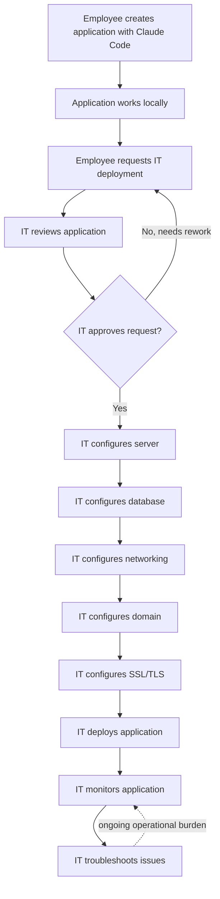
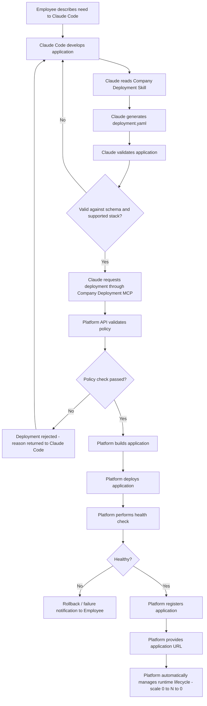
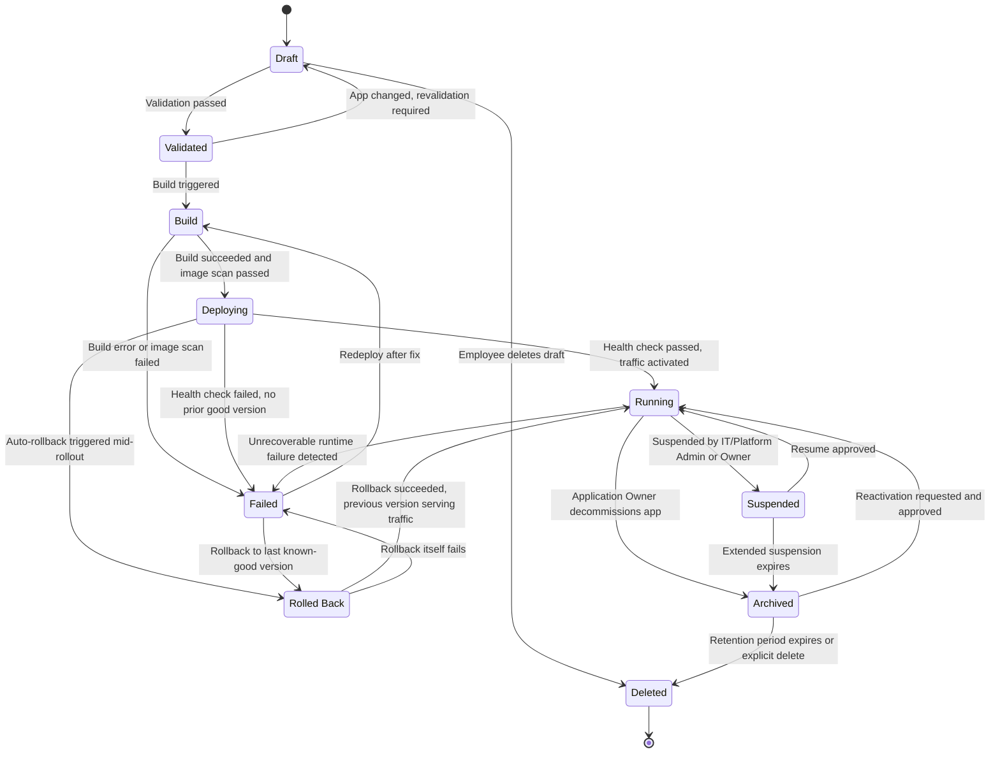
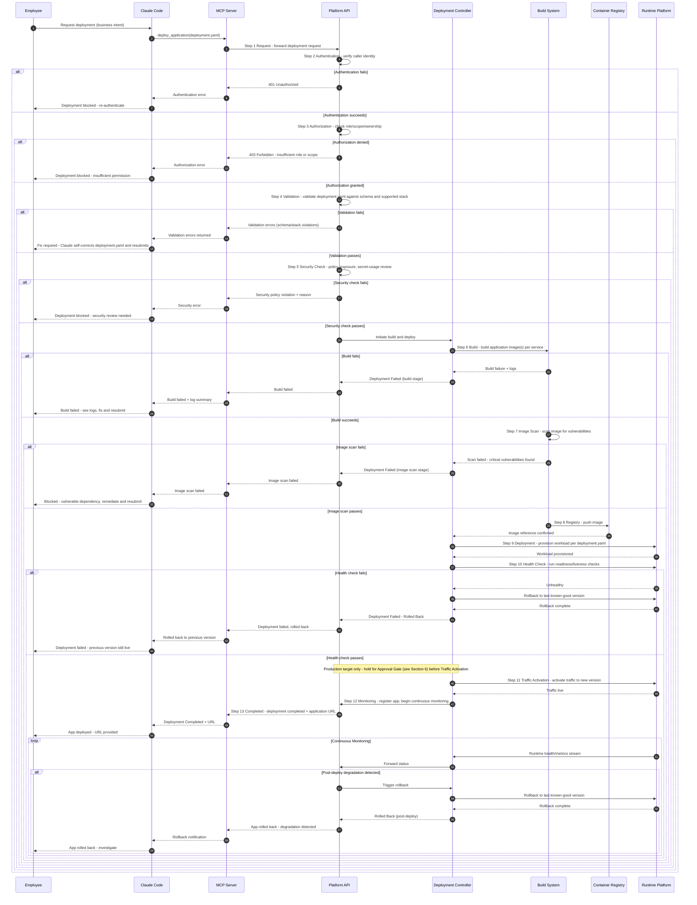
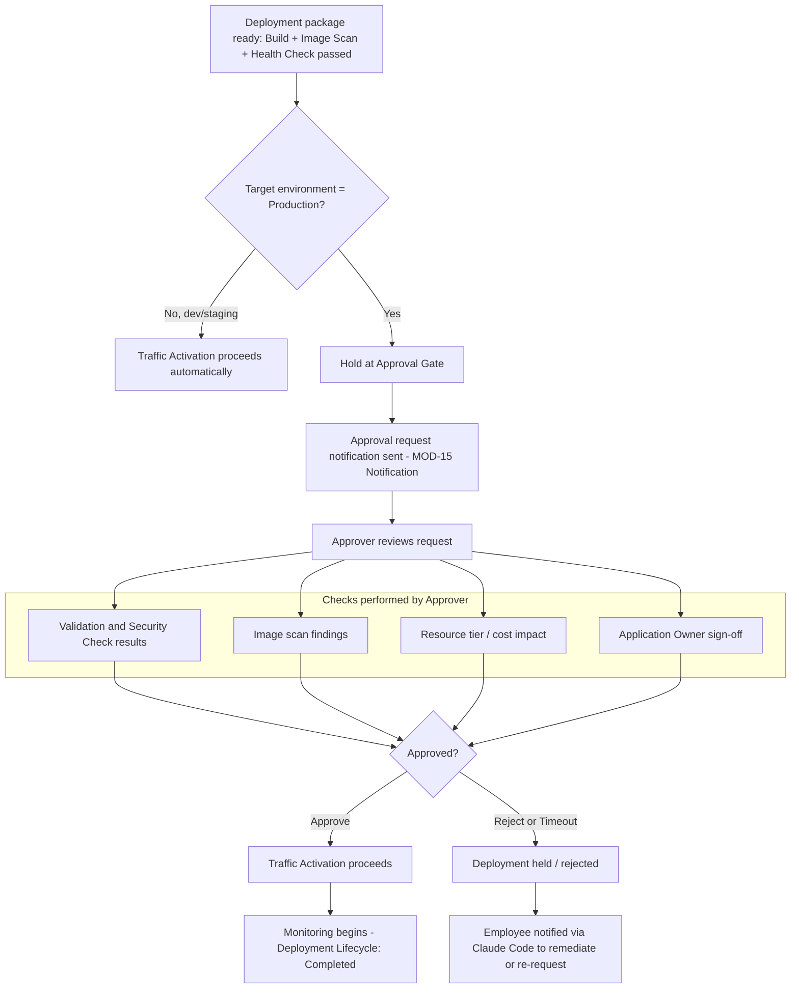

# 05 — Process Flows

## Document Control

| Field | Value |
|---|---|
| Document | 05_Process_Flows.md |
| Project | Company AI Application Deployment Platform |
| Owner | Solution Architecture |
| Status | Draft |
| Date | 2026-08-28 |
| Related Documents | 01_BRD.md, 02_Functional_Requirements.md, 03_Non_Functional_Requirements.md, 06_System_Requirements.md, 08_Company_Deployment_Skill.md, 10_System_Architecture.md, 17_Decision_Log.md |

## Purpose

This document is the authoritative source for the platform's process flows: the current manual deployment process (AS-IS), the target self-service process (TO-BE), the Application Lifecycle state machine, the Deployment Lifecycle sequence (including failure/rollback branches), and the production Approval Gate. Functional behavior referenced here (module names, tool names) is specified in detail by 02_Functional_Requirements.md, 06_System_Requirements.md, and 07_MCP_Requirements.md; this document focuses on **flow and sequence**, not module internals.

---

## 1. AS-IS Process (Current — Manual IT-Led Deployment)

### 1.1 Flow Diagram

### 1.2 Step Table

| Step | Actor | Action | System Response |
|---|---|---|---|
| 1 | Employee / Application Developer | Creates application using Claude Code | No platform involvement; purely local development |
| 2 | Employee / Application Developer | Confirms application works locally | No standardized validation; correctness is self-assessed |
| 3 | Employee / Application Developer | Requests IT deployment (ticket/email/chat) | Request enters IT's manual queue; no SLA guarantee |
| 4 | IT Administrator | Reviews the application (stack, security, fit) | Ad-hoc review; criteria not standardized across requests |
| 5 | IT Administrator | Configures a server for the application | Manual provisioning; time and skill dependent |
| 6 | IT Administrator | Configures the database | Manual DB creation, credentials, and access setup |
| 7 | IT Administrator | Configures networking | Manual network/firewall/routing rules |
| 8 | IT Administrator | Configures domain | Manual DNS record creation |
| 9 | IT Administrator | Configures SSL/TLS | Manual certificate issuance and binding |
| 10 | IT Administrator | Deploys the application | Manual deployment execution; no standardized pipeline |
| 11 | IT Administrator | Monitors the application | Manual/ad-hoc monitoring; no guaranteed observability baseline |
| 12 | IT Administrator | Troubleshoots issues as they arise | Reactive, manual remediation; ties up IT capacity indefinitely |

### 1.3 Key Characteristics

- Every step from server through SSL is performed manually by IT for every application.
- No standardized deployment contract — each app is a bespoke effort.
- IT capacity scales linearly (or worse) with the number of applications and requests.
- No enforced technology stack boundary — unsupported technologies are only caught (if at all) during IT's manual review.

---

## 2. TO-BE Process (Target — Self-Service Platform-Led Deployment)

### 2.1 Flow Diagram

### 2.2 Step Table

| Step | Actor | Action | System Response |
|---|---|---|---|
| 1 | Employee / Application Developer | Describes the business need to Claude Code | Claude Code begins development session |
| 2 | AI Coding Agent / Claude Code | Develops the application | Application source produced/updated locally |
| 3 | AI Coding Agent / Claude Code | Reads the Company Deployment Skill (see 08_Company_Deployment_Skill.md) | Claude learns supported stack, contract format, and deployment rules |
| 4 | AI Coding Agent / Claude Code | Generates `deployment.yaml` describing app-level intent only | Standardized deployment contract produced (no infra manifests) |
| 5 | AI Coding Agent / Claude Code | Validates the application and contract locally before submission | Claude self-corrects obvious issues before calling the platform |
| 6 | AI Coding Agent / Claude Code | Requests deployment through the Company Deployment MCP | MOD-16 (MCP Server) authenticates the session and forwards the request |
| 7 | Platform (MOD-17 Platform API / MOD-04 Validation Engine) | Validates policy (schema, supported stack, security posture) | Pass/fail decision with actionable errors if failed |
| 8 | Platform (MOD-05 Build Engine) | Builds the application (per service, per declared runtime) | Container image(s) produced and scanned |
| 9 | Platform (MOD-06 Deployment Controller) | Deploys the application to the Container Platform | Workload provisioned per `resources`/`scaling`/`domain` sections |
| 10 | Platform (MOD-11 Health Check Manager) | Performs health check before activating traffic | Healthy → proceed; Unhealthy → rollback/failure path |
| 11 | Platform (MOD-02 Application Registry) | Registers the application (metadata, version, owner) | Application becomes discoverable in MOD-19 Application Catalog |
| 12 | Platform (MOD-10 Domain Manager) | Provides the application URL | URL returned to Claude Code and surfaced to the Employee |
| 13 | Platform (MOD-07 Resource Manager / Runtime) | Automatically manages runtime lifecycle | Stateless workloads scale 0→N→0 based on traffic (see Scale-to-Zero requirements) |

### 2.3 Key Characteristics

- Employee never interacts with infrastructure; Claude Code and the platform absorb all infra concerns.
- Every deployment goes through the same standardized contract (`deployment.yaml`) and the same policy/validation gates.
- IT involvement shifts from per-deployment manual execution to platform governance (policy definition, quota management, exception handling).
- Production deployments still carry a firm human Approval Gate (see Section 6); development may auto-deploy.

---

## 3. AS-IS vs TO-BE Comparison

| Dimension | AS-IS (Manual) | TO-BE (Self-Service Platform) | Benefit |
|---|---|---|---|
| Deployment lead time | Days to weeks; bound by IT ticket queue and manual configuration of server, database, networking, domain, SSL | Minutes; automated build → deploy → health check → URL, gated only by validation and (for prod) approval | Drastic reduction in time-to-running-application |
| IT involvement | IT performs every step for every application (server, DB, network, domain, SSL, deploy, monitor, troubleshoot) | IT defines policy, quotas, supported stack, and handles exceptions/escalations only; platform executes routine deployments | IT capacity decoupled from application volume |
| Consistency / standardization | Ad-hoc, per-application configuration; no common contract; drift between environments likely | Every application flows through one standardized `deployment.yaml` contract, validated against one supported-stack policy | Uniform, auditable, reproducible deployments |
| Security posture | Security depends on individual IT engineer diligence per request; inconsistent review depth | Policy, authorization, image scanning, and audit are enforced systematically and independently of the requester (AI agent is never a trust boundary) | Consistent, non-bypassable security enforcement |
| Employee autonomy | Employee is blocked on IT for every deployment; cannot self-serve | Employee (via Claude Code) can develop and deploy independently within approved policy; prod still requires approval | Faster iteration, less cross-team dependency |
| Scalability of the process itself | Linear/superlinear cost growth — more applications directly means more manual IT work | Sub-linear cost growth — platform automation absorbs volume; IT effort grows with policy/exception complexity, not app count | Process scales with the business, not with headcount |

---

## 4. Application Lifecycle

Fixed states: `Draft → Validated → Build → Deploying → Running → Suspended → Failed → Rolled Back → Archived → Deleted`

### 4.1 State Diagram

### 4.2 Transition Table

| From → To | Trigger | Guard / Precondition | Actor |
|---|---|---|---|
| Draft → Validated | Validation passed | `deployment.yaml` schema-valid; stack in supported list | AI Coding Agent / Claude Code (via MOD-04 Validation Engine) |
| Draft → Deleted | Employee deletes draft | No active deployment attempt exists | Employee / Application Developer |
| Validated → Draft | Application or contract changed after validation | Source or `deployment.yaml` modified post-validation | AI Coding Agent / Claude Code |
| Validated → Build | Build triggered | Policy check passed (MOD-04 / MOD-03) | Platform (Deployment Manager) |
| Build → Deploying | Build succeeded, image scan clean | No critical vulnerabilities found | Platform (Build Engine) |
| Build → Failed | Build error, or image scan finds critical issues | — | Platform (Build Engine) |
| Deploying → Running | Health check passed | Readiness probe healthy; traffic activated (and, for production, Approval Gate passed — see Section 6) | Platform (Health Check Manager / Deployment Controller) |
| Deploying → Failed | Health check failed, no rollback target exists (e.g., first-ever deployment) | — | Platform (Health Check Manager) |
| Deploying → Rolled Back | Auto-rollback triggered mid-rollout | Prior healthy version exists | Platform (Deployment Controller) |
| Running → Suspended | Suspension requested | Policy violation, cost/quota breach, or manual suspend | IT Administrator / Platform Administrator |
| Running → Failed | Unrecoverable runtime failure | Crash loop or sustained health failure | Platform (Health Check Manager) |
| Running → Archived | Decommission requested | Owner confirms application no longer needed | Application Owner |
| Suspended → Running | Resume approved | Suspension cause resolved | IT Administrator / Application Owner |
| Suspended → Archived | Extended suspension | Suspension duration exceeds retention threshold — **TBD**: exact threshold needs a business decision | Platform (automated policy job) |
| Failed → Build | Redeploy after fix | Employee/Claude submits corrected application | Employee via Claude Code |
| Failed → Rolled Back | Manual or automatic rollback | Last known-good version available | Platform (Deployment Manager) |
| Rolled Back → Running | Rollback succeeded | Previous version healthy and serving traffic | Platform (Deployment Controller) |
| Rolled Back → Failed | Rollback itself fails | No further healthy version available | Platform (Deployment Controller) |
| Archived → Running | Reactivation requested and approved | Approval per reactivation policy — **TBD**: exact reactivation approval workflow needs definition | Application Owner + IT Administrator |
| Archived → Deleted | Retention period expires or explicit delete confirmed | Data retention policy satisfied | Platform Administrator / automated retention job |

Note: `Suspended` here refers to an administrative/lifecycle state (policy, cost, or manual suspension), distinct from the transparent scale-to-zero runtime behavior (0→N→0 instance count) that stateless workloads undergo while still `Running`. Scale-to-zero does not change Application Lifecycle state.

---

## 5. Deployment Lifecycle

Fixed steps: `Request → Authentication → Authorization → Validation → Security Check → Build → Image Scan → Registry → Deployment → Health Check → Traffic Activation → Monitoring → Completed` (+ Failure/Rollback branches at any gate).

### 5.1 Sequence Diagram

### 5.2 Failure and Rollback Summary

| Gate | Failure Trigger | Immediate System Response | Recovery Path |
|---|---|---|---|
| Authentication | Invalid/expired credential or session | Request rejected (401), no downstream calls made | Employee/Claude Code re-authenticates and resubmits |
| Authorization | Caller lacks required role/scope/ownership | Request rejected (403), no downstream calls made | Employee requests access via IT Administrator / Platform Administrator |
| Validation | `deployment.yaml` fails schema or unsupported stack used | Request rejected with structured errors | Claude Code self-corrects `deployment.yaml` and resubmits |
| Security Check | Policy violation (e.g., disallowed exposure, secret misuse) | Request rejected with reason | Employee/Claude Code adjusts configuration; may require Security Administrator review |
| Build | Compilation/build error | Build marked Failed, logs captured | Employee/Claude Code fixes source and resubmits (Application Lifecycle: Failed → Build) |
| Image Scan | Critical vulnerability found in image | Image blocked from Registry push | Dependency remediation required before resubmission |
| Health Check (initial) | Readiness/liveness probe fails post-deploy | No traffic activated; auto-rollback to last known-good version if one exists, else Failed | Investigate and redeploy; Application Lifecycle: Deploying → Rolled Back or → Failed |
| Health Check (post-deploy, ongoing Monitoring) | Runtime degradation detected after traffic activation | Automatic rollback to last known-good version; Employee/App Owner notified | Application Lifecycle: Running → Rolled Back → Running (on successful rollback) |
| Approval Gate (production only) | Approver rejects or approval times out | Traffic Activation withheld | Employee notified to remediate or re-request approval (see Section 6) |

---

## 6. Approval Gate (Production Deployments)

Production deployments require an explicit human approval decision before production traffic is activated. This gate is a **firm requirement**; the exact approver role and approval tooling are **TBD** (see callout below). Development environments may proceed automatically per policy (no gate).

### 6.1 Gate Flow

### 6.2 Step Table

| Step | Actor | Action | System Response |
|---|---|---|---|
| 1 | Platform (Deployment Manager) | Detects target environment = Production after Health Check passes | Deployment held prior to Traffic Activation |
| 2 | Platform (Notification) | Sends approval request to the Approver | Approver is notified with a link/reference to the deployment package |
| 3 | Approver (role TBD) | Reviews validation, security check, image scan, cost/tier, and owner sign-off | Approver renders a decision |
| 4a | Approver | Approves | Traffic Activation proceeds; Deployment Lifecycle continues to Monitoring → Completed |
| 4b | Approver / Platform | Rejects, or approval window times out | Deployment held/rejected; Employee notified via Claude Code to remediate or re-request |

### 6.3 What Is Checked at the Gate

- Validation and Security Check results (already-passed gates, re-surfaced for human confirmation)
- Image scan findings (no unresolved criticals, informational summary of lower-severity findings)
- Resource tier and cost impact of the requested `resources`/`scaling` configuration
- Application Owner sign-off (confirms business intent to go live)

### 6.4 Decision Required (TBD)

- **TBD:** Exact approver role(s) for production approval — candidates include Application Owner, IT Administrator, Platform Administrator, or Security Administrator (possibly role depends on `domain.visibility` — internal vs external). Needs a business decision.
- **TBD:** Approval tooling/mechanism — options include an Administration Portal (MOD-18) approve/reject action, ticketing-system integration, or an in-chat approval surfaced back through Claude Code. Needs a business decision.
- **TBD:** Approval timeout duration and default behavior on timeout (auto-reject vs. escalate). Needs a business decision.

These items are tracked for resolution in 17_Decision_Log.md. The firm requirement — that production traffic activation cannot proceed without an explicit, recorded approval decision — is not itself TBD.
