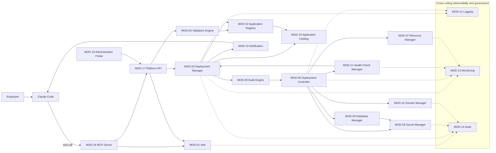

# 06 — System Requirements

## Document Control

| Field | Value |
|---|---|
| Document | 06_System_Requirements.md |
| Project | Company AI Application Deployment Platform |
| Owner | Solution Architecture |
| Status | Draft |
| Date | 2026-08-28 |
| Related Documents | 02_Functional_Requirements.md, 03_Non_Functional_Requirements.md, 05_Process_Flows.md, 07_MCP_Requirements.md, 08_Company_Deployment_Skill.md, 10_System_Architecture.md, 11_Security_Requirements.md, 12_Data_Requirements.md, 13_API_Requirements.md, 17_Decision_Log.md |

## Purpose and Scope

This document is the primary owner of the platform's **system module design** (MOD-01 through MOD-19: purpose, responsibilities, inputs/outputs, inter-module interactions, data ownership, non-functional considerations, and observability) and of the platform's **Observability requirements** as a cross-cutting concern.

It does **not** restate:

- Functional requirement details (FR-xxx, grouped into Modules A–AB) — see 02_Functional_Requirements.md.
- Measurable NFR targets/thresholds — see 03_Non_Functional_Requirements.md. This document references NFR **categories by name only** (Performance, Scalability, Availability, Reliability, Security, Maintainability, Observability, Auditability, Recoverability, Deployability, Portability, Usability, Accessibility) as defined there.
- The full logical architecture diagram and infrastructure-option evaluation (Docker vs. K3s+Kubernetes vs. K3s+Knative vs. Managed) — see 10_System_Architecture.md.
- Entity attribute/relationship detail — see 12_Data_Requirements.md. Entity names below (User, Application, Deployment, Secret, etc.) follow the canonical entity list owned by that document.
- Full MCP tool contracts (inputs/outputs/permissions per tool) — see 07_MCP_Requirements.md.
- Process sequencing (AS-IS/TO-BE flows, Application/Deployment Lifecycle diagrams) — see 05_Process_Flows.md; this document describes the modules that execute those flows.

Unresolved business decisions encountered while describing a module are marked **TBD** with a one-line description of what must be decided; they are consolidated in 17_Decision_Log.md.

---

## Module Interaction Diagram (End-to-End Deploy Request)

Read as: Claude Code never calls anything but MOD-16 (MCP Server). MOD-16 and MOD-18 (Administration Portal) are the only two entry points into the platform, and both are required to route exclusively through MOD-17 (Platform API), which is the single enforcement point for MOD-01 (IAM) authorization regardless of whether the caller is an AI agent or a human. MOD-03 (Deployment Manager) is the orchestrator for the deploy path; MOD-12/13/14 (Logging/Monitoring/Audit) receive signals from every module in the deploy path (dotted lines abbreviated to the primary emitters for readability — see each module's Observability subsection for its full signal set).

---

## Actor-to-Module Mapping

| Actor | Primary Modules | Notes |
|---|---|---|
| Employee / Application Developer | MOD-16 (via Claude Code), MOD-19, MOD-15 | Never interacts with modules directly except through Claude Code or the read-only Catalog; sees own application's validation errors (MOD-04) and deployment status (MOD-03) surfaced through Claude Code |
| AI Coding Agent / Claude Code | MOD-16 exclusively | By design, the only platform module Claude Code is permitted to call; all other modules are reached indirectly through MOD-16 → MOD-17 |
| IT Administrator | MOD-18, MOD-07, MOD-09, MOD-10, MOD-12 | Governs infrastructure-adjacent policy: quotas, database standards, domain/DNS/TLS policy, log review |
| Platform Administrator | MOD-18, MOD-01, MOD-04, MOD-13, MOD-17 | Governs platform-wide policy: roles, validation/supported-stack rules, API health, cross-app dashboards |
| Application Owner | MOD-19, MOD-13, MOD-15, MOD-03 (approval role, see 05_Process_Flows.md §6) | Oversees their own application's status, metrics, and notifications; participates in production approval |
| Security Administrator | MOD-01, MOD-08, MOD-10, MOD-14 | Owns identity/secret/exposure policy and is a primary consumer of the audit trail |
| Management / Auditor | MOD-14, MOD-13, MOD-19 | Read-only, org-wide oversight: audit trail, aggregate dashboards, catalog |

---

## MOD-01: Identity & Access Management (IAM)

**Purpose**
Authenticates and authorizes every human and machine actor (employees, IT/Platform/Security administrators, the Claude Code/MCP service identity) across the platform, and enforces role-based, resource-scoped access control independently of any calling agent.

**Key Responsibilities**
- Authenticate employees (corporate SSO/IdP) and service principals (MCP client, build/CI agents)
- Issue and validate short-lived credentials/tokens for MCP and Platform API calls
- Maintain role definitions and role assignments for all 7 actor types
- Enforce resource-level authorization (application ownership, environment, department scope) per request
- Enforce separation of duties (e.g., dev auto-deploy vs. production approval eligibility)
- Support credential rotation, session expiry, and revocation

**Inputs**
Identity assertions from the corporate IdP/SSO; role and permission policy definitions; access requests from MOD-16 and MOD-17; role assignments managed via MOD-18.

**Outputs**
Authentication decisions/tokens; authorization decisions (allow/deny + reason); identity context attached to downstream requests; audit events to MOD-14.

**Interactions**
MOD-16 authenticates every Claude Code/MCP session against MOD-01; MOD-17 calls MOD-01 on every API request; MOD-18 is the administrative surface for managing roles/assignments; MOD-14 receives every authentication/authorization decision; MOD-03 consults MOD-01 for approval-role eligibility checks.

**Data Owned**
User, Role, Permission, Department (ownership scoping), APIKey/Credential (session/token) — see 12_Data_Requirements.md.

**Non-Functional Considerations**
Security (primary), Availability (a single point of failure risk — every request depends on it), Performance (low-latency token validation on the request hot path), Auditability.

**Observability**
Logs: authentication attempts (success/failure), token issuance/revocation. Metrics: auth latency, denial rate, active session count. Events: authorization denials with reason codes; anomalous access patterns (repeated denials, unusual role usage). Audit events: every auth/authz decision, every role/permission change. Visibility: authentication/authorization detail is IT Administrator / Platform Administrator / Security Administrator only; an Employee sees only their own current session status, never other actors' auth events.

---

## MOD-02: Application Registry

**Purpose**
The canonical system of record for every application known to the platform — metadata, ownership, environments, and `deployment.yaml` version history — independent of current runtime state.

**Key Responsibilities**
- Register new applications and assign unique application identifiers
- Store `deployment.yaml` versions and history per application
- Track ownership (Application Owner, Department) and environment(s) (dev/staging/production)
- Serve as the lookup source for MOD-03, MOD-07, MOD-09, MOD-10, MOD-19
- Enforce application naming uniqueness and metadata schema
- Hold the current Application Lifecycle state pointer (transition logic itself lives in MOD-03/MOD-06)

**Inputs**
New application registration requests (from MOD-03); `deployment.yaml` submissions; ownership/metadata updates; lifecycle state change notifications.

**Outputs**
Application records; `deployment.yaml` version history; ownership/existence confirmations to MOD-04, MOD-07, MOD-09, MOD-10, MOD-19.

**Interactions**
MOD-03 registers/updates applications during the deployment flow; MOD-04 reads schema/history context for validation; MOD-19 reads the registry to populate the catalog; MOD-07/MOD-09/MOD-10 read application metadata to provision resources, databases, and domains; MOD-14 receives registry change events.

**Data Owned**
Application, ApplicationOwner, ApplicationVersion, Environment, Service — see 12_Data_Requirements.md.

**Non-Functional Considerations**
Reliability, Availability, Scalability (registry must scale with number of applications, not stay flat), Maintainability.

**Observability**
Logs: application create/update/delete/ownership-change events. Metrics: registry query latency/error rate, number of registered applications by environment/state. Events: `deployment.yaml` version diffs. Application status: current lifecycle state per application. Visibility: an Employee/Application Owner sees their own application's registry record and version history in full; Platform Administrator/IT Administrator see the full registry.

---

## MOD-03: Deployment Manager

**Purpose**
The orchestration brain of the platform — sequences validation, policy checks, build, deployment, and health checks per the fixed Deployment Lifecycle (see 05_Process_Flows.md §5), enforces the production Approval Gate, and drives Application Lifecycle transitions.

**Key Responsibilities**
- Receive deployment requests from MOD-16/MOD-17
- Sequence calls to MOD-04 (Validation), MOD-05 (Build), MOD-06 (Deployment Controller), MOD-11 (Health Check)
- Track Deployment Lifecycle state per deployment attempt
- Hold production deployments at the Approval Gate pending an explicit approval decision (see 05_Process_Flows.md §6)
- Trigger the rollback path on failure at any gate
- Drive Application Lifecycle state transitions via MOD-02

**Inputs**
Deployment request (`deployment.yaml` + application reference); policy decision from MOD-04; build/scan results from MOD-05; controller/health results from MOD-06/MOD-11; approval decision (source/tooling TBD, see 05_Process_Flows.md §6.4).

**Outputs**
Deployment Lifecycle state transitions; deployment attempt history; triggers to MOD-05/MOD-06; notifications via MOD-15; audit events to MOD-14.

**Interactions**
Central orchestrator — interacts with MOD-01 (authz), MOD-02 (registry), MOD-04, MOD-05, MOD-06, MOD-07, MOD-08, MOD-09, MOD-10, MOD-11, MOD-14, MOD-15, MOD-16, MOD-17.

**Data Owned**
Deployment, DeploymentHistory, DeploymentApproval — see 12_Data_Requirements.md.

**Non-Functional Considerations**
Reliability (must not lose or duplicate deployment requests), Availability, Scalability (many concurrent deployments across applications), Observability (as the orchestrator, it is the primary source of end-to-end deployment status).

**Observability**
Logs/Events: deployment status transitions (Requested/Validating/Building/Deploying/Healthy/Failed/RolledBack/AwaitingApproval). Metrics: per-stage duration (deployment lead time), gate-hold duration, failure rate by gate. Deployment status: authoritative source for "what stage is my deployment at." Failure events: full detail of which gate failed and why. Visibility: an Employee/Application Owner sees status and history for their own application's deployments; Platform Administrator/IT Administrator see a cross-application view.

---

## MOD-04: Validation Engine

**Purpose**
Validates `deployment.yaml` and application artifacts against schema, the supported technology stack, and platform policy before any build or deploy work is committed.

**Key Responsibilities**
- Schema-validate `deployment.yaml` (required fields; allowed runtimes: React/Next.js/Vue frontends, Go/Node.js/Python backends, PostgreSQL database, Redis cache)
- Enforce policy rules (resource tier limits, scaling min/max bounds, visibility rules, scale-to-zero eligibility by workload type)
- Reject disallowed configuration (e.g., scale-to-zero applied to a static frontend or a database, unsupported runtime)
- Return pass/fail with actionable, structured error detail so Claude Code can self-correct

**Inputs**
`deployment.yaml`; application/build context; the current validation rule set and supported-stack list (managed via MOD-18).

**Outputs**
Validation result (pass/fail + structured errors); validated configuration object passed to MOD-03/MOD-05.

**Interactions**
Invoked by MOD-03 on every deployment attempt; reads schema/version context from MOD-02; validation rules are managed through MOD-18; MOD-14 receives audit events for validation failures (especially repeated or policy-violating attempts, which may indicate misuse).

**Data Owned**
Validation rule set and supported-stack list; validation result history — see 12_Data_Requirements.md.

**Non-Functional Considerations**
Performance (must return fast enough to keep the Claude Code feedback loop tight), Maintainability (the supported stack is expected to grow — see functional requirement Module F: Stack Management), Reliability.

**Observability**
Logs/Events: validation pass/fail with reason codes. Metrics: rule-violation frequency (useful for identifying friction points in platform adoption), validation call latency. Visibility: an Employee sees their own validation errors (surfaced through Claude Code, this is the primary self-correction signal); Platform Administrator sees aggregate violation trends across the organization.

---

## MOD-05: Build Engine

**Purpose**
Builds deployable container images per service from application source, according to the `deployment.yaml` service definitions, without ever exposing raw Docker/Kubernetes build primitives to the AI agent or employee.

**Key Responsibilities**
- Execute the build pipeline per declared service (frontend/backend runtime)
- Produce container images tagged with application and version metadata
- Trigger (or hand off to) image vulnerability scanning before registry push
- Report build success/failure with logs

**Inputs**
Validated `deployment.yaml`; application source; build configuration and IT-governed base images.

**Outputs**
Built container images; build logs; build/scan status to MOD-03/MOD-06; image reference to the Container Registry (see 10_System_Architecture.md for registry/build infrastructure detail).

**Interactions**
Triggered by MOD-03; hands built image reference to MOD-06 for deployment; MOD-08 supplies build-time credentials if needed (e.g., private registry access); MOD-12 receives build logs; MOD-14 receives build/scan audit events.

**Data Owned**
Build job record, image tag/version reference — see 12_Data_Requirements.md (captured as part of DeploymentHistory).

**Non-Functional Considerations**
Performance (build time budget), Scalability (concurrent builds across many applications), Reliability, Security (supply-chain integrity of produced images).

**Observability**
Logs/Events: build start/success/failure, image scan pass/fail. Metrics: build duration, build queue depth/concurrency, scan-failure rate. Failure events: build errors with log excerpt. Visibility: Employee/Application Owner see summarized build status (pass/fail + high-level reason); full build logs (which may contain infrastructure detail) are IT Administrator / Platform Administrator visibility by default.

---

## MOD-06: Deployment Controller

**Purpose**
Executes the actual deployment of built images onto the Container Platform — translating application-level intent into infrastructure-level action — and owns rollout and rollback mechanics. Infrastructure implementation choice (Docker/K3s+Kubernetes/K3s+Knative/Managed) is described in 10_System_Architecture.md; this module is the abstraction boundary that keeps that choice invisible to employees and Claude Code.

**Key Responsibilities**
- Create/update workload definitions on the Container Platform per `deployment.yaml` (scaling, resources, ports)
- Manage rollout strategy and traffic cutover, including holding for the production Approval Gate
- Execute rollback to the last known-good version on failure at any post-build gate
- Coordinate with MOD-07 (Resource Manager), MOD-08 (Secret Manager), MOD-09 (Database Manager), MOD-10 (Domain Manager) to assemble the fully running application

**Inputs**
Built image reference; `deployment.yaml` resources/scaling/domain sections; rollback target version.

**Outputs**
Deployment/rollout status; running workload reference; rollback events.

**Interactions**
Consumes image reference from MOD-05; provisions via MOD-07/MOD-08/MOD-09/MOD-10; hands off to MOD-11 for health checks; reports status to MOD-03; emits to MOD-12 (logs) and MOD-13 (monitoring hooks).

**Data Owned**
Deployment/release record, rollout state, version history used for rollback — see 12_Data_Requirements.md (captured as part of Deployment/DeploymentHistory).

**Non-Functional Considerations**
Reliability (safe rollout and rollback), Availability, Performance (deployment speed), Recoverability (rollback correctness is the primary recovery mechanism for a bad deployment).

**Observability**
Logs/Events: rollout start/progress/complete, rollback triggered/completed. Deployment status: replica/instance counts, version currently serving traffic. Failure events: provisioning failures from any dependent module (MOD-07/08/09/10). Visibility: Employee/Application Owner see high-level status (deploying/live/rolled back); IT Administrator/Platform Administrator see full rollout detail.

---

## MOD-07: Resource Manager

**Purpose**
Manages compute resource allocation (tiers, scaling bounds, quotas) per application/service in line with the `deployment.yaml` `resources` and `scaling` sections and IT-defined organizational limits.

**Key Responsibilities**
- Map declared resource tier (e.g., small/medium/large) to concrete compute allocation
- Enforce organization-wide and department-level quotas and cost guardrails
- Apply scaling `min`/`max` policy, including scale-to-zero for eligible stateless web/API/worker workloads only (never static frontends or databases/persistent infrastructure)
- Track current resource consumption per application for capacity planning

**Inputs**
`deployment.yaml` resources/scaling sections; organizational quota policy (managed via MOD-18); current utilization from MOD-13.

**Outputs**
Resource allocation decisions; quota check pass/fail; scaling configuration applied by MOD-06.

**Interactions**
MOD-06 applies the allocation decision; MOD-13 supplies utilization data feeding capacity decisions; MOD-18 is the policy management surface; MOD-03 is informed of quota violations that block a deployment; MOD-14 receives audit events for quota overrides.

**Data Owned**
ResourceProfile (tier definitions), quota/allocation records, utilization snapshots — see 12_Data_Requirements.md.

**Non-Functional Considerations**
Scalability, Performance, Reliability. Cost-efficiency targets, if formalized, belong in 03_Non_Functional_Requirements.md under Scalability/Performance — **TBD:** exact cost-per-tier and quota-override policy needs a business decision.

**Observability**
Events: resource allocation, quota-exceeded, scale-up/scale-down (0→N→0 scale events). Metrics: utilization (CPU/memory), instance count over time, quota consumption per department. Resource usage: current and historical, per application. Visibility: Employee/Application Owner see a usage summary for their own application; quota and cost detail across the organization is IT Administrator / Platform Administrator visibility only.

---

## MOD-08: Secret Manager

**Purpose**
Securely stores and injects secrets and credentials (database credentials, API keys, TLS material) required by applications and platform components, without ever exposing raw secret values to the AI agent, MCP, or employee.

**Key Responsibilities**
- Generate and store secrets (database credentials issued in coordination with MOD-09, third-party API keys, TLS material)
- Inject secrets into runtime workloads via a secure mechanism (implementation detail: 10_System_Architecture.md)
- Rotate secrets per policy
- Enforce least-privilege access: an application can never read another application's secrets; raw secret values are never returned through MOD-16/MOD-17

**Inputs**
Secret creation requests (from MOD-09/MOD-06 during provisioning); rotation schedule/policy (managed via MOD-18).

**Outputs**
Secret references/handles (never raw values) to MOD-06; injected runtime secrets; rotation events.

**Interactions**
MOD-06 requests injection at deploy time; MOD-09 requests database credential lifecycle operations; MOD-01 controls access to the secret store itself; MOD-14 audits every access (read/rotate/revoke); MOD-16/MOD-17 are explicitly and permanently excluded from ever reading raw secret values.

**Data Owned**
Secret metadata (reference identifiers, rotation timestamps, ownership binding) — actual secret values live in a dedicated secret store; see 10_System_Architecture.md for the storage mechanism and 12_Data_Requirements.md for the Secret entity shape.

**Non-Functional Considerations**
Security (the platform's highest-sensitivity module), Auditability, Availability, Reliability.

**Observability**
Events: secret create/rotate/revoke, every access attempt (who/what accessed, never the value itself). Failure events: rotation-overdue alerts, unauthorized access attempts. Audit events: full access trail, retained per compliance policy. Visibility: fully restricted to IT Administrator / Platform Administrator / Security Administrator; not visible to Employee/Application Owner and never surfaced through Claude Code or MCP — at most a boolean "secret configured" status may be exposed, never the value or raw metadata.

---

## MOD-09: Database Manager

**Purpose**
Provisions and manages the lifecycle of managed database instances (PostgreSQL now; Redis cache; extensible) declared in the `deployment.yaml` `database` section, abstracting away database server administration entirely.

**Key Responsibilities**
- Provision a database instance/schema per application on request
- Coordinate credential issuance and connection-info injection via MOD-08
- Apply backup/retention policy (IT-governed)
- Handle database lifecycle in step with application lifecycle, while keeping the database itself out of scale-to-zero (databases and persistent infrastructure are never scaled to zero alongside stateless application containers)
- Support only the supported database/cache types; unsupported types fail MOD-04 validation before reaching this module

**Inputs**
`deployment.yaml` database section; application lifecycle state changes (from MOD-02/MOD-03).

**Outputs**
Database connection reference (delivered via a MOD-08 secret); provisioning status to MOD-06/MOD-03.

**Interactions**
Triggered by MOD-06 during deployment provisioning; requests credentials from MOD-08; associates database-to-application in MOD-02; reports health/performance metrics to MOD-13; emits audit events to MOD-14.

**Data Owned**
Database (instance record, type, backup schedule, application association) — see 12_Data_Requirements.md.

**Non-Functional Considerations**
Reliability, Availability (data persistence is critical and independent of application container lifecycle), Recoverability (backup/restore is the primary data-loss mitigation), Security.

**Observability**
Events: provisioning start/complete, backup success/failure. Metrics: storage utilization, connection health, query/latency signals feeding MOD-13. Failure events: provisioning or backup failures raised to MOD-15. Visibility: Employee/Application Owner see a provisioned/healthy summary; IT Administrator sees full operational detail (storage, backup status, performance). **TBD:** exact backup frequency/retention duration and RPO/RTO targets for managed databases need a business decision (tracked jointly with Backup/DR requirements).

---

## MOD-10: Domain Manager

**Purpose**
Manages domain/URL assignment, routing, and visibility (internal vs. external) for deployed applications, abstracting DNS, TLS, and ingress/reverse-proxy configuration entirely away from employees and Claude Code.

**Key Responsibilities**
- Allocate a subdomain/URL per application per the `deployment.yaml` `domain.visibility` setting
- Coordinate TLS issuance (mechanics described in 10_System_Architecture.md)
- Enforce internal-vs-external visibility policy; external exposure is treated as higher-risk and is cross-referenced with the production Approval Gate (see 05_Process_Flows.md §6)
- Deregister the domain when an application is archived or deleted

**Inputs**
`deployment.yaml` domain section; application service topology from MOD-06.

**Outputs**
Assigned URL returned to MOD-03 (and surfaced to the employee); routing configuration applied via MOD-06.

**Interactions**
MOD-06 applies the resulting routing configuration; MOD-03 relays the final URL to the requester; visibility changes (especially internal → external) are subject to Security Administrator policy; MOD-14 audits every domain/visibility change.

**Data Owned**
Domain (URL record, visibility setting, application association) — see 12_Data_Requirements.md.

**Non-Functional Considerations**
Security (external exposure is a direct attack-surface increase), Availability, Auditability.

**Observability**
Events: domain assignment/removal, visibility-change events (especially internal→external), TLS issuance status. Visibility: the assigned URL itself is visible to Employee/Application Owner; the visibility-change audit trail is Security Administrator visibility. **TBD:** whether external visibility requires a distinct/additional approval step beyond the standard production Approval Gate needs a business decision.

---

## MOD-11: Health Check Manager

**Purpose**
Performs post-deploy and ongoing health checks that gate traffic activation and detect runtime failures that should trigger rollback or alerting.

**Key Responsibilities**
- Execute readiness/liveness checks immediately post-deployment, before traffic activation
- Continuously monitor running-application health, feeding MOD-13
- Signal MOD-03/MOD-06 to trigger rollback on sustained failure (both at initial deploy and during ongoing Monitoring)
- Define the health-check contract per service type (what "healthy" means for a frontend vs. an API vs. a worker)

**Inputs**
Deployed workload reference; health-check definition (platform default plus any application-specific override); ongoing runtime signals.

**Outputs**
Health-check pass/fail result; continuous health-status stream to MOD-13/MOD-03.

**Interactions**
Gates traffic activation for MOD-06; informs the Deployment Lifecycle decision in MOD-03; feeds MOD-13 for monitoring; triggers MOD-15 failure notifications; MOD-14 audits every failure/rollback trigger.

**Data Owned**
Health-check definition, health-check result history — see 12_Data_Requirements.md.

**Non-Functional Considerations**
Reliability, Performance (checks must not add excessive latency to the deploy path), Availability.

**Observability**
Events: health-check pass/fail, consecutive-failure/crash-loop detection. Metrics: time-to-healthy, check latency. Health Checks: this module is the canonical source of the "Health Checks" observability signal referenced platform-wide. Visibility: Employee/Application Owner see a simple healthy/unhealthy status; detailed check logs and history are IT Administrator / Platform Administrator visibility.

---

## MOD-12: Logging

**Purpose**
Centralized collection, storage, and retrieval of structured logs emitted by every platform module and every deployed application runtime.

**Key Responsibilities**
- Aggregate structured logs from MOD-01 through MOD-19 and from application containers
- Provide per-application log access scoped strictly to that application's owner
- Apply IT-governed retention policy
- Redact/protect sensitive data in logs; secrets are never logged (coordinated with MOD-08)

**Inputs**
Log streams from all modules and application containers.

**Outputs**
Searchable, retained log store; log query/export access (surfaced to end users via MOD-19/MOD-18 as appropriate).

**Interactions**
Every module emits to MOD-12; MOD-13 correlates logs with metrics for troubleshooting; distinct from MOD-14 (audit is a tamper-evident compliance trail, not a general-purpose log store); MOD-18 provides administrative log access.

**Data Owned**
Log entries (structured), retention policy configuration — see 12_Data_Requirements.md.

**Non-Functional Considerations**
Scalability (log volume grows with application count and traffic), Performance (query latency), Security (access control and redaction), Recoverability (logs must survive module failure without loss).

**Observability**
This module is itself part of the observability substrate: it must expose meta-metrics — ingestion rate, ingestion errors/drops, storage utilization, query latency — as its own health signal. Logs: the "Logs" signal referenced platform-wide is owned here. Visibility: Employee/Application Owner see logs for their own application only; platform/module-internal logs are IT Administrator / Platform Administrator visibility; logs flagged as security-sensitive are additionally visible to Security Administrator.

---

## MOD-13: Monitoring

**Purpose**
Real-time and historical metrics collection, dashboards, and alerting for application and platform health/performance.

**Key Responsibilities**
- Collect metrics (resource usage, request rate/latency/error rate, scale events) per application and per platform module
- Provide dashboards, surfaced via MOD-18 (administrators) and MOD-19 (application owners)
- Evaluate alert thresholds and hand off alert events to MOD-15
- Supply capacity-planning signals back to MOD-07

**Inputs**
Metric streams from all modules and application runtimes; alert threshold configuration (managed via MOD-18).

**Outputs**
Aggregated metrics and dashboards; alert events to MOD-15; capacity signals to MOD-07.

**Interactions**
Every module emits metrics to MOD-13; MOD-15 delivers resulting alerts; MOD-07 consumes capacity feedback; MOD-11 supplies health-check correlation data; MOD-19 surfaces application-level status derived from MOD-13 data.

**Data Owned**
Metric time series, alert rule definitions, alert event history — see 12_Data_Requirements.md.

**Non-Functional Considerations**
Performance (near-real-time collection), Scalability (metric cardinality/volume growth), Availability, Reliability.

**Observability**
Meta-observability: collector uptime, ingestion lag, dashboard availability. Metrics: the "Metrics," "Resource usage," and "Scale events" signals referenced platform-wide are owned here. Visibility: Employee/Application Owner see metrics for their own application; cross-application/platform-wide dashboards are IT Administrator / Platform Administrator visibility; Management/Auditor receive an aggregate, organization-wide read-only view.

---

## MOD-14: Audit

**Purpose**
The tamper-evident, compliance-grade record of every security-relevant and business-relevant action across the platform (who did what, when, with what outcome) — the system of record for Security Administrator and Management/Auditor oversight.

**Key Responsibilities**
- Capture immutable audit events for authentication/authorization decisions, deployments, approvals, policy overrides, secret access, and administrative actions
- Provide query/export for compliance review
- Enforce retention per compliance policy (IT/Security-governed)
- Guarantee append-only integrity — audit records can never be modified or deleted through normal operation

**Inputs**
Audit events emitted by every other module, most heavily MOD-01, MOD-03, MOD-08, MOD-10, MOD-18.

**Outputs**
Immutable audit trail; compliance reports/exports.

**Interactions**
Receives events from all 18 other modules; MOD-18 provides the administrative query interface; consumed directly by Security Administrator and Management/Auditor.

**Data Owned**
AuditLog (actor, action, target, timestamp, outcome) — see 12_Data_Requirements.md.

**Non-Functional Considerations**
Auditability (primary), Security, Recoverability (the audit store's own durability is critical — a dropped audit event is itself a compliance incident), Availability.

**Observability**
This module must monitor its own completeness: ingestion-gap detection and write-failure alerting are first-class signals (a silently dropped audit event is a critical incident in its own right). Audit events: the "Audit events" signal referenced platform-wide is owned here. Visibility: restricted to Security Administrator and Management/Auditor; not visible to Employee/Application Owner. **TBD:** whether a limited self-service "my actions" view should be exposed to individual employees needs a business decision.

---

## MOD-15: Notification

**Purpose**
Delivers timely, correctly-routed notifications to the right actor for events across the deployment and application lifecycle (status changes, approvals pending, failures, security alerts).

**Key Responsibilities**
- Route event-to-actor notifications: deployment success/failure, approval pending (production Approval Gate), health degradation, quota breach
- Support multiple delivery channels and respect actor notification preferences
- Enforce role-based routing (e.g., an approval request reaches only an eligible approver)

**Inputs**
Events from MOD-03, MOD-06, MOD-07, MOD-09, MOD-11, MOD-13, MOD-14; actor notification preferences.

**Outputs**
Delivered notifications; delivery status.

**Interactions**
Receives deployment-status events from MOD-03, health-failure events from MOD-11, quota events from MOD-07, security-relevant alerts from MOD-14 (routed to Security Administrator); may deliver back into an active Claude Code session via MOD-16.

**Data Owned**
Notification, notification preference, delivery log — see 12_Data_Requirements.md.

**Non-Functional Considerations**
Reliability (an approval or failure alert must never be silently dropped), Performance (timeliness), Usability.

**Observability**
Events: notification sent/delivered/failed. Metrics: delivery latency, per-channel error rate. Visibility: delivery-pipeline health is IT Administrator / Platform Administrator visibility; individual actors see only notifications addressed to them. **TBD:** the exact set of supported delivery channels (in-chat via Claude Code, email, Administration Portal inbox, ticketing integration) needs a business decision.

---

## MOD-16: MCP Server (Company Deployment MCP)

**Purpose**
The AI-facing integration layer exposing a curated set of high-level, business-capability deployment tools to Claude Code — strictly excluding low-level infrastructure primitives (no kubectl, no Docker daemon control, no host filesystem access, no arbitrary Kubernetes resource creation). Full tool-by-tool specification is owned by 07_MCP_Requirements.md; this section describes the module's role and boundary.

**Key Responsibilities**
- Expose a curated tool set (e.g., `get_platform_info`, `get_supported_stacks`, `validate_application`, `create_application`, `deploy_application`, `get_deployment_status`, `get_application_status`, `get_application_logs`, `get_application_metrics`, `rollback_application`, `restart_application`, `delete_application` — see 07_MCP_Requirements.md)
- Authenticate every Claude Code session (via MOD-01) and attach identity context to every call
- Translate MCP tool calls into MOD-17 Platform API calls; the MCP layer holds no independent business logic
- Guarantee that no exposed tool can bypass MOD-01 authorization or MOD-04 validation
- Return structured, actionable responses (including validation errors) so Claude Code can self-correct

**Inputs**
Tool invocations from Claude Code; identity/session token.

**Outputs**
Tool call results (status, URLs, structured errors) returned to Claude Code; forwarded requests to MOD-17.

**Interactions**
MOD-01 authenticates each session; MOD-17 receives every forwarded request (all business logic lives there, per the AI Agent → MCP → Platform API → Deployment Controller → Infrastructure boundary); MOD-14 audits every tool call; MOD-15 may surface notifications back into the chat session.

**Data Owned**
MCPClient (registered client/session identity), tool definition/schema registry — see 12_Data_Requirements.md.

**Non-Functional Considerations**
Security (this module is the AI-agent trust boundary — the platform must never trust the agent itself), Usability (errors must be clear enough for the agent to self-correct), Performance, Maintainability (the tool surface evolves as the platform grows).

**Observability**
Logs: tool invocation records (tool name, actor, parameters excluding secrets, result). Metrics: invocation rate, error rate per tool. Events: denied-call events (an attempted out-of-scope or unauthorized action) are treated as security-relevant and escalated to MOD-14. Visibility: invocation logs are IT Administrator / Platform Administrator / Security Administrator visibility; an employee sees only their own in-session call results through Claude Code, never the raw invocation log.

---

## MOD-17: Platform API

**Purpose**
The single authoritative internal API surface implementing all platform business logic. MOD-16 (MCP) and MOD-18 (Administration Portal) are both clients of this API, guaranteeing one enforcement point regardless of whether a request originates from an AI agent or a human.

**Key Responsibilities**
- Implement and expose all deployment, application, and administrative operations as a governed API
- Enforce MOD-01 authorization on every call independent of the calling channel
- Orchestrate calls into MOD-02 through MOD-15 per operation, primarily by delegating deployment orchestration to MOD-03
- Version and stabilize the API contract for both AI and human clients (see 13_API_Requirements.md for endpoint-level detail)

**Inputs**
API requests from MOD-16/MOD-18; request payloads (`deployment.yaml`, queries, administrative commands).

**Outputs**
API responses; orchestration calls into downstream modules.

**Interactions**
MOD-01 (authorization on every call), MOD-03 (deployment orchestration), MOD-02/MOD-07/MOD-09/MOD-10/MOD-19 (data and resource operations), MOD-14 (audit of every call), and its two clients MOD-16 and MOD-18.

**Data Owned**
Operational request/response log and rate-limit state; business data is owned by the respective downstream modules — see 12_Data_Requirements.md.

**Non-Functional Considerations**
Availability (the single front door — an outage here stops both AI-driven and human-driven operations), Performance, Scalability, Security, Deployability (the API itself must be safely upgradable without disrupting either client).

**Observability**
Metrics: request/response latency, error rate, and throughput per endpoint; rate-limit events. Events: per-client (MCP vs. Administration Portal) usage split, useful for tracking self-service adoption (a platform KPI). Visibility: operational metrics are IT Administrator / Platform Administrator visibility; an employee sees only their own call outcomes, surfaced through whichever client (Claude Code or, for admins, the Portal) they used.

---

## MOD-18: Administration Portal

**Purpose**
The human-operated UI for IT Administrators, Platform Administrators, and Security Administrators to manage platform configuration, policy, quotas, and approvals — the human counterpart to Claude Code's AI-operated path, calling the same MOD-17 Platform API so that no logic is duplicated or diverges between paths.

**Key Responsibilities**
- Manage roles/permissions (administrative front-end to MOD-01)
- Configure policy: validation rules and supported stack (MOD-04), quotas (MOD-07), approval workflow configuration
- Provide the approval interface for the production Approval Gate (candidate tooling — see 05_Process_Flows.md §6.4, TBD)
- Surface dashboards (MOD-13), audit search (MOD-14), and deployment/application oversight (MOD-02/MOD-03)

**Inputs**
Administrative actions and configuration changes; review/approval decisions.

**Outputs**
Updated policy/configuration consumed by MOD-04/MOD-07 and other policy-governed modules; approval decisions forwarded to MOD-03.

**Interactions**
Calls MOD-17 exclusively for all operations (no direct data-store access, consistent with the API-first design); by extension touches the configuration surface of nearly every module.

**Data Owned**
Administrative configuration and policy definitions (canonical storage lives in the owning module; the Portal is the editing surface); approval decision records — see 12_Data_Requirements.md.

**Non-Functional Considerations**
Usability (primary — this is the platform's only human-operated administrative surface), Security (a highly privileged UI), Availability, Accessibility.

**Observability**
Events: every administrative action and configuration change (feeds MOD-14 as an audit event). Metrics: admin session activity. Visibility: this module and its telemetry are IT Administrator / Platform Administrator / Security Administrator visibility only; not applicable to Employee/Application Owner.

---

## MOD-19: Application Catalog

**Purpose**
A self-service, human-readable directory of registered applications and their current status, letting employees and application owners browse their applications without requiring platform-administrator access, and giving Management/Auditor a read-only organization-wide view.

**Key Responsibilities**
- List applications with owner, environment, current lifecycle state, and URL, respecting visibility/access scoping
- Surface the current Application Lifecycle state and the result of the most recent deployment
- Provide search/filter (by owner, department, status)
- Scope access correctly: an employee sees their own/team's applications; Management/Auditor sees an organization-wide read-only view

**Inputs**
Application metadata from MOD-02; lifecycle/deployment status from MOD-03; health/status summaries from MOD-13.

**Outputs**
Catalog listing and detail views.

**Interactions**
MOD-02 is the source of truth for application metadata; MOD-03 supplies current status; MOD-13 supplies health summaries; MOD-01 enforces access scoping; MOD-17 is the API path through which the catalog is served.

**Data Owned**
A derived catalog view/index; source data is owned by MOD-02 — see 12_Data_Requirements.md.

**Non-Functional Considerations**
Usability, Performance (listing/search latency), Availability, Accessibility.

**Observability**
Metrics: catalog query/search volume and latency. Events: catalog access logs. Application status: this module is the primary human-facing surface for the "Application status" signal referenced platform-wide. Visibility: catalog access logs are IT Administrator / Platform Administrator visibility; catalog content itself is scoped per role — Employee/Application Owner see their own/team's applications, Management/Auditor see an organization-wide read-only view.

---

## Observability — Cross-Cutting Summary

This document is the primary owner of the platform's Observability requirements. The signal categories below are each owned by a specific module (as detailed in each module's Observability subsection above) but are listed together here because they are referenced platform-wide:

| Signal Category | Primary Owning Module(s) | Employee / Application Owner Visibility | IT / Platform Admin / Security Admin Visibility |
|---|---|---|---|
| Logs | MOD-12 | Own application's logs only | All platform and application logs |
| Metrics | MOD-13 | Own application's metrics | All applications, cross-application dashboards |
| Health Checks | MOD-11 | Healthy/unhealthy status only | Full check history and detail |
| Events (general) | MOD-13 / MOD-15 | Events concerning their own application | All platform events |
| Deployment status | MOD-03 | Own deployment's status/history | All deployments, cross-application |
| Application status | MOD-02 / MOD-19 | Own/team applications | Organization-wide (Management/Auditor: read-only) |
| Resource usage | MOD-07 / MOD-13 | Own application's usage summary | Full utilization, quota, and cost detail |
| Scale events | MOD-07 / MOD-13 | Own application's scale events (0→N→0) | All scale events, cross-application |
| Failure events | MOD-03 / MOD-06 / MOD-11 | Own application's failures | All failures, cross-application |
| Audit events | MOD-14 | Not visible (TBD: possible "my actions" self-view) | Security Administrator / Management / Auditor |

General principle applied consistently across all 19 modules: an actor sees full detail for what they own (their own application, their own session), a summarized/derived signal for anything platform-adjacent that affects them (e.g., "healthy" rather than raw probe output), and no visibility into other actors' or other applications' data. IT Administrator, Platform Administrator, and Security Administrator roles see progressively more — operational detail, policy/config detail, and security/audit detail respectively — with Security Administrator and Management/Auditor being the only roles with audit-trail visibility.
