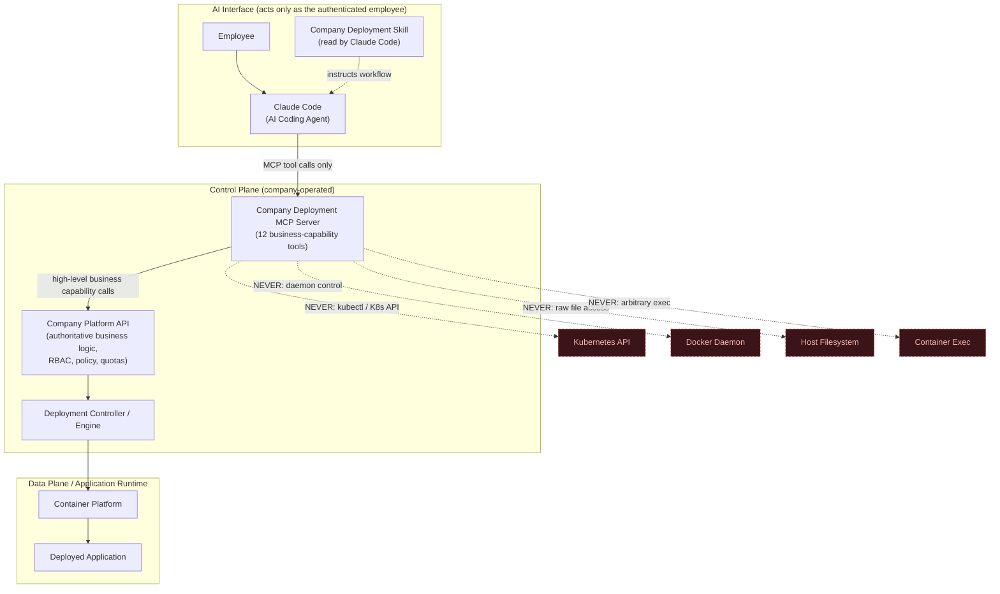

# 07. MCP Requirements

## Document Control

| Field | Value |
|---|---|
| Document Title | MCP Requirements — Company Deployment MCP |
| Document ID | 07_MCP_Requirements |
| Version | 0.1 (Draft) |
| Status | Draft — for review |
| Prepared By | admin@sti-th.com (Solution Architecture) |
| Last Updated | 2026-08-28 |
| Related Documents | `02_Functional_Requirements.md` (modules **Y — MCP Integration**, **Z — Claude Code / AI Agent Integration**), `05_Process_Flows.md` (Deployment Lifecycle, production approval gate), `08_Company_Deployment_Skill.md` (the AI agent's consumer of this interface), `09_SDLC.md`, `10_System_Architecture.md`, `11_Security_Requirements.md`, `12_Data_Requirements.md`, `13_API_Requirements.md`, `17_Decision_Log.md` |

## Purpose & Audience

This document defines the **Company Deployment MCP** as a business capability interface: the contract Claude Code (and any future AI coding agent) uses to request deployment actions on behalf of an authenticated employee. It is written for Solution Architects, Security Architects, Platform Engineers who will implement the MCP server, and reviewers validating that the AI-agent integration does not become a security or operational liability.

This document does **not** assign Functional Requirement IDs — those belong to modules **Y (MCP Integration)** and **Z (Claude Code / AI Agent Integration)** in `02_Functional_Requirements.md`. This document is referenced by, and gives implementation-level shape to, those modules.

---

## 1. MCP Purpose

The Company Deployment MCP exists to give an AI coding agent a **safe, narrow, business-level door** into the platform — never a general-purpose one.

**Why an MCP layer exists (business framing):**

- Employees increasingly delegate work to Claude Code, including "please deploy this." Without a controlled interface, that request has no safe way to reach real infrastructure.
- The MCP converts a natural-language deployment intent into a small, fixed set of auditable, policy-checked business operations (register an app, validate it, deploy it, check its status, roll it back, etc.) — the same operations a human would perform through the Platform API, just reachable from inside an agentic coding session.
- It lets the company say "yes" to AI-assisted deployment without saying "yes" to AI-assisted infrastructure administration. The MCP is the enforcement point that keeps those two things separate.
- It is what allows `08_Company_Deployment_Skill.md` to exist as a *procedural* document rather than a security document — because the hard boundary is enforced here, the skill can safely instruct the agent on workflow without being the thing that has to prevent misuse.

**What the MCP must never allow**, regardless of how it is asked, how the request is phrased, or what the calling agent claims about itself or the employee:

- No `kubectl` or any direct Kubernetes/K3s API access.
- No Docker daemon control (no image builds, no container start/stop/exec via Docker directly).
- No host filesystem access, on any node, for any reason.
- No arbitrary container execution (`exec`, shell-in, debug-attach) into running workloads.
- No arbitrary network configuration (ingress rules, firewall rules, service mesh policy, DNS records) outside the fixed `domain.visibility` options the Platform API already supports.
- No arbitrary Kubernetes (or equivalent) resource creation of any kind — Secrets, ConfigMaps, CRDs, RBAC objects, PersistentVolumes, etc.
- No credential material for infrastructure systems (cluster kubeconfig, registry admin credentials, cloud provider keys) reachable from, or embedded in, the MCP server or its tool responses.
- No bypass path where a "trusted" or "elevated" agent session skips the same authorization/policy checks a human would go through via the Platform API or Admin Portal.

If a capability cannot be expressed as one of the 12 business tools defined in Section 13, it is **out of scope for the MCP** by design — not a gap to be filled with a lower-level tool.

---

## 2. MCP Architecture

The MCP is a thin, policy-aware layer that sits strictly between Claude Code and the Company Platform API. It implements no infrastructure logic itself; it validates, authenticates, authorizes (as a first pass), translates tool calls into Platform API calls, and relays results. The Platform API remains the single authoritative business service and the Deployment Controller/Container Platform remain entirely behind it.



**Key architectural properties:**

1. **Single egress path.** Claude Code is configured with exactly one deployment-related integration point: the Company Deployment MCP Server. It has no other credential, endpoint, or protocol client that reaches the platform or infrastructure.
2. **Company-operated, not employee-operated.** The MCP server is a centrally hosted Control Plane component operated by the Platform team, not a process an employee runs locally with elevated local privileges. This is what makes independent, server-side enforcement possible — see Section 4.
3. **No business logic in the MCP layer.** The MCP does not itself decide RBAC outcomes, run the validation engine, or execute deployments. It authenticates the caller, does a fast first-pass authorization/shape check, forwards the request to the Platform API, and relays the Platform API's authoritative response. This avoids duplicated, potentially inconsistent policy logic living in two places.
4. **No direct edge to infrastructure.** As shown above, there is no line from the MCP (or from Claude Code) to Kubernetes, Docker, the host filesystem, or container exec, under any tool. Every one of the 12 tools in Section 13 terminates at the Platform API.
5. **Exact transport/protocol binding (local stdio vs. remote HTTP/SSE MCP transport, hosting topology, network zone) is an implementation decision** for `10_System_Architecture.md` and `13_API_Requirements.md`. This document fixes the *logical* boundary; it does not fix wire-level detail.

---

## 3. MCP Authentication

The MCP must authenticate **the employee behind the session**, not "the agent" as an independent principal, and never a shared infrastructure credential.

**Design principles:**

- Every MCP session is bound 1:1 to an authenticated employee identity sourced from the company's existing corporate identity provider (IdP). Claude Code does not maintain its own user directory.
- The credential presented to the MCP server is a **scoped, short-lived MCP session token** — issued specifically for MCP tool use — not a general-purpose corporate SSO token, not an infrastructure/service-account credential, and not reusable to call the Platform API, Admin Portal, or any infrastructure system directly.
- The token is minted only after the employee has authenticated through the company IdP for the current Claude Code session (interactive login or an equivalent SSO flow already trusted by the company). The MCP server (or a dedicated token-issuance service in front of it) is the only issuer of MCP session tokens.
- The token carries, at minimum: employee identity, issued-at/expiry, and audience restriction to the Company Deployment MCP Server (it must not be valid against any other API). It does **not** carry a self-asserted role or permission list — roles are resolved server-side from the identity, every call, per Section 4.
- Claude Code holds the token only for the lifetime of the working session; per `08_Company_Deployment_Skill.md`'s guardrails, the token (and any other credential) must never be written into source files, `deployment.yaml`, or persisted in the visible chat transcript.
- Every MCP tool call must present a valid, non-expired, non-revoked token. A missing, malformed, expired, or revoked token fails closed with `UNAUTHORIZED` (Section 8) before any authorization or business logic runs.
- Re-authentication/refresh behavior (silent refresh vs. re-login prompt) must degrade safely: an expired token blocks tool calls and surfaces a clear "please re-authenticate" condition to the employee via Claude Code — it must never fall back to a cached or default identity.

**TBD (see `17_Decision_Log.md`):**

- Exact IdP (Azure AD / Okta / other) and exact grant type (OIDC device authorization flow, browser SSO handoff, or a proprietary token broker) — depends on the company's chosen IdP, owned by `11_Security_Requirements.md`.
- Exact MCP session token lifetime and refresh mechanism.
- Whether the token issuance step is a discrete "Auth/Token Service" or a responsibility folded into the Platform API.

---

## 4. MCP Authorization

**The core rule: never trust the AI agent as a security boundary, and never trust the MCP layer's own first-pass check as the final word either.** Authorization is enforced twice, independently:

1. **MCP-layer first pass** — token validity, coarse rate limiting, and request shape checks. This exists to fail fast and cheaply; it is a convenience, not the security boundary.
2. **Platform API authoritative check (every call, no exceptions)** — the Platform API independently re-resolves the calling employee's roles, application ownership/contributor status, and department membership from its own data model (`User`, `Role`, `Permission`, `ApplicationOwner` — see `12_Data_Requirements.md`) and evaluates the specific tool + target application + target environment against policy. It never accepts a role, permission, "already validated," or "approved" claim embedded in the request payload from the MCP layer or the agent — it re-derives the truth itself.

**What gets checked on every tool call:**

- **Identity check** — is the session token valid, unexpired, unrevoked (Section 3)?
- **RBAC check** — does this employee's resolved role set permit this tool at all (Section 6)?
- **Ownership check** — for application-scoped tools, is this employee the Application Owner, a listed contributor, or a member of the owning department; or do they hold an elevated organization-wide role (IT Administrator, Platform Administrator, Security Administrator, Management/Auditor) with a scope that covers this application?
- **Environment-sensitivity check** — does the target environment (development / staging / production) require additional gating for this employee and this tool (feeds directly into Section 12, Production Approval)?
- **Policy/quota check** — does the request violate a security policy or exceed a department/application quota (Section 8's `POLICY_VIOLATION` / `QUOTA_EXCEEDED`)?

Every authorization decision (allow or deny, and why) is recorded — see Section 7.

A critical corollary: **"AI Coding Agent / Claude Code" is not itself a role with independent permissions.** Every one of the 12 tools is invoked by Claude Code strictly *as* one of the seven platform actors — almost always Employee/Application Developer or Application Owner. The Permission fields in Section 13 name the human role the session must belong to; there is no tool the agent can call "as itself."

---

## 5. MCP Tool Discovery

The Company Deployment Skill must never hardcode assumptions about what the platform currently supports — this is how the AI agent learns it at runtime:

- **Protocol-level discovery.** The MCP server publishes the standard MCP tool manifest (tool names, input/output schemas) so Claude Code can enumerate the 12 tools and their current call signatures without out-of-band documentation.
- **Business-level discovery — `get_platform_info`.** This tool (Section 13.1) is the business-readable companion to protocol discovery: it returns the current policy version, supported environments, a summary of approval rules, the current supported-stack version reference, and the tool-manifest version. `08_Company_Deployment_Skill.md` instructs Claude Code to call it at the start of a deployment workflow rather than relying on any cached/packaged knowledge.
- **Stack-level discovery — `get_supported_stacks`.** The authoritative, current list of supported runtimes/database/cache options (Section 13.2), so the agent never generates a `deployment.yaml` against a stale stack list.
- **Drift detection.** Because the skill package ships its own reference cache (`docs/`, `schemas/` — see `08_Company_Deployment_Skill.md`), the tool-manifest version and policy version returned by `get_platform_info` let the skill detect when its packaged cache has drifted from the live platform and prefer the live result.

---

## 6. MCP Tool Permissions

Permissions are granted to **human roles**; Claude Code exercises them only inside an authenticated employee session (Section 4). The table below is the summary matrix — full detail is in each tool's entry in Section 13.

| Tool | Employee / App Developer (own apps) | Application Owner | IT Administrator | Platform Administrator | Security Administrator | Management / Auditor |
|---|---|---|---|---|---|---|
| `get_platform_info` | Yes | Yes | Yes | Yes | Yes | Yes |
| `get_supported_stacks` | Yes | Yes | Yes | Yes | Yes | Yes |
| `get_deployment_requirements` | Yes (own / prospective app) | Yes | Yes | Yes | Yes | Read (summary) |
| `create_application` | Yes | Yes | No¹ | Yes (rare, on request) | No | No |
| `validate_application` | Yes | Yes | No | Yes | No | No |
| `deploy_application` — dev/staging | Yes | Yes | No | Yes | No | No |
| `deploy_application` — production | Requires approval² | Requires approval² | No | Approver | Approver | No |
| `get_application_status` | Yes (own) | Yes | Yes (org-wide) | Yes (org-wide) | Yes (org-wide) | Yes (read, org-wide) |
| `get_deployment_status` | Yes (own) | Yes | Yes (org-wide) | Yes (org-wide) | Yes (org-wide) | Read (org-wide) |
| `get_application_logs` | Yes (own) | Yes | Yes (org-wide, investigation) | Yes (org-wide) | Yes (org-wide, investigation) | TBD — summary only, see Decision Log |
| `get_application_metrics` | Yes (own) | Yes | Yes (org-wide) | Yes (org-wide) | Yes (org-wide) | Yes (aggregate) |
| `rollback_application` — dev/staging | Yes (own) | Yes | No | Yes | No | No |
| `rollback_application` — production | Requires approval² | Requires approval² | No | Approver | Approver | No |
| `restart_application` | Yes (own) | Yes | Yes | Yes | No | No |
| `delete_application` — dev/staging | Requests only³ | Yes | No | Yes | No | No |
| `delete_application` — production | Requests only³ | Requires approval² | No | Approver | Approver | No |

¹ IT Administrator manages platform configuration through the Admin Portal / Platform API directly, not through the employee-facing MCP path.
² The initiating call still originates from the Employee/App Developer's or Application Owner's session; the Platform API routes it into a `PENDING_APPROVAL` state (Section 12) requiring sign-off before execution proceeds. The exact single-approver-vs-multi-approver policy is **TBD** — see `17_Decision_Log.md`.
³ A non-owning contributor may request deletion conversationally but cannot execute it — ownership confirmation is required (Section 13.13).

---

## 7. MCP Audit Logging

Every MCP tool call — successful, failed, or denied — is logged. This is the platform's primary evidence trail for "who did what to which application, and was it allowed."

**Minimum fields captured per call:**

| Field | Description |
|---|---|
| `timestamp` | Call time (UTC) |
| `employee_identity` | The authenticated employee behind the session (never "Claude Code" alone) |
| `session_id` / `correlation_id` | Ties together all tool calls belonging to one Claude Code working session and, where applicable, one deployment workflow (create → validate → deploy → status polls → confirmation) |
| `tool_name` | Which of the 12 tools was called |
| `input_parameters` | Full request payload, with secret-shaped values redacted before storage |
| `target_application_id` | The application acted on, where applicable |
| `authorization_decision` | Allow/deny and the reason (role, ownership, environment gate, quota, etc.) |
| `result` | Success / failure / structured error code (Section 8) |
| `result_summary` | E.g. resulting lifecycle state, deployment_id issued, URL returned |
| `duration_ms` | Call latency |

**Requirements:**

- Audit records are **append-only** and not editable or deletable by the employee, Application Owner, or the AI agent itself — only Platform Administrator/Security Administrator tooling (outside the MCP) can manage retention.
- High-sensitivity calls — `deploy_application`, `rollback_application`, `delete_application`, `get_application_logs`, any `PENDING_APPROVAL`/approval-decision event — are always logged in full detail, never sampled.
- High-frequency, low-sensitivity read calls (e.g., status polling during Section 9's async pattern) may be logged at reduced verbosity or sampled for volume reasons, but must remain sufficient to detect abuse patterns (e.g., excessive polling, enumeration attempts).
- Audit log retention period and the system of record (dedicated Audit module vs. shared log store) are addressed in `12_Data_Requirements.md` (`AuditLog` entity); exact retention duration is **TBD**.

---

## 8. MCP Error Handling

All tool responses use a consistent structured envelope so Claude Code can react programmatically rather than parsing prose:

```
{
  "status": "success | error",
  "data": { ... tool-specific payload ... },
  "error": {
    "code": "ERROR_CODE",
    "message": "human-readable explanation",
    "details": [ { "field": "...", "reason": "..." } ]
  },
  "request_id": "correlation id for this call",
  "server_time": "ISO-8601 timestamp"
}
```

| Error Code | Category | Meaning | What the Agent Should Do Next |
|---|---|---|---|
| `VALIDATION_ERROR` | Client input malformed or fails a structural/business rule | E.g. missing required `deployment.yaml` field, bad port value | Surface the specific field-level errors to the employee in plain language; do not retry with guessed values; only resubmit once the employee has provided/confirmed a correction |
| `POLICY_VIOLATION` | Request is well-formed but violates platform/security policy | E.g. attempted privileged config, disallowed domain visibility for the app's classification | Stop; explain the specific policy in plain language; do not attempt to work around it or resubmit a disguised version of the same request |
| `UNSUPPORTED_STACK` | A declared runtime/framework/database/cache is not on the current supported list | Re-check `get_supported_stacks`; ask the employee whether to change the stack or request an exception through IT/Platform Administrator — never silently substitute a "close enough" technology |
| `QUOTA_EXCEEDED` | A resource, application-count, or department quota would be exceeded | Inform the employee; propose a smaller resource tier or direct them to request a quota increase from Platform Administrator |
| `UNAUTHORIZED` | Missing/expired/revoked token, or the resolved identity lacks permission for this tool/application | Do not retry under a different claimed identity or role; ask the employee to re-authenticate, or explain that they/the app owner must grant access |
| `NOT_FOUND` | Referenced application, version, or deployment does not exist | Confirm the identifier with the employee; never fabricate or guess an identifier |
| `CONFLICT` | Idempotency key reused with different input, duplicate in-flight operation, or name collision | Check current state via the relevant `get_*` status tool before retrying; surface the conflict to the employee if it is not self-resolving |
| `RATE_LIMITED` | Too many calls in a time window | Back off according to the provided retry hint; never tight-loop retry or poll |
| `PENDING_APPROVAL` | Not a failure — a production-affecting action is queued for human approval (Section 12) | Inform the employee the action is queued for approval and by whom; poll `get_deployment_status` rather than treating this as an error |
| `INTERNAL_ERROR` | Unexpected platform-side failure | Surface a generic, honest message; suggest retrying after a delay; if persistent, tell the employee to contact IT/Platform Administrator rather than attempting a workaround |

Exact numeric rate limits and quota thresholds are **TBD** (owned by `03_Non_Functional_Requirements.md` / `04_Business_Rules.md`, tracked in `17_Decision_Log.md`).

---

## 9. MCP Timeout Handling

**Read tools** (`get_platform_info`, `get_supported_stacks`, `get_deployment_requirements`, `get_application_status`, `get_deployment_status`, `get_application_logs`, `get_application_metrics`) are synchronous request/response and are expected to return quickly. The exact latency SLA is owned by `03_Non_Functional_Requirements.md`; this document only fixes that they must not block on long-running platform work.

**Long-running mutating operations must be asynchronous, never a blocking call held open until completion:**

- `deploy_application`, `rollback_application`, and the decommission workflow behind `delete_application` kick off multi-stage platform work (Build → Image Scan → Deploy → Health Check → Traffic Activation, per the Deployment Lifecycle) that can take well beyond any reasonable single request/response window, especially with a production approval gate in the middle.
- These tools return **immediately** with an acknowledgment (a `deployment_id`/job reference and an initial phase, e.g. `QUEUED` or `BUILDING`) — never with the final outcome.
- The Company Deployment Skill instructs Claude Code to poll `get_deployment_status` (and, once terminal, `get_application_status`) at a bounded interval until a terminal state is reached (`COMPLETED`, `FAILED`, `ROLLED_BACK`), rather than issuing one call and waiting indefinitely.
- The skill defines a maximum client-side polling duration, after which Claude Code tells the employee the operation is still in progress (and how to check later) instead of declaring failure or blocking the conversation. Exact poll interval and maximum polling duration are **TBD** — see `17_Decision_Log.md`.
- No MCP tool call itself may remain open for the duration of a build+deploy pipeline; doing so risks hitting MCP-transport-level timeouts independent of the platform's own status, which is exactly the failure mode this async/poll pattern avoids.

A future enhancement (event/webhook push into the Claude Code session instead of polling) is noted as a Phase 2+ candidate and is not required for MVP.

---

## 10. MCP Idempotency

Retried tool calls — from network hiccups, agent retries, or an employee re-issuing the same instruction — must never create duplicate deployments or resources.

- Every mutating tool (`create_application`, `deploy_application`, `validate_application` re-submission, `rollback_application`, `restart_application`, `delete_application`) accepts an **idempotency key**.
- The Platform API stores the key against the resulting operation/resource for a bounded retention window (**TBD** exact duration, e.g. on the order of 24 hours).
- A repeated call with the **same key and equivalent input** returns the original result (or a reference to the already-in-flight job) rather than starting a new one.
- A repeated call with the **same key but different input** is rejected with `CONFLICT` (Section 8) — this protects against accidental key reuse across genuinely different requests.
- This is what specifically protects the common agentic-retry failure mode: e.g., a transient network error right after `deploy_application` already started on the platform side must not result in two concurrent deployments of the same application/version.

Exact idempotency key derivation (agent-supplied request ID vs. server-derived from application id + version + content hash) is **TBD** — see `17_Decision_Log.md`.

---

## 11. MCP Deployment Confirmation

An employee (and the agent relaying to them) must get an unambiguous, factual confirmation — never an assumed one.

- A deployment is only "confirmed" once `get_deployment_status` (or the terminal payload of the async job) reports `COMPLETED`, meaning the platform has performed its health checks and activated traffic.
- The terminal success payload is a structured confirmation object containing at minimum: `application_id`, `version`, `environment`, `url`, `deployed_at`, and a `health_check_summary`.
- `08_Company_Deployment_Skill.md` instructs Claude Code to relay this confirmation **verbatim** — including the real, platform-issued URL — to the employee, and never to construct, guess, or pattern-match a "likely" URL before this payload is received.
- On failure, an equivalent structured failure payload (`FAILED`, with a reason and, where available, a suggested next step) is returned and must be relayed faithfully — not summarized away or presented optimistically.

---

## 12. MCP Production Approval

A `deploy_application` call targeting a production environment does not proceed straight into the build/deploy pipeline. It must trigger an approval gate, aligned with the approval step in `05_Process_Flows.md`'s Deployment Lifecycle:

1. `deploy_application(environment=production)` is received and passes the same validation/policy/quota checks as any other deployment.
2. Instead of proceeding to Build, the Platform API creates a `DeploymentApproval` record (see `12_Data_Requirements.md`) and returns `status = PENDING_APPROVAL` with a reference id.
3. Approval is performed by an authorized human approver (Application Owner and/or Platform Administrator and/or Security Administrator, depending on policy) through a channel **outside the MCP** — e.g. the Admin Portal, triggered by a Notification (see System Modules). The AI agent has no tool that grants or forces approval; there is intentionally no `approve_deployment` tool exposed to Claude Code.
4. On approval, the pipeline proceeds automatically (Build → Image Scan → Deploy → Health Check → Traffic Activation) exactly as a non-gated deployment would.
5. On rejection, the deployment transitions to `Failed` with the rejection reason surfaced back through `get_deployment_status`.
6. Claude Code, per the skill, must clearly tell the employee that production deployment requires human approval and is **not immediate** — and must not represent the application as deployed/live until a terminal `COMPLETED` status is observed.

**TBD:** exact approver matrix (single approver vs. required multi-approval; whether Application Owner approval alone suffices or Platform/Security Administrator sign-off is mandatory for all production deployments) — tracked in `17_Decision_Log.md` and owned jointly with `05_Process_Flows.md` and `11_Security_Requirements.md`.

---

## 13. MCP Tool Catalog

**Conventions used below:**

- Every call implicitly carries the authenticated session context described in Sections 3–4 (employee identity, session/correlation id) even where not listed under "Input."
- Every mutating tool accepts an `idempotency_key` per Section 10, even where not repeated in every table.
- Every response uses the structured envelope and error taxonomy defined in Section 8.
- **Permission** names the human role(s) the calling employee's session must resolve to; Claude Code never holds permissions independently (Section 4/6).

### 13.1 `get_platform_info`

| Attribute | Definition |
|---|---|
| Purpose | Retrieve the platform's current capability descriptor — policy version, supported environments, approval-rule summary, supported-stack version reference, and tool-manifest version — so the Company Deployment Skill can stay in sync instead of hardcoding assumptions (Section 5). |
| Input | Optional `client_skill_version` (for compatibility/drift reporting). |
| Output | `platform_version`, `policy_version`, `supported_environments[]`, `approval_rules_summary`, `supported_stack_version_ref`, `tool_manifest_version`. |
| Permission | Any authenticated employee session (all seven actors, read-only). |
| Validation | Valid, non-expired, non-revoked session token only — no application-level scope required. |
| Error Conditions | `UNAUTHORIZED`, `INTERNAL_ERROR`. |
| Security Considerations | Must return no sensitive data — no internal hostnames, cluster identifiers, credentials, or other applications' details. |
| Audit Requirements | Logged with identity and timestamp; may be sampled at high call volume but must remain sufficient to detect anomalous polling. |

### 13.2 `get_supported_stacks`

| Attribute | Definition |
|---|---|
| Purpose | Return the current, authoritative list of supported frontend/backend/database/cache runtimes and versions, used before generating or validating a `deployment.yaml`. |
| Input | Optional `category` filter (`frontend`, `backend`, `database`, `cache`). |
| Output | List of `{category, runtime, version_range, status}` (`status`: GA / deprecated / beta) plus a `stack_list_version`. |
| Permission | Any authenticated employee session (read-only). |
| Validation | Valid session token. |
| Error Conditions | `UNAUTHORIZED`, `INTERNAL_ERROR`. |
| Security Considerations | Read-only, no sensitive information; must reflect exactly what the Validation Engine enforces (no separate "documentation-only" list). |
| Audit Requirements | Standard logging; low sensitivity. |

### 13.3 `get_deployment_requirements`

| Attribute | Definition |
|---|---|
| Purpose | Given an existing `application_id` or a proposed application shape, return the specific constraints that apply — required `deployment.yaml` fields, allowed resource tiers, allowed scaling bounds, domain-visibility rules, and environment-specific policy notes — so the skill generates a compliant definition on the first attempt. |
| Input | Either `application_id`, or a proposed shape `{services[], database, cache, environment}`. |
| Output | Applicable constraints, required fields, allowed resource tiers, allowed scaling bounds, domain rules, environment-specific notes. |
| Permission | Employee / Application Developer (own or prospective application), Application Owner. |
| Validation | If `application_id` is supplied, caller must have ownership/contributor rights on it. |
| Error Conditions | `UNAUTHORIZED`, `NOT_FOUND` (unknown `application_id`), `VALIDATION_ERROR` (malformed proposed shape), `INTERNAL_ERROR`. |
| Security Considerations | Must not expose another application's configuration or any infrastructure-level detail (node pools, cluster names, internal endpoints). |
| Audit Requirements | Log requester, target application id (if any), timestamp. |

### 13.4 `create_application`

| Attribute | Definition |
|---|---|
| Purpose | Register a new application in the Application Registry in `Draft` state from a submitted `deployment.yaml`, establishing the entry point of the Application Lifecycle. |
| Input | Structured `deployment.yaml` content, declared owner, declared department, `idempotency_key`. |
| Output | `application_id`, `status = Draft`, `created_at`, normalized/echoed deployment definition. |
| Permission | Employee / Application Developer, Application Owner. |
| Validation | Schema validation of the submitted definition; application name uniqueness/format; declared owner must match the caller or an owner the caller is authorized to create on behalf of (e.g. same department); duplicate `idempotency_key` handling per Section 10. |
| Error Conditions | `VALIDATION_ERROR` (schema), `UNAUTHORIZED`, `CONFLICT` (name collision or reused key with different payload), `QUOTA_EXCEEDED` (department/application count quota), `INTERNAL_ERROR`. |
| Security Considerations | Server re-validates every field independent of any local/skill-side check; the `owner` field cannot be spoofed to a different employee without department authorization; no infrastructure-shaped fields (e.g. raw manifests) are accepted — only the fixed `deployment.yaml` schema. |
| Audit Requirements | Full record of submitted definition content, resulting `application_id`, requester identity. |

### 13.5 `validate_application`

| Attribute | Definition |
|---|---|
| Purpose | Run the server-side Validation Engine against a `Draft` (or previously failed) application's definition — supported-stack compliance, resource/quota policy, security policy, schema correctness — transitioning `Draft → Validated` on success. |
| Input | `application_id`, version/content reference (or an updated `deployment.yaml` if changed). |
| Output | `validation_result { passed: bool, findings[] }` (each finding: severity, code, field, message), resulting lifecycle state. |
| Permission | Employee / Application Developer, Application Owner. |
| Validation | Caller ownership/contributor check; application must be in `Draft` or previously `Failed` validation; the full policy set is re-checked server-side regardless of any local pre-check the skill performed. |
| Error Conditions | `UNAUTHORIZED`, `NOT_FOUND`, `UNSUPPORTED_STACK` (as a specific finding), `INTERNAL_ERROR`. A failed validation itself is a normal successful tool call carrying `passed: false` findings — not a transport-level error. |
| Security Considerations | Validation status cannot be short-circuited by a client-supplied "already validated" flag; the platform is the sole source of truth for validation outcome. |
| Audit Requirements | Log validation attempt, findings summary, resulting state, requester. |

### 13.6 `deploy_application`

| Attribute | Definition |
|---|---|
| Purpose | Request deployment of a `Validated` application version to a target environment, triggering the asynchronous Deployment Lifecycle (Build → Image Scan → Deploy → Health Check → Traffic Activation). Production targets are routed to the approval gate (Section 12) instead of immediate deployment. |
| Input | `application_id`, version reference, `target_environment`, `idempotency_key`. |
| Output | Async acknowledgment: `deployment_id`, initial `status` (`QUEUED` \| `BUILDING` \| `PENDING_APPROVAL`), correlation id for polling. |
| Permission | Employee / Application Developer, Application Owner for development/staging. Production additionally requires human approval per Section 12 — the calling employee must still be an owner/authorized contributor to initiate the request. |
| Validation | Application must be `Validated` (or `Running`, for a new-version redeploy); caller authorized for the target environment; resource quota check; stack support re-checked at deploy time (in case it was deprecated since validation); idempotency dedup. |
| Error Conditions | `UNAUTHORIZED`, `NOT_FOUND`, `VALIDATION_ERROR` (wrong state), `POLICY_VIOLATION`, `QUOTA_EXCEEDED`, `UNSUPPORTED_STACK` (deprecated between validate and deploy), `CONFLICT` (duplicate in-flight deployment), `PENDING_APPROVAL` (production, not a failure). |
| Security Considerations | Production approval requirement cannot be skipped by any client-side claim; the Platform API independently determines environment sensitivity and gating regardless of what the agent/skill believes. No secret material is accepted in this call — only references to platform-managed secrets. |
| Audit Requirements | Full record: requester, application, version, target environment, approval routing decision, resulting `deployment_id`. |

### 13.7 `get_application_status`

| Attribute | Definition |
|---|---|
| Purpose | Return an application's current lifecycle state and aggregate health, for both agent polling and general status checks. |
| Input | `application_id`. |
| Output | `application_id`, `name`, `current_lifecycle_state`, `environment(s)`, `latest_deployment_id`, `health_summary`, `url` (if `Running`). |
| Permission | Application Owner and dev-team contributors (own apps); IT Administrator, Platform Administrator, Security Administrator, Management/Auditor (organization-wide read). |
| Validation | Caller must be an owner/contributor, or hold an elevated role with organization-wide read scope. |
| Error Conditions | `UNAUTHORIZED`, `NOT_FOUND`, `INTERNAL_ERROR`. |
| Security Considerations | Field-level restriction for non-owning elevated roles where appropriate (e.g. Auditor sees state/metadata, not secret references). |
| Audit Requirements | Logged; elevated-role reads of applications the caller does not own are flagged for anomaly detection. |

### 13.8 `get_deployment_status`

| Attribute | Definition |
|---|---|
| Purpose | Poll the status of a specific asynchronous deployment job started by `deploy_application` or `rollback_application` — the core mechanism of the async status-poll pattern (Section 9). |
| Input | `deployment_id`. |
| Output | `deployment_id`, `application_id`, `phase` (`QUEUED`, `BUILDING`, `IMAGE_SCAN`, `PENDING_APPROVAL`, `DEPLOYING`, `HEALTH_CHECK`, `TRAFFIC_ACTIVATION`, `COMPLETED`, `FAILED`, `ROLLED_BACK`), progress detail, `started_at`, `updated_at`, terminal result summary (URL or failure reason). |
| Permission | Same as the original requester (Employee/App Developer, Application Owner) plus IT Administrator, Platform Administrator, Management/Auditor (read). |
| Validation | Caller authorization tied to the underlying application; `deployment_id` must exist and belong to an application the caller can access. |
| Error Conditions | `UNAUTHORIZED`, `NOT_FOUND`, `INTERNAL_ERROR`. |
| Security Considerations | No infrastructure identifiers (node names, cluster ids) in status messages — business-level phase names only. |
| Audit Requirements | Logged; may be aggregated/sampled for high-frequency polling, per Section 7. |

### 13.9 `get_application_logs`

| Attribute | Definition |
|---|---|
| Purpose | Retrieve recent application-level logs (stdout/stderr / structured app logs) for troubleshooting — scoped strictly to application-level output, never host or container-runtime logs. |
| Input | `application_id`, `environment`, `time_range` or `tail_lines`, optional filter (`service`, `severity`). |
| Output | Log entries `{timestamp, service, level, message}`, pagination cursor. |
| Permission | Application Owner and dev-team contributors (own apps); IT Administrator and Security Administrator (organization-wide, investigation purposes); Platform Administrator. Management/Auditor access is **TBD** (likely summary-only). |
| Validation | Ownership/role check; time-range and volume limits enforced server-side; secret/PII redaction applied before the response leaves the Platform API. |
| Error Conditions | `UNAUTHORIZED`, `NOT_FOUND`, `VALIDATION_ERROR` (bad time range), `QUOTA_EXCEEDED` (request too large), `INTERNAL_ERROR`. |
| Security Considerations | Highest redaction requirement of the read tools — must never surface infrastructure credentials, another application's data, or raw secret values. This tool exposes an application's own log **stream only**; it is explicitly not a shell/exec capability. |
| Audit Requirements | The read itself is a security-sensitive audit event — who viewed which application's logs, and when, is always recorded in full. |

### 13.10 `get_application_metrics`

| Attribute | Definition |
|---|---|
| Purpose | Return aggregate operational metrics — request rate, error rate, latency, instance count/scale events, resource utilization — for status reporting to the employee/agent and dashboards. |
| Input | `application_id`, `environment`, `time_range`, `metric_types[]`. |
| Output | Metric series/summary values, current instance count, last scale event. |
| Permission | Application Owner and dev-team contributors (own apps); IT Administrator, Platform Administrator (organization-wide); Management/Auditor (aggregate level). |
| Validation | Ownership/role check; time-range bounds enforced. |
| Error Conditions | `UNAUTHORIZED`, `NOT_FOUND`, `VALIDATION_ERROR`, `INTERNAL_ERROR`. |
| Security Considerations | No host/node/cluster-identifying data; aggregated application-level metrics only. |
| Audit Requirements | Standard logging. |

### 13.11 `rollback_application`

| Attribute | Definition |
|---|---|
| Purpose | Roll a `Running` (or `Failed`) application back to a previously successful deployed version, per the Deployment Lifecycle's rollback flow. |
| Input | `application_id`, `target_version` (or `"previous"`), `environment`, `idempotency_key`. |
| Output | Async acknowledgment: new rollback `deployment_id`, `status`, confirmed `target_version`. |
| Permission | Application Owner; Employee/App Developer if owner/contributor, for development/staging. Production rollback requires approval per Section 12, restricted at minimum to Application Owner/Platform Administrator initiation with Platform/Security Administrator sign-off. |
| Validation | Application must be `Running` or `Failed`; `target_version` must exist in the application's own deployment history and have been a previously successful deployment; environment authorization check. |
| Error Conditions | `UNAUTHORIZED`, `NOT_FOUND` (application or version), `VALIDATION_ERROR` (invalid state for rollback), `CONFLICT` (rollback already in progress), `INTERNAL_ERROR`. |
| Security Considerations | Rollback target must come exclusively from the platform's own recorded deployment history — never an arbitrary client-supplied artifact or image reference. |
| Audit Requirements | Full record: requester, from-version, to-version, environment, result. |

### 13.12 `restart_application`

| Attribute | Definition |
|---|---|
| Purpose | Restart a `Running` application's workload in place (e.g. to clear transient state or pick up non-deployment config) without changing its version — a lighter-weight operation than redeploy. |
| Input | `application_id`, `environment`, `idempotency_key`. |
| Output | `status` (`RESTARTING` / `COMPLETED`), `restarted_at`. |
| Permission | Application Owner; Employee/App Developer if owner/contributor; IT Administrator; Platform Administrator. |
| Validation | Application must be `Running`; rate-limited to prevent restart storms (exact limit **TBD**). |
| Error Conditions | `UNAUTHORIZED`, `NOT_FOUND`, `VALIDATION_ERROR` (not `Running`), `RATE_LIMITED` / `QUOTA_EXCEEDED`, `INTERNAL_ERROR`. |
| Security Considerations | Scoped strictly to the caller's own application workload; cannot target infrastructure components, nodes, or other applications. |
| Audit Requirements | Logged with requester, application, environment, timestamp. |

### 13.13 `delete_application`

| Attribute | Definition |
|---|---|
| Purpose | Permanently decommission an application, moving it through `Archived → Deleted` per the defined Application Lifecycle (a grace period before hard deletion is expected; exact policy owned by `12_Data_Requirements.md`). |
| Input | `application_id`, explicit `confirmation` (non-guessable, e.g. echoing the application name), `idempotency_key`. |
| Output | `status` (`ARCHIVING` / `DELETING` / `DELETED`), `effective_deletion_date` if a grace period applies. |
| Permission | Application Owner; Platform Administrator. A non-owning contributor may only *request* deletion conversationally (Section 6). Production deletion additionally requires Platform Administrator and/or Security Administrator sign-off — exact policy **TBD**, aligned with the Section 12 approval philosophy. |
| Validation | Ownership check; explicit confirmation required (a single ambiguous instruction must never trigger deletion); check for active dependents (e.g. another application referencing its database) that would block immediate hard deletion. |
| Error Conditions | `UNAUTHORIZED`, `NOT_FOUND`, `VALIDATION_ERROR` (missing/invalid confirmation), `CONFLICT` (active dependents), `INTERNAL_ERROR`. |
| Security Considerations | Irreversible action — must never be triggerable from agent inference alone without an explicit, employee-confirmed instruction visible in the conversation. Associated secrets and data are purged per the platform's data retention policy (`12_Data_Requirements.md`, exact retention **TBD**). |
| Audit Requirements | Highest-sensitivity audit entry: requester, application, timestamp, and approval chain if one applied. |

---

## 14. Cross-References & Open Decisions

This document intentionally leaves the following as **TBD**, to be resolved and recorded in `17_Decision_Log.md`:

1. Exact IdP and OAuth/OIDC grant type backing MCP session tokens (Section 3).
2. Exact MCP session token lifetime and refresh mechanism (Section 3).
3. Whether token issuance is a discrete Auth/Token Service or folded into the Platform API (Section 3).
4. Exact rate limits and quota thresholds behind `RATE_LIMITED` / `QUOTA_EXCEEDED` (Section 8).
5. Exact read-tool latency SLA and async poll interval / maximum client-side polling duration (Section 9).
6. Exact idempotency key derivation and retention window (Section 10).
7. Exact production approval matrix — single vs. multi-approver, and whether Security Administrator sign-off is mandatory for all production actions or only above a risk threshold (Section 12).
8. Management/Auditor access level to `get_application_logs` — full vs. summary-only (Sections 6, 13.9).
9. Audit log retention period and system of record (Section 7; owned jointly with `12_Data_Requirements.md`).
10. Data retention/grace period before hard deletion under `delete_application` (Section 13.13; owned by `12_Data_Requirements.md`).
