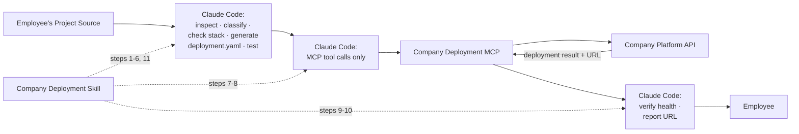
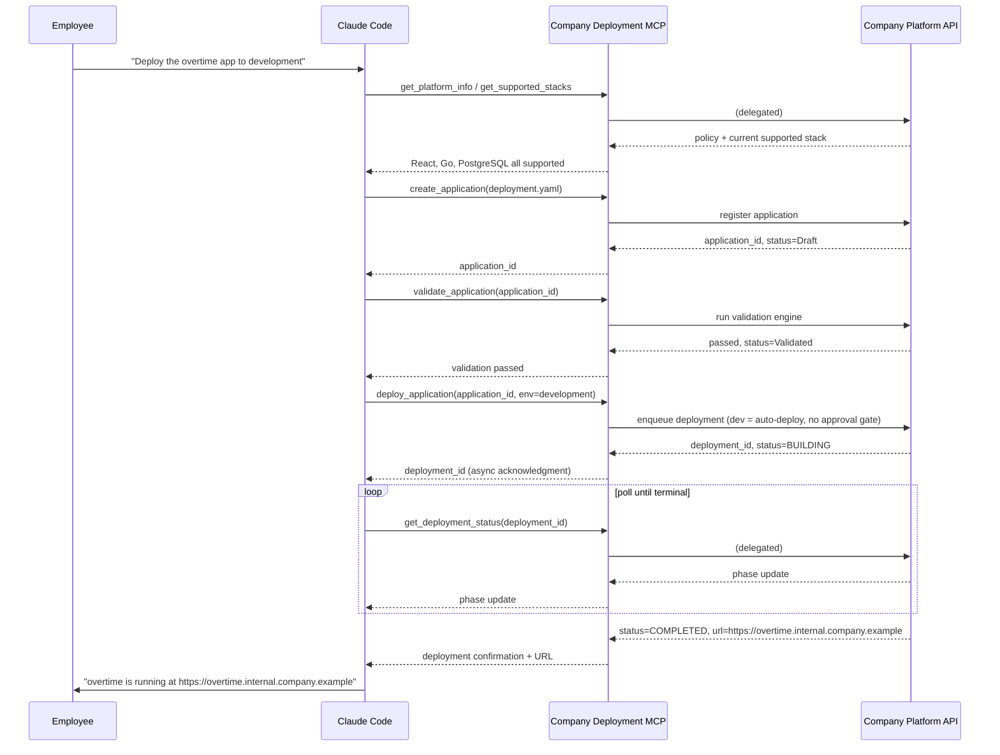

# 08. Company Deployment Skill

## Document Control

| Field | Value |
|---|---|
| Document Title | Company Deployment Skill — Requirements & Structure |
| Document ID | 08_Company_Deployment_Skill |
| Version | 0.1 (Draft) |
| Status | Draft — for review |
| Prepared By | admin@sti-th.com (Solution Architecture) |
| Last Updated | 2026-08-28 |
| Related Documents | `07_MCP_Requirements.md` (the 12 tools this skill calls), `02_Functional_Requirements.md` (module **Z — Claude Code / AI Agent Integration**), `05_Process_Flows.md` (TO-BE process, approval gate), `06_System_Requirements.md`, `11_Security_Requirements.md`, `17_Decision_Log.md` |

## Purpose & Audience

This document defines requirements for the **Company Deployment Skill**: a packaged instruction set that Claude Code reads so it knows how to behave when an employee asks it to deploy an application on this platform. The skill is a *procedural and behavioral* artifact — it does not implement security, and it must never be relied upon as one. The security boundary is the MCP server and Platform API defined in `07_MCP_Requirements.md`; this skill's job is to make the AI agent a well-behaved, predictable client of that boundary.

This document is written for the team that authors and maintains the skill package, for Security reviewers verifying it introduces no way around the MCP boundary, and for anyone onboarding Claude Code onto this platform.

---

## 1. What the Skill Is, and Is Not

The Company Deployment Skill is a set of instructions Claude Code **reads**, not a program the platform **runs**. It shapes agent behavior the same way a runbook shapes a human engineer's behavior: it tells the agent what order to do things in, what to check, what to say to the employee, and what it must refuse to do.

- It is **not** a security control. Every boundary that must actually hold (auth, RBAC, policy, quotas) is enforced server-side by the MCP and Platform API regardless of whether the skill is followed correctly.
- It **is** the thing that makes the AI agent a good, efficient, low-friction user of that boundary — reducing failed validations, avoiding wasted deploy attempts, giving employees clear status and honest errors, and refusing categories of request the platform would reject anyway.
- If the skill's instructions and the MCP's actual enforced behavior ever disagree, **the MCP/Platform API's live behavior wins** (see Section 5). The skill is written to always defer to the platform's authoritative, live responses rather than to its own packaged assumptions.



---

## 2. Skill Behavioral Contract — the 11 Ordered Steps

The skill instructs Claude Code to follow this order for any deployment request. Steps are sequential; the agent does not skip ahead (e.g. it does not call `deploy_application` before `validate_application` has passed), and it does not silently reorder steps to "save time."

### Step 1 — Inspect the project

Read the project's structure: package manifests (`package.json`, `go.mod`, `requirements.txt`, `pyproject.toml`, etc.), entry points, declared ports/env vars, and any existing local-dev tooling (e.g. a `docker-compose.dev.yml` an employee uses for local Postgres). Local-dev container files are read only to infer architecture (e.g. "this app expects a Postgres database locally") — they are **never** submitted to the platform and never treated as the deployment mechanism; the platform's own Build Engine is the sole builder of what actually runs (see `06_System_Requirements.md` / System Modules — Build Engine).

### Step 2 — Identify the application architecture

Classify the project into one of the platform's known **application shapes** (this determines which `examples/` template applies and which sections of `deployment.yaml` are needed): frontend-only (static), frontend + api, frontend + api + database, frontend + api + database + cache, or api/worker-only. Multiple services within one app (e.g. `frontend`, `api`) are recorded as separate entries under `services:`.

### Step 3 — Check supported technologies

Call `get_platform_info` and `get_supported_stacks` (MCP tools defined in `07_MCP_Requirements.md`, Sections 13.1–13.2) and compare the detected runtimes/framework/database/cache against the **live** result — never against the skill's packaged `docs/` reference alone (see Section 5). If something detected in Step 1 is not on the supported list, the agent stops here and follows the validation-failure handling in Section 6 rather than guessing a substitute.

### Step 4 — Generate `deployment.yaml`

Populate the deployment definition from what was inspected and confirmed: `app.name`, `app.owner` (confirmed with the employee — never inferred silently for ownership/accountability fields), `services.*.runtime` (and `port` where applicable), `database.type` (if present), `scaling.min`/`max` (defaulting to scale-to-zero-friendly values for stateless web/API services, per the platform's scale-to-zero policy — adjustable with the employee), `resources.tier`, and `domain.visibility` (explicitly confirmed with the employee — internal vs. any broader visibility is a classification decision, not a guess). The generated file is checked against the packaged `schemas/` definition locally, as a fast first-pass convenience only (Section 4).

### Step 5 — Validate the deployment definition

Call `validate_application` (Section 13.5 of `07_MCP_Requirements.md`). This server-side result is authoritative — a local schema pass is not treated as "validated." Findings are surfaced per Section 6 below.

### Step 6 — Run application tests

Run the project's own existing test tooling (e.g. `npm test`, `go test ./...`, `pytest`) before requesting a deployment. The platform's validation checks infrastructure/policy compliance, not application correctness — that remains the employee's/agent's responsibility. If tests fail or none exist, the agent surfaces this clearly and asks the employee how to proceed (see Section 6) rather than silently deploying untested code or silently skipping the step.

### Step 7 — Call the Company MCP

From here on, every platform interaction goes exclusively through the 12 MCP tools defined in `07_MCP_Requirements.md`: `create_application` to register the app (if not already registered), then the lifecycle tools as needed. No other channel is used.

### Step 8 — Deploy only through the approved platform

Call `deploy_application`. Handle the asynchronous acknowledgment (a `deployment_id`, not a final result) and poll `get_deployment_status` per the async pattern in `07_MCP_Requirements.md` Section 9. If the target is production, expect and correctly handle a `PENDING_APPROVAL` state (Section 12 of that document) rather than treating it as an error or as a completed deployment.

### Step 9 — Verify deployment health

Once `get_deployment_status` reports a terminal `COMPLETED` phase, confirm via `get_application_status` (and, if useful, `get_application_metrics`) that the application is `Running` and healthy before declaring success — the agent does not declare success on the strength of the deploy call being *accepted*.

### Step 10 — Report the application URL

Relay the exact `url` from the platform's deployment confirmation payload (Section 11 of `07_MCP_Requirements.md`) to the employee, verbatim, along with environment and version. Never a pattern-guessed or "typical" URL — see the guardrail in Section 7.

### Step 11 — Never manipulate infrastructure directly

At every step above, and at all times, the agent's only path to the platform is the MCP. It does not write, suggest, or execute `kubectl`, Docker, Helm, SSH, or any other infrastructure-level command, even if asked. See the full guardrail list in Section 7.

---

## 3. Skill Package Structure

```
company-deployment-skill/
  SKILL.md
  docs/
    supported-stack.md
    policy-summary.md
    deployment-lifecycle.md
    troubleshooting.md
  schemas/
    deployment.schema.json
  examples/
    frontend-only.deployment.yaml
    frontend-api.deployment.yaml
    frontend-api-db.deployment.yaml
    frontend-api-db-cache.deployment.yaml
```

### `SKILL.md` — the procedure Claude Code reads

The primary behavioral contract: the ordered 11-step procedure (Section 2), the decision rules for each step (what counts as "supported," what triggers a stop-and-ask, how to handle async polling), and the guardrails (Section 7). This is the file Claude Code actually loads to know *how to act*. It is treated like code: versioned, reviewed, and changed deliberately — governance of who may publish a new `SKILL.md` (Platform Administrator / IT, per `06_System_Requirements.md` — Administration) is out of scope for this document but must exist before rollout.

### `docs/` — supporting reference material

Human-and-agent-readable background: a cached snapshot of the supported stack list, a plain-language summary of platform policy (quotas, environment rules, approval requirements), a description of the Deployment Lifecycle phases the agent will see in `get_deployment_status`, and a troubleshooting guide mapping common validation error codes (Section 8 of `07_MCP_Requirements.md`) to plain-language explanations and typical remediations.

`docs/` is explicitly a **cache, not a source of truth** — see Section 5. It exists so the agent (and human engineers reading the skill package) has fast, offline-readable context; it is never used to justify skipping the live `get_platform_info` / `get_supported_stacks` calls in Step 3.

### `schemas/` — `deployment.yaml` schema(s) for validation

A formal JSON Schema (or YAML-Schema equivalent) describing the structure of `deployment.yaml` (the `app` / `services` / `database` / `scaling` / `resources` / `domain` blocks and their allowed fields/types). Its purpose is **fast, offline, first-pass validation** — catching obvious structural mistakes before spending a network round trip on `validate_application`. It is versioned and expected to be refreshed from the platform's authoritative schema (tracked via the `tool_manifest_version` returned by `get_platform_info`); it is never treated as a substitute for the server-side result of `validate_application`, which remains the only authoritative check (Section 5).

### `examples/` — worked `deployment.yaml` templates per common app shape

Concrete, complete example definitions for each application shape named in Step 2: frontend-only, frontend + api, frontend + api + database, and frontend + api + database + cache. Claude Code uses these as structural starting templates when generating a new application's definition (Step 4), reducing generation errors; they also serve as onboarding reference for human engineers. Examples use placeholder names/owners only and must never contain real application names, real internal URLs, or any secret-shaped values.

---

## 4. Common Response Handling

The skill instructs Claude Code to treat every MCP tool response using the structured envelope and error taxonomy defined in `07_MCP_Requirements.md` Section 8 — it does not invent its own interpretation of success/failure, and it always reads the actual `status`/`error.code` field rather than inferring outcome from response shape or prose.

---

## 5. Staying in Sync with the Live Platform

The single biggest risk for a packaged skill is **drift**: the platform's supported stack, quotas, or policy change, but the skill's bundled `docs/`/`schemas/` still reflect an older state, causing the agent to generate definitions that look right locally but fail server-side (or worse, appear to "know" something the platform no longer allows).

The skill prevents this by design:

- **Live calls are authoritative, packaged docs are advisory.** Step 3 always calls `get_platform_info` and `get_supported_stacks` at the start of a deployment workflow. The result of those calls — not `docs/supported-stack.md` — is what determines whether a detected technology is supported.
- **Version comparison, not blind trust.** `get_platform_info` returns a `tool_manifest_version` and `supported_stack_version_ref`. The skill compares these against the version markers recorded in its own `docs/`/`schemas/` files. A mismatch does not block the agent (the live call already gave it the correct current answer) — it is treated as a signal that the packaged skill artifact itself is stale and due for republication.
- **Local schema is fail-fast only.** `schemas/deployment.schema.json` is used purely to catch obvious mistakes before a network call; a definition that passes the local schema still must pass `validate_application` (Step 5), and a definition that fails the local schema is still worth showing to the employee immediately rather than waiting on a round trip.
- **Refresh governance.** Republishing the skill package (updating `docs/` and `schemas/` from the platform's current manifest) is an administrative responsibility, not something Claude Code does for itself mid-session. Exact cadence/ownership (e.g. automatic regeneration vs. Platform Administrator-triggered) is **TBD** — see Section 10.

---

## 6. Handling Validation Failures

Whenever a local schema check, `validate_application`, or `deploy_application` returns `VALIDATION_ERROR`, `POLICY_VIOLATION`, `UNSUPPORTED_STACK`, or `QUOTA_EXCEEDED` (per `07_MCP_Requirements.md` Section 8):

1. **Surface it fully and clearly.** The agent explains, in plain language, which field or requirement failed and why — not a raw error dump, but also not a vague paraphrase that hides the actual reason.
2. **Never attempt a silent workaround.** The agent must not: substitute an unsupported runtime/framework/database for a supported one without asking; strip, rename, or omit fields to dodge a schema or policy check; retry with fabricated or guessed values hoping validation passes; or attempt to reach infrastructure directly to accomplish what validation blocked.
3. **Offer employee-approved next steps, then wait.** E.g. "PostgreSQL is supported but the framework you're using for the API isn't in the current stack — would you like to switch to Go or Node.js, or should I flag this to IT as a stack exception request?" The decision — and any resulting change to the project or the request — belongs to the employee (or is routed to the appropriate human: Platform Administrator for quota, IT for a stack exception), never resolved unilaterally by the agent.
4. **Re-run, don't patch around.** Once the employee has made a change (to the project or to the intended configuration), the agent re-runs the relevant step from the top (re-inspect if code changed, regenerate `deployment.yaml`, re-validate) rather than hand-patching just enough to pass the specific error seen.

---

## 7. Handling Partial Failures and Rollback, Conversationally

If a build fails, a deployment fails mid-pipeline, or a post-deploy health check fails, the skill instructs the agent to:

1. **Get the facts first.** Call `get_deployment_status` (and `get_application_logs` if useful) to learn which phase failed and why, rather than speculating.
2. **Explain plainly.** Tell the employee what failed, at what stage, and in language they can act on — not a raw stack trace dump unless asked for detail.
3. **Do not blindly retry.** The agent does not re-trigger `deploy_application` repeatedly on its own initiative — this would both violate the "ask before acting" principle and stress the idempotency/rate-limit boundaries described in `07_MCP_Requirements.md` Sections 8 and 10.
4. **Propose a course of action and get explicit confirmation.** Typically: fix the underlying issue and redeploy, or call `rollback_application` to return to the last known-good version. The employee (or, for production, the approval process in `07_MCP_Requirements.md` Section 12) decides.
5. **Report rollback outcomes the same way as a normal deployment.** A successful `rollback_application` is confirmed to the employee with the same rigor as Step 10 of Section 2 — the resulting version, environment, and (if applicable) URL, taken from the platform's own confirmation, not assumed.
6. **Never leave the employee without a clear final status.** Every deployment conversation ends in one of exactly three states as far as the employee is told: succeeded (with URL), failed (with a clear reason and next step), or rolled back (with confirmation) — never silently abandoned mid-conversation.

---

## 8. Guardrails — Never Do List

These are hard behavioral constraints the skill imposes on the agent, independent of what the employee asks for. If an employee's request would require violating one of these, the agent explains why it cannot comply and, where relevant, points to the appropriate human channel (IT Administrator, Platform Administrator) instead.

- **Never write or suggest infrastructure commands.** No `kubectl`, `docker`, `docker-compose` (beyond an employee's own pre-existing local-dev file, which is read-only context, never executed by the agent on the platform's behalf), `helm`, `ssh`, or any raw container/orchestration command, for any reason, even "just to check something."
- **Never touch infrastructure directly.** No access to, or attempted modification of, the host filesystem, container runtime, or network configuration outside the employee's own project directory.
- **Never fabricate a URL before deployment confirms success.** No guessed, pattern-matched, or "typical" URL is ever presented as real. A URL is only ever reported after a `COMPLETED` deployment confirmation (`07_MCP_Requirements.md` Section 11) supplies the actual value.
- **Never bypass the MCP to reach infrastructure or the Platform API directly.** No direct HTTP calls to the Platform API, no attempts to locate or call internal infrastructure endpoints even if discovered incidentally (e.g. in a config file), and no attempt to use elevated claims to skip a tool's normal authorization path.
- **Never store production secrets in source, `deployment.yaml`, or the chat transcript.** Secrets are referenced by name/identifier only and managed exclusively through the platform's Secret Manager; the agent never pastes a credential, connection string, or token inline anywhere it writes or says.
- **Never treat a `PENDING_APPROVAL` state as something to work around.** No retrying, escalating urgency claims, or asserting elevated identity to skip a human approval gate — approval is a human decision made through its own channel.
- **Never declare an application "deployed" or "live" from a partial or assumed state.** Only a terminal `COMPLETED` status with confirmed health, per Step 9.
- **Never silently downgrade a request to make it pass.** Any change to the requested configuration in response to a validation failure is proposed to, and confirmed by, the employee first (Section 6).

---

## 9. Worked Example — React + Go + PostgreSQL

This walks through the skill's 11 steps for a simple three-tier internal app, matching the platform's canonical `deployment.yaml` example.

**Scenario:** An HR employee has been iterating on an "overtime" tracking tool locally with Claude Code: a React frontend, a Go API on port 8080, and a local Postgres instance for development. They ask Claude Code to deploy it.



1. **Inspect the project.** Claude Code finds a `/frontend` directory with a `package.json` depending on `react` (no server-side framework), and an `/api` directory with a `go.mod` and a `main.go` reading its port from an environment variable, currently `8080`. It also notices a local `docker-compose.dev.yml` referencing `postgres:15` — read only as a signal that the app expects PostgreSQL, not used as the deployment mechanism.
2. **Identify the architecture.** Three services map to a **frontend + api + database** shape → matches `examples/frontend-api-db.deployment.yaml`.
3. **Check supported technologies.** Claude Code calls `get_supported_stacks`: React ✅, Go ✅, PostgreSQL ✅ — all within the current supported stack. Proceeds.
4. **Generate `deployment.yaml`.** Owner and visibility are confirmed with the employee (HR, internal-only — not customer-facing), and scaling defaults to scale-to-zero-friendly bounds for this small internal tool:

```yaml
app:
  name: overtime
  owner: HR
services:
  frontend:
    runtime: react
  api:
    runtime: golang
    port: 8080
database:
  type: postgres
scaling:
  min: 0
  max: 3
resources:
  tier: small
domain:
  visibility: internal
```

5. **Validate the deployment definition.** Local schema check passes; `validate_application` returns `passed: true`, application moves to `Validated`.
6. **Run application tests.** `npm test` in `/frontend` and `go test ./...` in `/api` both pass. (Had they failed, Claude Code would have stopped and surfaced this per Section 6/7 rather than deploying anyway.)
7. **Call the Company MCP.** `create_application` registers the app; `validate_application` confirms it as above.
8. **Deploy only through the approved platform.** `deploy_application(environment=development)` — development auto-deploys, no approval gate. Claude Code receives a `deployment_id` and polls `get_deployment_status` through `BUILDING → IMAGE_SCAN → DEPLOYING → HEALTH_CHECK → COMPLETED`.
9. **Verify deployment health.** `get_application_status` confirms `Running` with a passing health check.
10. **Report the application URL.** Claude Code relays the platform's returned URL verbatim, e.g. *"overtime is deployed to development and running at `https://overtime.internal.company.example` (v1)."* (Illustrative URL only — the real value always comes from the platform's confirmation, never guessed.)
11. **Never manipulate infrastructure directly.** At no point did Claude Code write a manifest, touch a container, or call anything besides the five MCP tools above.

**Promoting to production (optional continuation):** if the employee later asks to promote the same application to production, `deploy_application(environment=production)` returns `PENDING_APPROVAL` instead of proceeding. Claude Code tells the employee the deployment is queued for approval (per `07_MCP_Requirements.md` Section 12) and polls `get_deployment_status` until the approver's decision resolves it to `COMPLETED` or `FAILED`, reporting the outcome exactly as in Step 10 once it does.

---

## 10. Open Decisions

Tracked in `17_Decision_Log.md`:

1. Governance and cadence for republishing the skill package (`docs/`, `schemas/`) when the platform's manifest/policy changes (Section 5) — automatic regeneration vs. Platform Administrator-triggered release.
2. Whether failing local application tests (Step 6) should be a hard stop for all environments, or only strongly flagged (with employee override) for development/staging, given production already carries a mandatory approval gate.
3. Exact list of application shapes covered by `examples/` at MVP vs. Phase 2 (e.g. whether an api/worker-only template ships at launch).
4. Ownership/versioning scheme for `SKILL.md` itself (who approves changes to agent behavior before rollout) — ties to `09_SDLC.md` and Administration responsibilities in `06_System_Requirements.md`.
