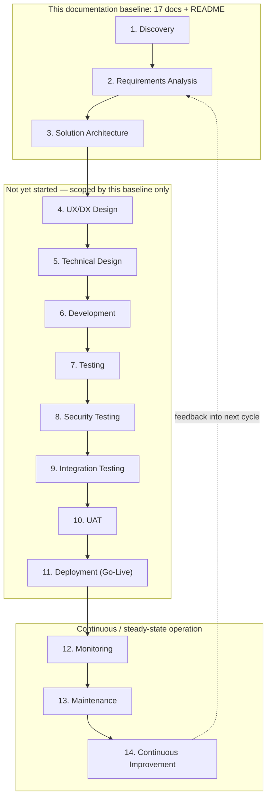

# 09 — SDLC Plan

## Company AI Application Deployment Platform

| Field | Value |
|---|---|
| Document ID | DOC-09 |
| Version | 0.1 |
| Status | Draft — Documentation Baseline |
| Prepared by | admin@sti-th.com (Senior SDLC Specialist / QA Architect) |
| Last updated | 2026-08-28 |
| Applies to | The platform itself (build/run of the Company AI Application Deployment Platform) — **not** the applications employees deploy through it |
| Related documents | 01_BRD.md, 02_Functional_Requirements.md, 03_Non_Functional_Requirements.md, 04_Business_Rules.md, 05_Process_Flows.md, 06_System_Requirements.md, 07_MCP_Requirements.md, 08_Company_Deployment_Skill.md, 10_System_Architecture.md, 11_Security_Requirements.md, 12_Data_Requirements.md, 13_API_Requirements.md, 14_Test_Strategy.md, 15_Traceability_Matrix.md, 16_Risk_Register.md, 17_Decision_Log.md, README.md |

---

## 1. Purpose and Scope

This document defines the Software/System Development Life Cycle (SDLC) used to **build, launch, and operate the Company AI Application Deployment Platform**. It is easy to conflate this with the deployment lifecycle the *platform itself executes for employee applications* (Request → Authentication → Authorization → Validation → Security Check → Build → Image Scan → Registry → Deployment → Health Check → Traffic Activation → Monitoring → Completed, documented in 05_Process_Flows.md and 06_System_Requirements.md). They are different things:

- **The platform's own SDLC** (this document): how the platform is analyzed, designed, built, tested, released, and evolved as a software product.
- **The application deployment lifecycle** (05_Process_Flows.md, 06_System_Requirements.md): what happens each time the platform deploys *someone else's* application.

This document defines the former: 14 phases, in order, each with Objective, Activities, Deliverables, Responsible Roles, Entry Criteria, Exit Criteria, Risks, and Quality Gates.

### 1.1 A note on roles vs. actors

The **SDLC delivery roles** used in this document (Business Analyst, Solution Architect, Product Owner, DevOps Architect, Platform Engineering, Security Team, IT Administrator, QA/Test Engineer, Employees/pilot users, Management) describe *who builds and operates the platform*. They are distinct from the **platform runtime actors** defined in 01_BRD.md (Employee/Application Developer, AI Coding Agent/Claude Code, IT Administrator, Platform Administrator, Application Owner, Security Administrator, Management/Auditor), who are *users of the finished platform*. Some individuals may occupy both a delivery role and a runtime actor role (e.g., an IT Administrator configures the platform during Development and later administers it as a runtime actor), but the two lists should not be merged.

---

## 2. This Document Set as a Phase Deliverable

**This entire 17-document baseline (01 through 17) plus README.md is itself the primary work product of Phases 1–3 (Discovery, Requirements Analysis, Solution Architecture).** Nothing in Phases 4 onward has started yet — no code, no MCP server, no Kubernetes/K3s manifests exist. Concretely:

| Phase | Primary documents produced or finalized in that phase |
|---|---|
| 1. Discovery | 01_BRD.md (business case, problem statement, scope, personas, AS-IS process); seed entries in 16_Risk_Register.md and 17_Decision_Log.md |
| 2. Requirements Analysis | 02_Functional_Requirements.md, 03_Non_Functional_Requirements.md, 04_Business_Rules.md, 05_Process_Flows.md (TO-BE process, lifecycles), 06_System_Requirements.md, 12_Data_Requirements.md, 13_API_Requirements.md (capability-level), 15_Traceability_Matrix.md (baseline); 01_BRD.md finalized |
| 3. Solution Architecture | 10_System_Architecture.md, 07_MCP_Requirements.md, 08_Company_Deployment_Skill.md, 11_Security_Requirements.md (architecture + threat model); this document (09_SDLC.md), 14_Test_Strategy.md, 16_Risk_Register.md, and 17_Decision_Log.md finalized as the closing artifacts of the baseline; README.md ties the set together |

Because these three phases are being executed together as a single documentation engagement, the boundary between them is expressed here as a **content boundary within each sibling document** (e.g., 01_BRD.md carries Discovery content, 06_System_Requirements.md carries Requirements Analysis content, 10_System_Architecture.md carries Solution Architecture content) rather than as three separately-dated releases. Phases 4–14 below describe work that has **not yet started** and is scoped, but not performed, by this baseline.

### 2.1 What is explicitly deferred to later phases (not decided here)

This baseline intentionally leaves the following as **TBD**, to be resolved as MVP-scoping and design decisions in UX/DX Design, Technical Design, and Development — and tracked in 17_Decision_Log.md:

- Final container platform selection (e.g., Docker Compose vs. K3s+Kubernetes vs. K3s+Knative vs. a managed container platform) — evaluated as options in 10_System_Architecture.md, decided in Technical Design.
- Exact CI runner / build pipeline tooling.
- Exact identity provider / SSO integration product.
- Exact secret store product.
- Exact image scanning tool.
- Exact numeric NFR targets not yet empirically validated (cold-start latency, idle-to-scale-zero window, throughput ceilings) — 03_Non_Functional_Requirements.md states target *categories and provisional values*; Performance/Cold Start/Scale-to-Zero Testing (Phase 7–9, see 14_Test_Strategy.md) validate or revise them.
- Full list of environments beyond dev/staging/production (e.g., whether a separate QA or pre-prod/pilot tier is permanent or temporary).
- Which specific pilot teams/applications participate in UAT.
- Unit test coverage threshold and other CI quality-gate thresholds.
- Approval-workflow tooling for production deploys (ticketing system integration vs. in-portal approval).
- Backup/DR tooling and exact RPO/RTO figures.

None of these block Discovery, Requirements Analysis, or Solution Architecture from completing — they are flagged as open decisions rather than silently assumed, per 17_Decision_Log.md.

---

## 3. Phase Sequence

Phases 1–11 are broadly sequential with formal exit gates; Phases 12–14 operate continuously/cyclically once the platform is live, and Phase 14 feeds new requirements back into Phase 2 for the next iteration (new supported stacks, new MCP tools, policy changes), spinning up a fresh, smaller pass through the same phase model.

---

## 4. Phase Definitions

### Phase 1 — Discovery

**Objective**
Establish the business case, problem statement, actor list, and high-level scope for the platform, and secure sponsorship before investing in detailed requirements work.

**Activities**
- Interview stakeholders (Engineering leadership, IT, Security, prospective employee users) to capture pain points with the current manual, IT-mediated deployment process (documented as AS-IS in 05_Process_Flows.md).
- Quantify the current-state IT workload baseline (tickets/month, average time-to-production) to anchor later KPIs.
- Identify the seven platform actors and draft their responsibilities/goals at a high level.
- Draft the core business objective, in/out-of-scope boundaries, and the v1 supported-stack candidate list.
- Assess organizational risk appetite for AI-agent-mediated deployment (Claude Code issuing deployment requests via MCP).
- Secure executive sponsorship and initial funding/time allocation.

**Deliverables**
- 01_BRD.md (Executive Summary, Background, Problem Statement, Business Opportunity, Business Objectives, Project Goals, Scope/Out-of-Scope, Stakeholders, User Personas, AS-IS Process)
- Seed entries in 16_Risk_Register.md and 17_Decision_Log.md

**Responsible Roles**
Business Analyst (lead), Product Owner (accountable), Management (sponsor), Solution Architect (advisory)

**Entry Criteria**
- Executive mandate exists to explore a self-service deployment platform
- Access to representative stakeholders across Engineering, IT, Security, and prospective employee users

**Exit Criteria**
- Business case, problem statement, and actor list approved by Product Owner/Management
- 01_BRD.md drafted through Section 13 (AS-IS Process) and reviewed by the sponsor

**Risks**
- Stakeholders disagree on what "self-service" means (fully autonomous vs. guided-and-approved)
- Security/compliance sensitivity of AI-mediated deployment underestimated at this early stage
- Scope creep before requirements are formalized

**Quality Gates**
- Discovery sign-off gate: Product Owner and Management formally approve the business case before Requirements Analysis begins

---

### Phase 2 — Requirements Analysis

**Objective**
Convert the Discovery business case into a complete, traceable set of functional and non-functional requirements, business rules, process flows, and module boundaries sufficient to drive architecture.

**Activities**
- Elicit functional requirements per module group (Authentication, Application Registration, Stack Management, Deployment Validation, Scale-to-Zero, Secret Management, Rollback, Audit, MCP Integration, etc.) covering the full deployment lifecycle.
- Elicit non-functional requirements (performance, scalability, availability, security, observability, recoverability) with measurable targets where determinable, TBD elsewhere.
- Document business rules (e.g., unsupported stacks fail validation before any Build stage; production deploys require approval; databases/static frontends are excluded from scale-to-zero).
- Formalize the TO-BE process flow and the fixed deployment lifecycle, and diff it against AS-IS.
- Define the deployment.yaml contract shape and the v1 supported-stack matrix (Frontend: React/Next.js/Vue; Backend: Go/Node.js/Python; Database: PostgreSQL; Cache: Redis).
- Decompose the system into MOD-01…MOD-19 and assign each a responsibility statement (06_System_Requirements.md).
- Identify major data entities (Application, Deployment, Secret, AuditLog, etc.) at requirements level.
- Draft high-level API capability groupings (Business API vs. MCP Interface vs. internal infrastructure APIs) without committing to a protocol.
- Build the initial Requirements Traceability Matrix (Business Objective → Requirement → Module).
- Run cross-functional review workshops (Security, IT, DevOps, prospective employee users) and log open items as TBD.

**Deliverables**
- 02_Functional_Requirements.md
- 03_Non_Functional_Requirements.md
- 04_Business_Rules.md
- 05_Process_Flows.md
- 06_System_Requirements.md
- 12_Data_Requirements.md
- 13_API_Requirements.md (capability level)
- 15_Traceability_Matrix.md (baseline)
- 01_BRD.md finalized (remaining sections: Business/Security/Compliance/Data/Audit/RBAC/Quota/Lifecycle requirements)

**Responsible Roles**
Business Analyst (lead), Product Owner (accountable), Solution Architect (contributor), Security Team (contributor), DevOps Architect (contributor), QA/Test Engineer (contributor — testability review)

**Entry Criteria**
- Discovery exit criteria met; 01_BRD.md's business case approved

**Exit Criteria**
- FR/NFR/business-rules documents reviewed and approved by Product Owner and Solution Architect
- Every module MOD-01…MOD-19 has at least one owning requirement
- No unresolved "critical" ambiguity remains in the deployment lifecycle definition

**Risks**
- Requirements written at infrastructure-detail level, leaking the abstraction the platform exists to hide from employees
- NFR targets fixed without engineering validation, forcing rework once measured
- Security requirements treated as an add-on late in elicitation rather than first-class from the start

**Quality Gates**
- Requirements baseline review: joint sign-off from Business Analyst, Solution Architect, Security Team, DevOps Architect, QA/Test Engineer
- Traceability check: every functional requirement traces to a business objective; every module has ≥1 requirement (15_Traceability_Matrix.md)

---

### Phase 3 — Solution Architecture

**Objective**
Define the target-state architecture — component boundaries, the Employee → Claude Code → Company Deployment Skill → Company Deployment MCP → Platform API → Deployment Engine → Container Platform integration chain, the security/trust model, and infrastructure options — sufficient to guide UX/DX and Technical Design.

**Activities**
- Design the logical architecture (Control Plane / Data Plane / AI Interface / Application Runtime) and the end-to-end request flow.
- Define the MCP tool surface as business-capability tools only (get_platform_info, get_supported_stacks, get_deployment_requirements, create_application, validate_application, deploy_application, get_application_status, get_deployment_status, get_application_logs, get_application_metrics, rollback_application, restart_application, delete_application) with no raw infrastructure operations exposed.
- Define the authorization/policy enforcement model: the platform independently authorizes and re-checks every request; it never trusts agent-asserted identity, role, or intent.
- Define the scale-to-zero architecture boundary (stateless web/API/worker services only; static frontends and databases explicitly excluded).
- Define the Company Deployment Skill's structure and responsibilities (instructing Claude Code to inspect the project, generate deployment.yaml, validate, and call the MCP — never manipulate infrastructure directly).
- Produce the Security Requirements architecture view and initial threat model (malicious employee, compromised AI agent, cross-application access, supply-chain risk, etc.).
- Evaluate infrastructure implementation options (Docker+Compose, K3s+Kubernetes, K3s+Knative, managed container platform) against scale-to-zero fit, operational complexity, cost, security, and IT workload; record a recommendation without over-committing implementation detail.
- Produce architecture, sequence, and lifecycle-state diagrams.
- Conduct an architecture review board pass.
- Consolidate all outstanding TBDs into 17_Decision_Log.md and finalize 16_Risk_Register.md and README.md for the baseline release.

**Deliverables**
- 10_System_Architecture.md
- 07_MCP_Requirements.md
- 08_Company_Deployment_Skill.md
- 11_Security_Requirements.md
- 09_SDLC.md (this document) and 14_Test_Strategy.md finalized
- 16_Risk_Register.md and 17_Decision_Log.md finalized for this baseline
- README.md

**Responsible Roles**
Solution Architect (lead, accountable), DevOps Architect (contributor), Security Team (contributor), Platform Engineering (contributor), IT Administrator (contributor), Business Analyst (informed), Management (informed)

**Entry Criteria**
- Requirements Analysis exit criteria met

**Exit Criteria**
- Architecture reviewed and approved by the architecture review board (Solution Architect + Security Team + DevOps Architect)
- Every module (MOD-01…MOD-19) is placed in the architecture with defined interfaces and an owner
- Security Team has explicitly accepted the trust-boundary and authorization model
- All 17 documents + README pass an internal consistency check (no missing FR→module mapping, no undocumented TBD)

**Risks**
- Implicitly trusting AI-agent-asserted context anywhere in the authorization path
- Over-scoping v1 architecture beyond the agreed supported-stack matrix
- Under-specifying the MCP tool boundary, leaving room for later scope creep toward raw infrastructure access
- Selecting an infrastructure option prematurely, before Technical Design can validate it against real NFR targets

**Quality Gates**
- Architecture Review Board approval gate
- Security Team sign-off on the trust boundary / authorization model
- **Baseline completion gate**: this is the gate at which the full 17-document + README set is considered complete and ready to hand off to Phase 4 (UX/DX Design)

---

### Phase 4 — UX/DX Design

**Objective**
Design the developer/employee experience of interacting with the platform — primarily conversational, through Claude Code and the Company Deployment Skill — plus the Administration Portal UI, so the deployment.yaml contract and MCP interactions are intuitive, safe, and low-friction.

**Activities**
- Design the interaction patterns between Employee, Claude Code, and the Company Deployment Skill (prompts, confirmations, error surfaces, how the skill explains rejections).
- Design the deployment.yaml authoring experience: sensible defaults, inline validation feedback, worked examples per supported stack combination.
- Design Administration Portal information architecture for IT Administrator, Platform Administrator, Security Administrator, and Management/Auditor personas (MOD-18).
- Design the production-approval UX (who approves, what they see, how the requester is notified).
- Design plain-language error/guardrail messaging for common rejections (unsupported stack, policy violation, quota exceeded).
- Run usability walkthroughs with representative Employees/pilot users and capture findings.

**Deliverables**
- UX/DX Design document (interaction flows, portal information architecture, deployment.yaml examples) — informs the eventual detailed design captured in 08_Company_Deployment_Skill.md and 06_System_Requirements.md (Administration Portal, Notification modules)
- Usability findings feeding Technical Design's error-message and MCP error-schema decisions

**Responsible Roles**
Product Owner (accountable), Solution Architect (contributor), Platform Engineering (contributor), Employees/pilot users (contributor — usability feedback), QA/Test Engineer (informed)

**Entry Criteria**
- Solution Architecture approved; MCP tool surface and actor list finalized

**Exit Criteria**
- UX/DX design reviewed and approved by Product Owner
- Interaction flows validated with at least one round of pilot-user feedback
- Error/guardrail messaging patterns agreed with Security Team

**Risks**
- Designing for power users only, undermining the low-friction self-service goal
- Administration Portal scope expanding beyond MVP administration needs
- Assuming conversational-agent behavior (e.g., reliable free-text parsing) that Claude Code cannot guarantee

**Quality Gates**
- UX/DX review gate: Product Owner sign-off plus a completed pilot-user feedback session

---

### Phase 5 — Technical Design

**Objective**
Produce detailed, buildable technical designs for each module (MOD-01…MOD-19), finalized MCP tool contracts, the finalized deployment.yaml schema, and integration contracts — the last documentation step before implementation.

**Activities**
- Detail module-level design: interfaces, data ownership, and state transitions across the deployment lifecycle for each of MOD-01…MOD-19.
- Finalize MCP tool contracts: input/output schema, error semantics, and idempotency guarantees (especially for deploy_application, rollback_application) per 07_MCP_Requirements.md.
- Finalize the deployment.yaml schema: validation rules, defaults, versioning strategy for future stack additions.
- Design the data model in detail (Application, ApplicationVersion, Deployment, DeploymentHistory, Secret, Domain, AuditLog, DeploymentApproval, MCPClient, etc.) building on 12_Data_Requirements.md.
- Design the observability model: log/metric/event schema and correlation of audit entries across the lifecycle.
- Select and document target environment topology (dev/staging/production at minimum; additional tiers per 17_Decision_Log.md).
- Make the infrastructure implementation decision (container platform selection) based on the Phase 3 evaluation plus any new technical spikes.
- Conduct module-by-module technical design review/walkthrough.

**Deliverables**
- Technical Design document(s), one per module or module group, building on 06_System_Requirements.md
- 07_MCP_Requirements.md and 13_API_Requirements.md finalized to contract level
- 12_Data_Requirements.md finalized to schema level
- Updated 17_Decision_Log.md closing implementation-level TBDs (container platform, CI runner, IdP, secret store)

**Responsible Roles**
Solution Architect (accountable), Platform Engineering (lead), DevOps Architect (contributor), Security Team (contributor), QA/Test Engineer (contributor — testability/design-for-test review)

**Entry Criteria**
- Solution Architecture and UX/DX Design approved

**Exit Criteria**
- Every module has an approved technical design with defined interfaces
- MCP tool contracts frozen for v1 (subsequent changes require change control)
- Security Team has reviewed authorization enforcement points at the design level

**Risks**
- Technical design drifting from the architecture's trust-boundary principles under implementation pressure
- Under-designing idempotency/retry semantics for deploy/rollback operations
- deployment.yaml schema not anticipating future stack additions, forcing a breaking change later

**Quality Gates**
- Design freeze gate: no further module-interface changes without change control, before Development starts
- Security design review sign-off

---

### Phase 6 — Development

**Objective**
Implement the platform's modules, MCP server, and Platform API according to the frozen technical design, following secure coding and incremental delivery practices.

**Activities**
- Stand up source control, branching strategy, and CI pipeline skeleton (CI tooling: TBD, see 17_Decision_Log.md).
- Implement modules iteratively, prioritizing the modules that gate all lifecycle flows first (MOD-16 MCP Server, MOD-17 Platform API, MOD-01 Identity & Access Management, MOD-04 Validation Engine, MOD-03 Deployment Manager).
- Implement deployment.yaml parsing/validation against the frozen schema.
- Implement authorization enforcement that is independently evaluated by the platform, never derived from agent-supplied claims.
- Implement audit logging (MOD-14) at every MCP tool call and every lifecycle-stage transition.
- Conduct code review and static analysis on every change.
- Write and maintain unit tests alongside implementation, per 14_Test_Strategy.md's Unit Testing section.

**Deliverables**
- Working software increments (internal builds; not part of the 17-document baseline)
- Change-controlled updates to Technical Design documents where implementation reveals necessary deviations
- Unit test suites (per 14_Test_Strategy.md)
- Container images published to a non-production registry

**Responsible Roles**
Platform Engineering (lead), DevOps Architect (accountable — build/CI), Solution Architect (contributor — design-conformance review), Security Team (contributor — secure-coding review), QA/Test Engineer (contributor — test scaffolding)

**Entry Criteria**
- Technical Design frozen and approved
- Development environment and CI pipeline available

**Exit Criteria**
- Planned MVP module set implemented and passing unit tests
- Code review and static-analysis gates passed for all merged code
- No open critical/high security findings from secure-coding review

**Risks**
- Scope creep beyond the frozen v1 supported-stack matrix
- MCP tool implementation exposing more capability than its contract allows
- Insufficient automated test coverage accumulating as technical debt

**Quality Gates**
- Definition of Done: reviewed, unit-tested, static-analysis-clean, merged via CI
- Module-level exit review against Technical Design before integration

---

### Phase 7 — Testing

**Objective**
Verify functional correctness of implemented modules against requirements through structured unit and functional test execution, per 14_Test_Strategy.md.

**Activities**
- Execute unit test suites per module/language.
- Execute functional test cases mapped to 02_Functional_Requirements.md.
- Verify deployment.yaml validation logic against the full supported-stack matrix (accept valid, reject invalid/unsupported).
- Verify MCP tool contracts against 07_MCP_Requirements.md (schema, error codes).
- Track defects, triage severity, and run fix-verify cycles.

**Deliverables**
- Test execution reports (14_Test_Strategy.md-aligned)
- Defect log and resolution status
- Updated 15_Traceability_Matrix.md linking requirements to executed test cases

**Responsible Roles**
QA/Test Engineer (lead, accountable), Platform Engineering (contributor — fixes), DevOps Architect (informed)

**Entry Criteria**
- Development exit criteria met for the build under test
- Test environment available (see 14_Test_Strategy.md environment strategy)

**Exit Criteria**
- All planned test cases executed; no open critical/high-severity defects
- 15_Traceability_Matrix.md confirms coverage of in-scope functional requirements

**Risks**
- Testing against an environment that doesn't represent production topology
- Flaky/non-deterministic tests masking real defects, particularly around async deploy-status polling

**Quality Gates**
- Test exit gate: QA sign-off required before Security Testing / Integration Testing begins

---

### Phase 8 — Security Testing

**Objective**
Independently verify the platform enforces its security model — authorization is never trusted from the agent, cross-application isolation holds, dangerous configurations are rejected, and production deploys require approval — before workloads flow through Integration Testing.

**Activities**
- Execute the Security Testing scenarios defined in 14_Test_Strategy.md (secret/database isolation, privileged-container rejection, unsupported-stack rejection, production-approval enforcement).
- Run static/dependency vulnerability scanning on the platform codebase and container images.
- Attempt authorization-bypass scenarios (agent claims an elevated role; platform must independently reject it).
- Review audit log completeness for every MCP tool invocation.
- Conduct a penetration-test-style review of the MCP Server and Platform API boundary (scope/vendor TBD).

**Deliverables**
- Security test report (referencing 14_Test_Strategy.md)
- Vulnerability scan results and remediation log
- Security sign-off record; any accepted exceptions logged in 17_Decision_Log.md

**Responsible Roles**
Security Team (lead, accountable), QA/Test Engineer (contributor), Platform Engineering (contributor — remediation), Management (informed for critical findings)

**Entry Criteria**
- Testing phase functional exit criteria met
- Security test environment available with representative policy configuration

**Exit Criteria**
- No open critical/high security findings
- All Security Testing scenarios in 14_Test_Strategy.md pass
- Security Team formal sign-off recorded

**Risks**
- Security testing treated as a late gate rather than continuous practice, causing rework pressure
- Incomplete audit coverage discovered only after go-live
- False confidence from testing only "happy path" authorization

**Quality Gates**
- Security sign-off gate: mandatory, non-bypassable before Integration Testing/UAT touch real employee data

---

### Phase 9 — Integration Testing

**Objective**
Verify the full deployment lifecycle works end-to-end across all integrated modules and external dependencies (container platform, CI, registry, identity provider) in a staging-like environment.

**Activities**
- Execute end-to-end lifecycle scenarios across the fixed lifecycle: Request → Authentication → Authorization → Validation → Security Check → Build → Image Scan → Registry → Deployment → Health Check → Traffic Activation → Monitoring → Completed.
- Execute failure/rollback branch scenarios.
- Verify module-to-module integration contracts (e.g., MOD-04 Validation Engine → MOD-05 Build Engine handoff).
- Verify integration with external systems (identity provider, container platform, registry — products TBD).
- Run a representative synthetic application set (per 14_Test_Strategy.md's Test Data Strategy) through the full pipeline.

**Deliverables**
- Integration test report
- Evidence of correct lifecycle state-machine behavior
- Updated defect log

**Responsible Roles**
QA/Test Engineer (lead), DevOps Architect (accountable), Platform Engineering (contributor), IT Administrator (contributor — environment/integration support), Security Team (informed)

**Entry Criteria**
- Security Testing sign-off obtained
- Staging environment provisioned and integrated with dependent systems

**Exit Criteria**
- All in-scope lifecycle scenarios pass, including at least one full failure/rollback path
- No open critical/high integration defects

**Risks**
- Staging environment configuration drifting from production, hiding integration defects
- External dependency instability (identity provider, container platform) blocking test execution

**Quality Gates**
- Integration exit gate: joint DevOps Architect + QA/Test Engineer sign-off

---

### Phase 10 — UAT

**Objective**
Validate with real Employees/pilot users and Application Owners that the platform meets business needs and is usable for real deployment scenarios before general availability.

**Activities**
- Select pilot applications/teams representative of the supported-stack matrix.
- Execute pilot deployments through the real Employee → Claude Code → Skill → MCP flow.
- Collect structured feedback against UAT acceptance criteria drawn from 01_BRD.md goals.
- Validate approval workflows with actual Application Owners/Security Administrators.
- Triage findings into must-fix (blocks GA) vs. backlog (post-GA improvement).

**Deliverables**
- UAT report and sign-off record
- Pilot feedback log
- Updated backlog feeding the Continuous Improvement phase

**Responsible Roles**
Employees/pilot users (lead — execute scenarios), Product Owner (accountable), QA/Test Engineer (contributor — facilitation), Business Analyst (contributor — feedback synthesis), Management (informed)

**Entry Criteria**
- Integration Testing exit criteria met
- Pilot users onboarded; pilot applications selected

**Exit Criteria**
- UAT acceptance criteria met, or deviations formally accepted by Product Owner/Management
- No open must-fix defects from pilot usage

**Risks**
- Pilot group too narrow to represent real usage diversity (stacks, team sizes, app complexity)
- Pilot users under time pressure giving shallow feedback

**Quality Gates**
- UAT sign-off gate: Product Owner + Management approval required before go-live

---

### Phase 11 — Deployment (Go-Live)

**Objective**
Release the platform itself into production operation — this is the platform's own go-live, distinct from the application deployments it later performs for employees.

**Activities**
- Finalize production environment configuration and cutover plan.
- Execute the go-live runbook, potentially with a phased/canary rollout to employee cohorts.
- Confirm the production-approval workflow is active and enforced from day one.
- Communicate availability, supported stacks, and support channels to employees.
- Establish production monitoring and on-call coverage before/at cutover.

**Deliverables**
- Deployment/go-live runbook and execution record
- Production readiness checklist sign-off
- Employee-facing communication/enablement materials

**Responsible Roles**
DevOps Architect (lead, accountable), Platform Engineering (contributor), IT Administrator (contributor), Security Team (informed — final production check), Management (approves go-live)

**Entry Criteria**
- UAT sign-off obtained
- Production environment provisioned and security-hardened
- On-call/support model defined

**Exit Criteria**
- Platform live in production with monitoring active
- Go-live checklist fully closed; no open blocking issues

**Risks**
- Cutover without an adequate rollback plan for the platform itself
- Production-approval workflow misconfigured at launch, allowing unapproved production app deploys

**Quality Gates**
- Go-live approval gate: joint Management + Security Team + DevOps Architect sign-off

---

### Phase 12 — Monitoring

**Objective**
Continuously observe platform health, usage, and lifecycle behavior in production to detect issues early and inform operational decisions.

**Activities**
- Operate dashboards for lifecycle-stage metrics (deployment success rate, cold-start latency, scale-to-zero behavior).
- Monitor audit logs for anomalous authorization patterns.
- Track SLO/NFR adherence against 03_Non_Functional_Requirements.md targets.
- Triage alerts and incidents by severity.
- Report platform health to Management/Auditor stakeholders.

**Deliverables**
- Operational dashboards and alerting configuration (tooling TBD)
- Periodic platform health reports
- Incident log

**Responsible Roles**
Platform Engineering (lead), DevOps Architect (accountable), Security Team (contributor — audit/anomaly review), Management (informed)

**Entry Criteria**
- Deployment phase exit criteria met (platform live)

**Exit Criteria**
- Continuous phase — reviewed via a recurring cadence (e.g., monthly) rather than a one-time gate

**Risks**
- Alert fatigue from poorly tuned thresholds
- Monitoring gaps for scale-to-zero edge cases (idle app appears "down" vs. correctly scaled to zero)

**Quality Gates**
- SLO review gate: recurring review against 03_Non_Functional_Requirements.md targets with corrective-action tracking

---

### Phase 13 — Maintenance

**Objective**
Keep the platform stable, secure, and current through patching, defect fixes, and supported-stack updates without disrupting employee deployments.

**Activities**
- Apply security patches to platform components and base images.
- Fix production defects per severity SLA.
- Update the supported-stack matrix as new runtimes/versions are validated.
- Manage deprecation of stack versions with employee communication.
- Periodically test disaster-recovery and rollback paths.

**Deliverables**
- Patch/release notes
- Updated 06_System_Requirements.md or 17_Decision_Log.md entries when module scope changes
- Maintenance/support SLA report

**Responsible Roles**
Platform Engineering (lead), DevOps Architect (accountable), Security Team (contributor — patch prioritization), IT Administrator (contributor)

**Entry Criteria**
- Platform in steady-state production operation

**Exit Criteria**
- Continuous phase — reviewed via periodic maintenance SLA reporting rather than a single exit gate

**Risks**
- Patch backlog growing due to competing feature priorities
- Undocumented drift between deployed configuration and the documented baseline

**Quality Gates**
- Patch SLA compliance gate (e.g., critical CVEs remediated within a defined window — exact SLA TBD, see 17_Decision_Log.md)

---

### Phase 14 — Continuous Improvement

**Objective**
Evolve the platform based on production usage data, employee feedback, and changing business needs, feeding future requirement cycles.

**Activities**
- Analyze usage/adoption metrics and deployment success trends against the KPIs defined in 01_BRD.md.
- Collect and prioritize employee/Application Owner feedback and feature requests.
- Run periodic retrospectives across Engineering, Security, and IT.
- Propose roadmap items (new supported stacks, new MCP tools, policy refinements) back into a new Requirements Analysis cycle.
- Update the documentation baseline (this 17-document set) as decisions are finalized.

**Deliverables**
- Roadmap/backlog updates
- Retrospective reports
- Change requests feeding a new iteration of 02_Functional_Requirements.md, 03_Non_Functional_Requirements.md, and 17_Decision_Log.md

**Responsible Roles**
Product Owner (lead, accountable), Business Analyst (contributor), Management (contributor — prioritization), all other roles (contributor as needed)

**Entry Criteria**
- Sufficient production operating history/data available (e.g., after an initial GA period)

**Exit Criteria**
- Continuous phase — reviewed via a recurring roadmap-planning cadence rather than a single exit gate

**Risks**
- Improvement backlog never prioritized against operational maintenance load
- Feedback loop bypassing the documentation baseline, causing drift between the real platform and the documented design

**Quality Gates**
- Roadmap review gate: recurring (e.g., quarterly) Product Owner + Management review

---

## 5. RACI Summary

R = Responsible, A = Accountable, C = Consulted, I = Informed. Roles: **BA** Business Analyst, **SA** Solution Architect, **PO** Product Owner, **DA** DevOps Architect, **PE** Platform Engineering, **SEC** Security Team, **ITA** IT Administrator, **QA** QA/Test Engineer, **EMP** Employees/pilot users, **MGT** Management.

| Phase | BA | SA | PO | DA | PE | SEC | ITA | QA | EMP | MGT |
|---|---|---|---|---|---|---|---|---|---|---|
| 1. Discovery | R | C | A | I | I | I | I | I | I | C |
| 2. Requirements Analysis | R | C | A | C | I | C | I | C | I | I |
| 3. Solution Architecture | I | R/A | C | C | C | C | C | I | I | I |
| 4. UX/DX Design | I | C | A | I | C | I | I | I | R | I |
| 5. Technical Design | I | A | I | C | R | C | I | C | I | I |
| 6. Development | I | C | I | A | R | C | I | C | I | I |
| 7. Testing | I | I | I | I | C | I | I | R/A | I | I |
| 8. Security Testing | I | I | I | I | C | R/A | I | C | I | I |
| 9. Integration Testing | I | I | I | A | C | I | C | R | I | I |
| 10. UAT | C | I | A | I | I | I | I | C | R | I |
| 11. Deployment (Go-Live) | I | I | I | R/A | C | C | C | I | I | C |
| 12. Monitoring | I | I | I | A | R | C | I | I | I | I |
| 13. Maintenance | I | I | I | A | R | C | C | I | I | I |
| 14. Continuous Improvement | C | C | R/A | C | C | C | C | C | C | C |

---

## 6. Cross-References

- Deliverables named 01–17 + README above refer to the sibling documents of this baseline: 01_BRD.md, 02_Functional_Requirements.md, 03_Non_Functional_Requirements.md, 04_Business_Rules.md, 05_Process_Flows.md, 06_System_Requirements.md, 07_MCP_Requirements.md, 08_Company_Deployment_Skill.md, 09_SDLC.md (this document), 10_System_Architecture.md, 11_Security_Requirements.md, 12_Data_Requirements.md, 13_API_Requirements.md, 14_Test_Strategy.md, 15_Traceability_Matrix.md, 16_Risk_Register.md, 17_Decision_Log.md, README.md.
- Testing phases (7–10) execute against the strategy defined in 14_Test_Strategy.md.
- Open decisions referenced throughout as TBD are consolidated in 17_Decision_Log.md.
- Module ownership (MOD-01…MOD-19) referenced throughout is detailed in 06_System_Requirements.md.
