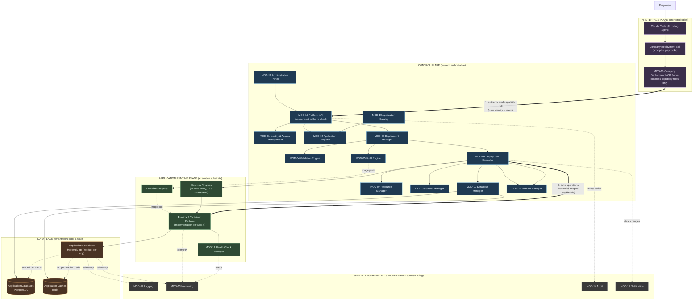

# 10. System Architecture

**Document:** 10_System_Architecture.md
**Project:** Company AI Application Deployment Platform
**Owner:** Solution Architecture / DevOps Architecture
**Status:** Draft for review — architecture recommendations pending Platform Administrator / IT Administrator sign-off (see open items tracked in `17_Decision_Log.md`)
**Related documents:** `03_Non_Functional_Requirements.md` (NFR targets referenced by category only), `06_System_Requirements.md` (per-module functional detail for MOD-01..19), `17_Decision_Log.md` (formal decision register for all TBD items raised here)

---

## 1. Architecture Overview & Principles

### 1.1 Purpose

This document defines the logical system architecture of the Company AI Application Deployment Platform: how the platform's modules are grouped into trust planes, how a deployment request flows end-to-end, how the underlying infrastructure implementation is chosen, and how tenants (applications) are isolated from one another. It is the single owning document for the logical architecture diagram and the infrastructure-option evaluation; sibling documents reference this document rather than repeating these artifacts.

### 1.2 Governing Architectural Principle

The platform is built around one non-negotiable request path:

```
Employee → Claude Code → Company Deployment Skill → Company Deployment MCP
         → Company Platform API → Deployment Controller → Container Platform → Application
```

Expressed as a layered abstraction, every deployment-affecting action must traverse:

```
AI Agent  →  MCP  →  Platform API  →  Deployment Controller  →  Infrastructure
```

No layer may be skipped. In particular:

- **Claude Code and the Company Deployment Skill never talk to infrastructure directly.** They only ever call the Company Deployment MCP's business-level tools (`get_platform_info`, `get_supported_stacks`, `validate_application`, `create_application`, `deploy_application`, `get_deployment_status`, `get_application_status`, `get_application_logs`, `get_application_metrics`, `rollback_application`, `restart_application`, `delete_application`).
- **The MCP is a thin, trusted-but-not-privileged translator.** It never exposes `kubectl`, a Docker daemon socket, host filesystem access, arbitrary container exec, arbitrary network configuration, or arbitrary infrastructure-resource creation. It has no standing infrastructure credentials of its own beyond what it needs to call the Platform API on behalf of an authenticated user.
- **The Platform API is the real security boundary**, not the MCP and not the AI agent. Every business capability the MCP exposes is re-validated and re-authorized at the Platform API using the caller's actual identity and entitlements — the platform must never trust the AI agent, the skill, or the MCP layer to have already "done" authorization correctly. This is restated explicitly in §2.3 and enforced structurally in the sequence diagram in §4.
- **Only the Deployment Controller (and the modules it delegates to) is permitted to speak to infrastructure.** Everything below the Platform API is infrastructure implementation detail and is intentionally replaceable (see §5) without changing the contract employees, Claude Code, or the MCP rely on.

### 1.3 Infrastructure Abstraction Principle

Employees and Claude Code interact exclusively with the **application-level `deployment.yaml` contract** — a declarative, business-oriented description of an application (runtimes, ports, database needs, scaling envelope, resource tier, domain visibility). They never author or see raw Kubernetes manifests, Helm charts, Docker Compose files, Nginx configuration, TLS certificate material, DNS records, or container networking rules. Translating the business-level contract into infrastructure-level resources is entirely the responsibility of the Deployment Controller and the modules beneath the Platform API. This separation is what allows the underlying runtime technology (§5) to be chosen, changed, or evolved over time without impacting the employee- or AI-agent-facing contract.

### 1.4 Extensible Supported-Stack Principle

The set of supported application technologies (frontend/backend runtimes, database, cache) is **IT-governed and centrally declared**, not hard-coded into the Platform API's core logic. The Validation Engine (MOD-04) consults a supported-stack registry (surfaced to agents via `get_supported_stacks`) so that:

- Unsupported technology choices fail fast, at `validate_application` time, before any build or deployment resources are consumed.
- Adding a new supported runtime, database engine, or cache is a registry/configuration change reviewed by IT, not a platform redesign or a change to MOD-01..19's architecture.

### 1.5 Trust Principle Summary

| Principle | Statement |
|---|---|
| Layered mediation | AI Agent → MCP → Platform API → Deployment Controller → Infrastructure; no layer bypassed |
| AI agent is not a trust boundary | Every capability call is independently authorized at the Platform API against the caller's real identity, regardless of what the MCP or skill already checked |
| Infrastructure abstraction | Employees/agents interact only with `deployment.yaml`; raw infra manifests never surface to them |
| MCP capability minimalism | MCP exposes only coarse, business-level operations; never raw infra control primitives |
| Stack governance | Supported stacks are centrally declared and independently extensible |

---

## 2. Logical Architecture Diagram

### 2.1 Diagram

The diagram groups all MOD-01..19 modules into four trust/responsibility planes: **AI Interface**, **Control Plane**, **Application Runtime**, and **Data Plane**. Cross-cutting modules (Logging, Monitoring, Audit, Notification) are rendered as a shared observability spine consumed by every plane rather than owned by one.



> Note on Build Engine placement: MOD-05 Build Engine is drawn inside the Control Plane because it is orchestrated and policy-gated by the Deployment Manager (it only builds validated, registered applications), even though its output (container images) is handed off into the Application Runtime plane via the Container Registry. This mirrors the "Control Plane decides, Runtime plane executes" separation used throughout this document.

### 2.2 Plane Descriptions and Trust Boundaries

**AI Interface Plane** — Claude Code, the Company Deployment Skill, and the Company Deployment MCP Server (MOD-16). This plane is where an employee's intent is translated into structured tool calls. It is treated as an **untrusted caller** from the platform's point of view: it authenticates as a specific employee (via IAM-issued, short-lived credentials/tokens obtained through the employee's own login — never a shared service credential embedded in the skill or agent), and it may only invoke the fixed set of coarse-grained MCP capabilities. It holds no direct infrastructure credentials, no standing elevated privileges, and no ability to construct arbitrary infrastructure operations. Its responsibility is UX and workflow orchestration on behalf of the employee, not policy enforcement.

**Control Plane** — MOD-01 IAM, MOD-02 Application Registry, MOD-03 Deployment Manager, MOD-04 Validation Engine, MOD-05 Build Engine, MOD-06 Deployment Controller, MOD-07 Resource Manager, MOD-08 Secret Manager, MOD-09 Database Manager, MOD-10 Domain Manager, MOD-17 Platform API, MOD-18 Administration Portal, MOD-19 Application Catalog. This is the platform's **authoritative, trusted core**. It is the only plane permitted to authenticate/authorize requests, decide policy, allocate resources, mint credentials, and issue infrastructure-changing commands. It is operated and change-managed by the Platform Engineering / IT team, not by application developers. Nothing in the Control Plane trusts the caller's self-reported claims; all decisions are re-derived from IAM-verified identity, stored application state, and policy rules.

**Application Runtime Plane** — the Container Registry, the Runtime/Container Platform (implementation selected per §5), the Gateway/ingress layer, and the Health Check Manager (MOD-11). This plane is the **execution substrate**: it runs what the Control Plane instructs it to run, exposes what the Domain Manager/Gateway configuration says to expose, and reports health/readiness back up. It has no decision-making authority of its own — it does not decide *whether* something should be deployed, only *how* to run what it has already been told, by the Control Plane, to run.

**Data Plane** — the running application containers (frontend/api/worker instances per application) plus the databases and caches those applications own. This plane holds **tenant workloads and tenant state**. Each application's containers and data stores are logically isolated from every other application's (see §7). The Data Plane is the least trusted plane from the platform's own perspective — application code here is employee-authored and may be arbitrary — so it is deliberately given no path back into the Control Plane; it can only reach the platform through the same Platform API surface any other authenticated caller would use (e.g., a running app cannot call the Deployment Controller directly).

**Shared Observability & Governance spine** — Logging (MOD-12), Monitoring (MOD-13), Audit (MOD-14), Notification (MOD-15). These modules are cross-cutting: they collect telemetry and events from every plane but do not themselves make control decisions. Audit in particular records every Platform API decision (allow and deny) independently of the AI Interface plane, so that "what the agent claims it did" and "what the platform actually authorized" can always be reconciled.

### 2.3 Boundary Crossing: AI Interface → Control Plane

- **What crosses:** a structured MCP tool invocation (e.g., `deploy_application(app_id, environment)`) carrying the employee's authenticated identity/session context and the business-level intent — never raw infrastructure parameters.
- **How it's authenticated:** the employee authenticates to the platform through the company's existing identity provider (SSO/OIDC, federated via MOD-01 IAM); the MCP forwards this as a verifiable, short-lived credential (e.g., token) on every call — it does not maintain its own separate identity system and does not impersonate the user with a long-lived static secret.
- **How it's authorized:** the Platform API (MOD-17) independently re-validates the token with MOD-01 IAM, re-resolves the caller's roles/entitlements and the target application's ownership, and re-checks the requested action against policy (quota, environment permissions, application ownership, stack support) **regardless of any validation the Skill, MCP, or agent already performed**. A capability the MCP happens to expose is not itself an authorization — see §4 for the explicit re-check step in the deploy sequence.
- **What must never cross:** kubectl-equivalent commands, container exec requests, raw manifests, infrastructure credentials, or any request shape that names a specific infrastructure primitive (pod, node, volume, etc.) rather than a business object (application, environment, deployment).

### 2.4 Boundary Crossing: Control Plane → Application Runtime

- **What crosses:** fully-resolved, policy-approved infrastructure operations issued only by the Deployment Controller (MOD-06) — e.g., "run this built image as service X with these resource limits, this scaling envelope, and this network exposure" — plus read-path queries for status/logs/metrics.
- **How it's authenticated:** the Deployment Controller uses controller-scoped service credentials that are provisioned, rotated, and constrained by the platform's own secret management (MOD-08), never credentials derived from or passed through the employee/agent request.
- **How it's authorized:** authorization already happened in the Control Plane (§2.3); the Runtime plane trusts the Deployment Controller as its sole control-plane caller and does not perform business-level policy evaluation itself — it enforces only infrastructure-level guardrails (namespace/tenant boundaries, resource quotas, network policy) that the Resource Manager and Domain Manager configured on the tenant's behalf.
- **What must never cross:** direct employee/agent access to the runtime platform's control surface; any runtime-plane component accepting instructions from a source other than the Deployment Controller.

---

## 3. Component Responsibility Table

| Component | Plane | Primary Responsibility | Talks To |
|---|---|---|---|
| Claude Code | AI Interface | AI coding agent used by the employee; invokes the Company Deployment Skill/MCP on the employee's behalf | Company Deployment Skill |
| Company Deployment Skill | AI Interface | Provides Claude Code with the playbooks/prompts for authoring `deployment.yaml` and invoking MCP tools correctly | Claude Code, MOD-16 MCP Server |
| MOD-16 MCP Server | AI Interface | Exposes only the fixed business-capability tool set; translates agent intent into Platform API calls; carries no infra credentials | Company Deployment Skill, MOD-17 Platform API |
| MOD-17 Platform API | Control Plane | Single trusted entry point; independently authenticates and authorizes every request; orchestrates calls into the rest of the Control Plane | MCP Server, MOD-01 IAM, MOD-02 Registry, MOD-03 Deployment Manager, MOD-14 Audit, MOD-18 Admin Portal |
| MOD-01 Identity & Access Management | Control Plane | Authenticates employees/service identities; issues/validates tokens; resolves roles and entitlements | Platform API, all Control Plane modules requiring identity checks |
| MOD-02 Application Registry | Control Plane | System of record for applications, their `deployment.yaml`, ownership, and versions | Platform API, MOD-19 Catalog, MOD-03 Deployment Manager |
| MOD-03 Deployment Manager | Control Plane | Orchestrates the deployment workflow: validate → build → deploy → verify; sequences MOD-04/05/06 | Platform API, Validation Engine, Build Engine, Deployment Controller |
| MOD-04 Validation Engine | Control Plane | Validates `deployment.yaml` against the supported-stack registry and platform policy before any build/deploy work begins | Deployment Manager, Application Registry |
| MOD-05 Build Engine | Control Plane (orchestration) / hands off to Runtime Plane | Builds application source into container images per the supported-stack build templates | Deployment Manager, Container Registry |
| MOD-06 Deployment Controller | Control Plane (boundary to Runtime Plane) | Sole authority translating an approved deployment into Runtime Platform operations; the only component permitted to instruct the Runtime Platform | Deployment Manager, Resource Manager, Secret Manager, Database Manager, Domain Manager, Runtime Platform |
| MOD-07 Resource Manager | Control Plane | Enforces resource tiers/quotas and scaling envelopes (min/max, scale-to-zero policy) per application | Deployment Controller, Runtime Platform |
| MOD-08 Secret Manager | Control Plane | Issues and scopes per-application secrets/credentials (DB creds, API keys); prevents cross-application secret access | Deployment Controller, Database Manager, Runtime Platform (secret injection only) |
| MOD-09 Database Manager | Control Plane | Provisions and manages per-application PostgreSQL/Redis instances; keeps persistent data lifecycle independent of app container scaling | Deployment Controller, Secret Manager, Data Plane databases/caches |
| MOD-10 Domain Manager | Control Plane | Assigns internal/external URLs per `domain.visibility`, coordinates TLS/DNS concepts with the Gateway | Deployment Controller, Gateway |
| MOD-11 Health Check Manager | Application Runtime | Continuously probes application readiness/liveness; feeds scaling and routing decisions | Runtime Platform, Monitoring |
| MOD-12 Logging | Cross-cutting (Observability) | Centralized log collection for platform and application components | All planes (telemetry producers) |
| MOD-13 Monitoring | Cross-cutting (Observability) | Metrics, dashboards, alerting on platform and application health/performance | All planes (telemetry producers), Notification |
| MOD-14 Audit | Cross-cutting (Governance) | Immutable record of every authorization decision and control action, independent of agent self-reporting | Platform API, Deployment Controller |
| MOD-15 Notification | Cross-cutting (Observability) | Delivers deployment/status/alert events to owners and IT | Deployment Manager, Monitoring, employees |
| MOD-18 Administration Portal | Control Plane | Human (IT/Platform Admin) UI for policy, quotas, approvals, and platform oversight | Platform API |
| MOD-19 Application Catalog | Control Plane | Employee-facing catalog/discovery of existing applications and their status | Application Registry, Platform API |
| Container Registry | Application Runtime | Stores built, versioned container images | Build Engine, Runtime Platform |
| Runtime / Container Platform | Application Runtime | Executes application containers; implements scale-to-zero and scaling policy at the infrastructure level | Deployment Controller, Container Registry, Gateway, Health Check Manager |
| Gateway / Ingress | Application Runtime | Reverse proxy, TLS termination, internal/external routing per Domain Manager configuration | Domain Manager, Runtime Platform, Employees/end users (data-plane traffic) |
| Application Containers | Data Plane | Run the employee's actual application services (frontend/api/worker) | Runtime Platform, application's own database/cache only |
| Application Databases (PostgreSQL) | Data Plane | Persistent, per-application relational storage; lifecycle independent of container scale-to-zero | Database Manager (provisioning), owning application's containers only |
| Application Caches (Redis) | Data Plane | Per-application caching; lifecycle independent of container scale-to-zero | Database Manager (provisioning), owning application's containers only |

---

## 4. Request/Deploy Sequence

The following sequence covers a full `deploy_application` call, from the employee's request in Claude Code through to a running application reachable at a platform-issued URL. It explicitly shows the **independent policy/authorization re-check at the Platform API**, distinct from any validation already performed by the Skill or MCP.

```mermaid
sequenceDiagram
    autonumber
    actor Emp as Employee
    participant CC as Claude Code
    participant Skill as Company Deployment Skill
    participant MCP as MOD-16 MCP Server
    participant API as MOD-17 Platform API
    participant IAM as MOD-01 IAM
    participant DM as MOD-03 Deployment Manager
    participant VE as MOD-04 Validation Engine
    participant BE as MOD-05 Build Engine
    participant DC as MOD-06 Deployment Controller
    participant RM as MOD-07 Resource Manager
    participant SM as MOD-08 Secret Manager
    participant DBM as MOD-09 Database Manager
    participant DomM as MOD-10 Domain Manager
    participant RT as Runtime Platform
    participant GW as Gateway
    participant Aud as MOD-14 Audit

    Emp->>CC: "Deploy the overtime app"
    CC->>Skill: Load deployment playbook
    Skill->>MCP: deploy_application(app_id, environment)
    Note over MCP: MCP forwards employee's authenticated<br/>session token; carries no infra credentials

    MCP->>API: POST deploy_application (token, app_id, environment)
    API->>IAM: Verify token, resolve roles & app ownership
    IAM-->>API: Identity confirmed + entitlements

    rect rgb(40,55,75)
    Note over API: INDEPENDENT AUTHZ RE-CHECK (never trusts MCP/agent)
    API->>API: Re-check: caller owns/has-role-on app_id?<br/>Environment permitted? Quota available?<br/>Prior validation still current?
    end

    alt Authorization denied
        API-->>Aud: Log denied attempt
        API-->>MCP: 403 Forbidden (reason)
        MCP-->>Skill: Denial + reason
        Skill-->>CC: Explain denial to employee
        CC-->>Emp: "Deployment blocked: <reason>"
    else Authorization granted
        API-->>Aud: Log authorized deploy request
        API->>DM: Orchestrate deploy(app_id, environment)

        DM->>VE: Validate deployment.yaml
        VE->>VE: Check stacks/policy against<br/>supported-stack registry
        alt Validation fails
            VE-->>DM: Invalid (unsupported stack / policy violation)
            DM-->>API: Validation error
            API-->>MCP: 422 Validation failed
            MCP-->>Skill: Validation error detail
            Skill-->>CC: Surface actionable error
            CC-->>Emp: "Fix required: <detail>"
        else Validation passes
            VE-->>DM: Valid
            DM->>BE: Build container image(s)
            BE-->>DM: Build complete (image refs)

            DM->>DC: Deploy approved, built application
            DC->>RM: Reserve resource tier + scaling envelope (incl. scale-to-zero policy)
            RM-->>DC: Resources allocated
            DC->>SM: Issue scoped secrets (DB creds, app secrets)
            SM-->>DC: Secrets provisioned (application-scoped only)
            DC->>DBM: Provision/attach database & cache (if declared)
            DBM-->>DC: Database/cache ready
            DC->>RT: Run services per deployment.yaml (images, limits, scaling)
            RT-->>DC: Services scheduled

            DC->>DomM: Assign URL per domain.visibility (internal/external)
            DomM->>GW: Configure routing + TLS termination
            GW-->>DomM: Route active

            RT-->>DC: Health checks passing (MOD-11)
            DC-->>DM: Deployment successful
            DM-->>API: Deployment status: RUNNING, url=<assigned URL>
            API-->>Aud: Log successful deployment
            API-->>MCP: 200 OK { status: RUNNING, url }
            MCP-->>Skill: Deployment result
            Skill-->>CC: Summarize result
            CC-->>Emp: "Deployed. Available at <url>"
        end
    end
```

Key architectural points illustrated by this sequence:

1. The MCP never decides authorization — it only forwards the employee's credential and the requested business action.
2. The Platform API's authorization re-check (step highlighted) is **independent** of anything the Skill/agent asserts; it is re-derived from IAM and the stored application ownership/quota state.
3. Validation (MOD-04) occurs after authorization but before any build/infrastructure cost is incurred, consistent with the extensible supported-stack principle (§1.4).
4. Only the Deployment Controller (MOD-06) ever calls into the Runtime Platform; Resource Manager, Secret Manager, Database Manager, and Domain Manager are all invoked by the Controller, not by the Deployment Manager or API directly, preserving the single infrastructure-facing choke point described in §1.2.
5. Every decision point (allow and deny) is written to Audit (MOD-14) independently of what is reported back to the employee.

---

## 5. Infrastructure Evaluation

### 5.1 Purpose and Evaluation Stance

This section evaluates candidate implementations for the **Runtime/Container Platform** layer identified in §2 (i.e., what actually executes application containers beneath the Deployment Controller). Per §1.3, this choice is an implementation detail hidden from employees and Claude Code — nothing above the Deployment Controller changes based on this decision. The evaluation is deliberately **not** a popularity contest; it is scored against the platform's stated primary business objective — *minimize IT operational workload while maintaining security and control* — and the platform's hard requirements (scale-to-zero for stateless workloads, persistent databases isolated from app-container scaling, AI-agent-safe abstraction via the MCP).

### 5.2 Candidate Options

- **Option A — Docker + Docker Compose:** single-host (or lightly orchestrated multi-host) container execution using Compose files as the deployment unit.
- **Option B — K3s + Kubernetes:** lightweight, CNCF-conformant Kubernetes distribution, self-hosted, using native Kubernetes workload primitives (Deployments/Services/HPA) without a serverless layer.
- **Option C — K3s + Knative:** the same self-hosted Kubernetes base, with Knative Serving layered on top to provide native request-driven autoscaling including scale-to-zero.
- **Option D — Managed Container Platform:** a cloud provider's managed container/serverless-container service (e.g., a managed Kubernetes offering or managed serverless-container product) where the control plane and much of the operational burden is owned by the vendor.

### 5.3 Scoring Table

Scale: 1 = Poor / High burden, 5 = Excellent / Low burden. For **Operational complexity** and **IT operational workload**, a higher score means *lower* burden (i.e., 5 = least IT effort), so all columns read consistently as "5 is the desirable direction."

| Dimension | A: Docker Compose | B: K3s + Kubernetes | C: K3s + Knative | D: Managed Container Platform |
|---|---|---|---|---|
| Scale-to-zero support | 1 (not native; needs bespoke scripting) | 2 (possible via HPA/KEDA add-ons, not native) | 5 (native, request-driven) | 4–5 (native on most serverless-container offerings; varies by vendor product chosen) |
| Operational complexity (5 = lowest burden) | 4 (simple, but scales poorly beyond single host) | 2 (full Kubernetes surface area to operate) | 2 (Kubernetes + Knative surface area) | 5 (vendor operates the control plane) |
| Cost (5 = lowest direct cost, self-hosted infra assumed for A–C) | 5 (minimal infra footprint) | 3 (cluster nodes + ops time) | 3 (cluster nodes + ops time, similar footprint to B) | 3 (no cluster ops cost, but managed-service premium; can be cost-efficient at low/variable load due to scale-to-zero) |
| Security | 2 (weak multi-tenant isolation primitives out of the box) | 4 (mature RBAC, network policy, namespace isolation) | 4 (inherits Kubernetes security model) | 4–5 (vendor-hardened control plane plus platform-configured tenant isolation) |
| Self-hosting capability | 5 (fully self-hosted) | 5 (fully self-hosted) | 5 (fully self-hosted) | 1–2 (typically vendor/cloud-dependent; some hybrid options exist) |
| Maintainability | 3 (simple but brittle at scale; manual host patching) | 2 (upgrades, etcd, node lifecycle all owned by IT) | 2 (all of B's burden plus Knative lifecycle) | 5 (vendor handles upgrades/patching of the platform itself) |
| Developer experience | 2 (no built-in service discovery/scaling ergonomics) | 3 (powerful but verbose without a platform layer) | 4 (declarative, scaling "just works" once abstracted) | 4 (typically good ergonomics, some vendor lock-in in tooling) |
| AI deployment compatibility (fit with MCP business-capability abstraction) | 3 (abstractable, but scale-to-zero/networking gaps must be hand-built into the Controller) | 3 (abstractable; rich primitives make it a solid target for the Controller to drive) | 5 (primitives map cleanly onto `deploy_application`/scaling business concepts) | 4 (abstractable; some vendor-specific API quirks the Controller must absorb) |
| Future scalability | 2 (not designed for multi-tenant growth) | 4 (industry-standard scaling path) | 5 (scaling + scale-to-zero designed in) | 4 (scales well, bounded by vendor service limits/quotas) |
| IT operational workload (5 = lowest ongoing workload) | 4 (low workload while small, degrades as usage grows) | 2 (highest ongoing operational burden: cluster, upgrades, security patching) | 2 (same burden as B, plus Knative) | 5 (lowest ongoing workload; vendor absorbs most operations) |

### 5.4 Rationale per Option

**Option A — Docker + Docker Compose.** Simplest possible starting point and genuinely low-cost/low-complexity at very small scale, but it structurally cannot deliver two hard platform requirements: native scale-to-zero and strong per-application multi-tenant isolation (network/secret/resource boundaries between applications are largely manual conventions rather than platform-enforced primitives). Every gap (scaling, isolation, TLS, routing) would have to be reinvented as custom scripting behind the Deployment Controller, which itself becomes a long-term maintenance liability and works directly against the "minimize IT operational workload" objective once more than a handful of applications are onboarded. Best understood as a bootstrap/prototyping substrate, not a durable target.

**Option B — K3s + Kubernetes.** Solves isolation, resource management, and future scalability well, and is fully self-hostable, which matters if on-prem/data-residency constraints apply (see open item in §5.6). However, it does not natively provide scale-to-zero — that would require bolting on additional components (e.g., an autoscaling add-on) and operating them — and it hands the IT team the single largest ongoing workload of all four options: cluster lifecycle, node patching, upgrades, etcd management, and ongoing security hardening. This directly conflicts with the platform's primary objective of *minimizing* IT operational workload, even though it is technically capable.

**Option C — K3s + Knative.** Inherits Kubernetes' isolation and scalability strengths and adds native, request-driven scale-to-zero, which maps directly onto the platform's stated scaling requirement (stateless services 0→N→0; databases excluded from this behavior, which Knative's model naturally supports by only fronting stateless request-driven services). Its resource model (Services/Revisions with declarative scaling bounds) also maps unusually cleanly onto the business-level `deployment.yaml` contract (`scaling.min`/`scaling.max`), which makes the Deployment Controller's translation layer simpler and more robust — a genuine AI-deployment-compatibility advantage. The tradeoff is that it carries all of Option B's cluster-operations burden *plus* the added lifecycle of Knative itself, so it does not reduce IT operational workload versus B — it only makes the platform more capable for the same (high) workload.

**Option D — Managed Container Platform.** Best score on the two dimensions tied directly to the platform's primary objective: operational complexity and IT operational workload, because the vendor owns control-plane operations, patching, and much of the underlying security hardening. It also typically offers native or near-native scale-to-zero on serverless-container products, strong default isolation, and good developer/AI-deployment ergonomics. The tradeoffs are reduced self-hosting capability (relevant only if there is a hard on-prem/data-residency requirement — currently a TBD, see §5.6) and a degree of vendor dependency/lock-in on the specific managed product's API surface, which the Deployment Controller would need to abstract carefully to preserve the platform's technology-neutral contract (§1.3).

### 5.5 Recommendation (Architecture Recommendation — pending Platform Administrator / IT Administrator sign-off)

Grounding the decision strictly in the stated primary business objective — **minimize IT operational workload while maintaining security and control** — rather than technology popularity:

- Option A is disqualified as a long-term target: it cannot meet the scale-to-zero and isolation requirements without IT reinventing platform capabilities by hand.
- Option B is technically sound but scores worst on the objective itself (highest IT operational workload) while still not natively delivering scale-to-zero — it asks IT to carry Kubernetes' full operational cost without getting the platform's key scaling requirement "for free."
- Option C delivers the strongest technical fit (native scale-to-zero, clean AI-deployment mapping, full self-hosting, good security) but does not reduce operational workload versus B — it is the right *capability* profile but the wrong *operating-cost* profile for a team whose explicit goal is minimizing that cost.
- Option D best serves the stated objective directly: lowest operational complexity and IT workload, strong security/isolation delegated to a vendor-hardened control plane, native scale-to-zero, and a clean fit for the MCP/business-capability abstraction — at the cost of self-hosting capability and some vendor coupling.

**Recommendation: adopt a phased path — start on Option D (Managed Container Platform) as the primary implementation target, and treat Option C (K3s + Knative) as the fallback/evolution path if a firm on-prem or data-residency requirement is confirmed that Option D cannot satisfy.**

Justification for the phased framing rather than an outright single pick:

1. The single largest architectural risk named in the business context is IT operational overload, not technology capability — Option D directly minimizes that risk on day one and lets the platform launch with the fewest new operational skills for IT to acquire.
2. Because the Deployment Controller (MOD-06) is the only component that speaks to infrastructure (§1.2–§1.3), the choice between D and C is genuinely swappable later without touching the employee-, Claude Code-, or MCP-facing contract — the `deployment.yaml` schema, the MCP tool surface, and every module above the Controller are unaffected either way.
3. If, during Decision Log review, IT/Security confirms a hard requirement to self-host (data residency, network isolation from any cloud vendor, procurement constraints), Option C is the best-scoring self-hosted option and should be adopted directly, accepting its higher operational workload as a necessary cost of that constraint — Option B should not be chosen in that scenario, since it carries the same operational cost as C without native scale-to-zero.
4. Option A may still be used tactically as an early local/dev-loop or proof-of-concept substrate for the platform team itself, but must not be presented to employees as the production Runtime Platform.

This recommendation is an architecture recommendation only. Final selection (including specific vendor/product for Option D, or confirmation to proceed with Option C) is a decision for Platform Administrator / IT Administrator sign-off and must be recorded in `17_Decision_Log.md`.

### 5.6 Open Items Feeding the Decision Log

| Item | Why it matters | Status |
|---|---|---|
| Cloud vs. on-premises hosting constraint | Directly determines whether Option D is admissible at all | TBD |
| Specific managed-platform vendor/product (if Option D confirmed) | Affects API surface the Deployment Controller must abstract, cost model, region availability | TBD |
| Data residency / regulatory constraints | May force Option C regardless of operational-workload tradeoff | TBD |
| Final Runtime Platform selection | Formal ratification of §5.5 recommendation | TBD — Recommendation pending Platform Admin/IT sign-off |

---

## 6. Networking & Domain Architecture (Logical Level)

This section describes networking and domain concepts at the business/logical level only. No actual reverse-proxy configuration, DNS zone files, or certificate material is defined here — those are Runtime Platform implementation details owned by whichever option is selected in §5, configured automatically by MOD-10 Domain Manager and MOD-06 Deployment Controller.

### 6.1 Gateway Concept

All external and internal traffic to application containers passes through a single logical **Gateway** (reverse-proxy concept) sitting at the edge of the Application Runtime plane (§2). The Gateway is the only network entry point applications receive; application containers are never directly reachable from outside the Runtime Platform. Conceptually the Gateway is responsible for:

- Terminating TLS so that individual applications never need to manage certificates themselves.
- Routing an inbound request to the correct application/service based on the assigned URL.
- Enforcing the internal/external visibility distinction described below.

### 6.2 Visibility: `domain.visibility` (internal vs. external)

Every application's `deployment.yaml` declares `domain.visibility` (e.g., `internal` or `external`). The Domain Manager (MOD-10) uses this business-level declaration — never a networking-level input from the employee or agent — to decide, at the logical level:

- **`internal`** — the application is reachable only from within the company network/identity boundary (e.g., only for employees on the corporate network or via the corporate identity-aware access path). No path from the public internet exists.
- **`external`** — the application is additionally exposed through the Gateway's public-facing path, subject to platform security policy (still fronted by the same TLS-terminating Gateway; still subject to platform authentication/authorization policy layered in front of the application if required by IT policy).

The employee/agent never chooses *how* this is implemented (no manual ingress rules, no manual firewall requests) — they only declare the desired business visibility, and the Domain Manager + Gateway realize it.

### 6.3 TLS Termination Concept

TLS is terminated centrally at the Gateway on behalf of every application. Conceptually:

- Applications are always served over encrypted transport to their callers, regardless of runtime implementation.
- Certificate issuance/renewal is a platform-owned, automated concern (mapped to whichever concrete mechanism the selected Runtime Platform option in §5 provides) — application owners never handle certificate files.
- Traffic from the Gateway to the application container inside the Runtime Platform's internal network is governed by the platform's internal network policy, not by the application itself.

### 6.4 DNS Concept

Each deployed application is assigned a platform-managed, predictable URL (e.g., derived from the application name and its `domain.visibility`) by the Domain Manager at deploy time — this is the `url` value returned in §4's sequence. DNS resolution for that URL is a platform-owned automated concern; employees/agents consume the returned URL and never request or manage DNS records directly.

---

## 7. Multi-Tenancy & Isolation Model

Each deployed application is treated as an independent **tenant** of the platform. Isolation is enforced structurally by the Control Plane and Runtime Platform, not by application-level convention, across four dimensions:

| Isolation dimension | Mechanism (logical) | Enforced by |
|---|---|---|
| **Workload isolation** | Each application's containers run in a dedicated logical execution boundary (tenant-scoped namespace/project concept) inside the Runtime Platform; one application's containers cannot see, address, or exec into another's | Deployment Controller (MOD-06) + Runtime Platform |
| **Network isolation** | Applications cannot directly initiate connections to another application's services or databases; all inbound traffic arrives only via the Gateway, scoped to that application's assigned route | Domain Manager (MOD-10), Gateway, Runtime Platform network policy |
| **Secret isolation** | Each application receives only the credentials the Secret Manager scoped specifically to it (its own DB credentials, its own service secrets); no application can read or enumerate another application's secrets | Secret Manager (MOD-08) |
| **Database/cache isolation** | Each application's PostgreSQL/Redis instance (or scoped schema/credential set, per Database Manager policy) is provisioned and addressable only by that application's own services; no direct application-to-application database access is possible, and no application can reach another's database even if it discovers its network address | Database Manager (MOD-09) + Secret Manager |

Two additional isolation principles apply platform-wide:

- **No lateral trust between applications.** Two applications owned by different teams (or even the same team) are mutually untrusted by default; any legitimate cross-application integration must go through the same governed, authenticated path any external caller would use (ultimately via the Platform API), never a network-level backdoor.
- **The Data Plane cannot reach the Control Plane.** Application containers have no network path to the Deployment Controller, Secret Manager, or other Control Plane modules beyond the read-only telemetry egress needed for logging/monitoring — this prevents a compromised application from escalating into a platform-level compromise (reinforcing §1.2's principle that only the Deployment Controller may command the Runtime Platform).

This model is intentionally independent of which Runtime Platform option (§5) is selected — Options B/C/D all provide native primitives capable of enforcing this table (namespaces/projects, network policy, RBAC-scoped secrets, per-tenant database provisioning); Option A does not, which is one of the reasons it was disqualified as a durable target in §5.4–§5.5.

---

## 8. Deployment Topology

The platform distinguishes two categories of "things running," which must not be confused when reasoning about availability, scaling, or on-call ownership:

### 8.1 Platform Infrastructure (Control Plane) — always-on

MOD-01 IAM, MOD-02 Application Registry, MOD-03 Deployment Manager, MOD-04 Validation Engine, MOD-05 Build Engine, MOD-06 Deployment Controller, MOD-07 Resource Manager, MOD-08 Secret Manager, MOD-09 Database Manager, MOD-10 Domain Manager, MOD-16 MCP Server, MOD-17 Platform API, MOD-18 Administration Portal, MOD-19 Application Catalog, plus the shared observability spine (MOD-12/13/14/15) and the Gateway itself. These components constitute the platform's own operating infrastructure. They are:

- Owned, operated, and kept continuously available by the Platform Engineering / IT team (subject to the availability targets defined in `03_Non_Functional_Requirements.md`, referenced here by category only — Availability/Reliability).
- **Never** scaled to zero — a scaled-to-zero Platform API or Deployment Controller would make the entire platform unable to serve any employee or resume any hosted application.
- Subject to the platform's own change-management, monitoring, and on-call processes, distinct from any individual hosted application's lifecycle.

### 8.2 Hosted Applications (Data Plane) — may scale to zero

Every employee-deployed application's containers (frontend/api/worker) live in the Data Plane and are, by design, allowed to scale to zero after a configurable idle period (per the scale-to-zero requirement) and scale back up on incoming traffic — this is a per-application, per-service behavior governed by that application's `scaling.min`/`scaling.max` declaration and Resource Manager policy, not a platform-wide state.

- Databases and caches backing hosted applications (MOD-09-managed PostgreSQL/Redis) are **excluded** from this scale-to-zero behavior — persistent data services remain available independent of whether their owning application's containers are currently scaled down, consistent with §1's requirement to keep databases separate from stateless workload scaling.
- Static-only frontends are not automatically assumed to require scale-to-zero container treatment; where an application's frontend has no server-side runtime component, it may be served through a lighter-weight static-hosting path within the Runtime Platform rather than as a scale-to-zero container workload — this is a Build Engine/Deployment Controller optimization decision, invisible to the employee's `deployment.yaml` beyond declaring `runtime: react` (or similar).
- Ownership of hosted-application availability/performance is shared: the platform guarantees the *mechanism* (scaling, health checks, restart, rollback) works correctly; the application owner (the requesting business unit, e.g., HR in the example contract) owns the application's own correctness and business-level SLAs.

### 8.3 Summary Table

| Category | Examples | Scale-to-zero eligible? | Owned/operated by |
|---|---|---|---|
| Platform infrastructure (Control Plane, MCP, Gateway, Observability) | MOD-01..10, MOD-16..19, Gateway, Logging/Monitoring/Audit/Notification | No — always-on | Platform Engineering / IT |
| Hosted application — stateless service (web/API/worker) | Employee application's `frontend`/`api`/worker services | Yes (0→N→0, idle-timeout configurable) | Application owner (platform provides mechanism) |
| Hosted application — static frontend only | Employee application with no backend runtime | Not necessarily container-scaled; may use lighter static-hosting path | Application owner (platform provides mechanism) |
| Hosted application — database/cache | Application's PostgreSQL/Redis | No — persists independent of container scaling | Platform-managed (MOD-09), application-scoped |

---

## Appendix: Cross-References

- Per-module functional requirements for MOD-01..19: see `06_System_Requirements.md`.
- Availability, performance, and other quantitative NFR targets referenced by category in §8.1: see `03_Non_Functional_Requirements.md`.
- Formal tracking and resolution of all TBD items raised in §5.6: see `17_Decision_Log.md`.
