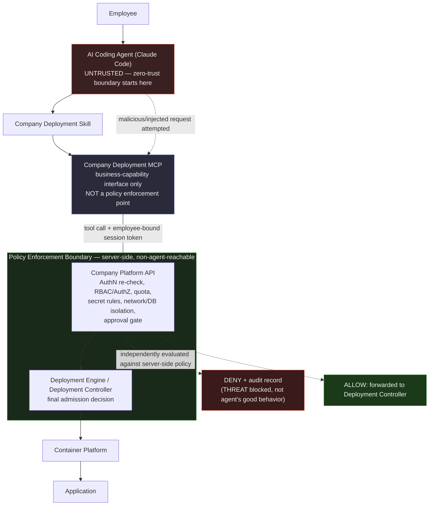

# 11. Security Requirements

## Document Control

| Field | Value |
|---|---|
| Document | 11_Security_Requirements.md |
| Owner | Security Architecture |
| Scope | Company AI Application Deployment Platform — security requirements baseline |
| Numbering owned here | `THREAT-xxx` (security threat model) |
| Numbering referenced, owned elsewhere | `FR-xxx` (sibling `02_Functional_Requirements.md`), `RISK-xxx` (sibling `16_Risk_Register.md`, general business/project risk — not security threats), `MOD-01..19` (sibling `06_System_Requirements.md`) |
| Related | `07_MCP_Requirements.md` (MCP tool-by-tool detail), `17_Decision_Log.md` (all TBDs below resolve there) |

### Note on scope relative to sibling documents

This document defines the **security requirements baseline**: what must be true, and why. It does not duplicate:
- Functional behavior of individual features — owned by `02_Functional_Requirements.md` (`FR-xxx`). This document references functional modules by name only, in particular **MOD-01 Identity & Access Management**, **MOD-08 Secret Manager**, and **MOD-14 Audit**.
- Full system module specifications — owned by `06_System_Requirements.md` (`MOD-01`–`MOD-19`).
- Tool-by-tool MCP input/output schemas — owned by `07_MCP_Requirements.md`. This document owns the **cross-cutting security posture** of the MCP layer: authentication of MCP sessions, the principle that the MCP is never itself a trust boundary, and audit obligations on every MCP tool call.
- General business/project risk — owned by `16_Risk_Register.md` (`RISK-xxx`). The threats catalogued in Section 12 of this document are **security-specific attack and abuse scenarios** (`THREAT-xxx`), not general project risk.
- Vendor/product selection — every concrete product or framework decision below is marked **TBD** and is tracked to closure in `17_Decision_Log.md`.

---

## 1. Security Objectives & Principles

The platform's purpose is to let an AI coding agent (Claude Code) deploy employee-built applications with minimal human friction. That convenience is only acceptable if the platform's security posture does not depend on the agent behaving correctly. The following principles are binding on every subsequent requirement in this document.

### 1.1 Zero trust toward the AI agent

The AI Coding Agent is **never** treated as a trusted principal and **never** treated as a security boundary. It is an untrusted, high-bandwidth input source, structurally identical in risk terms to a browser client: it can be manipulated by prompt injection from project content (a malicious `README`, a poisoned dependency, an adversarial code comment, output from a compromised tool the agent also uses), it can hallucinate or misinterpret intent, and it can be operated by a legitimate employee who is themselves acting maliciously or under duress. Every decision the agent's tool calls attempt to trigger MUST be independently re-authorized and re-validated at the server side, using the identity of the human employee behind the session — never using the agent's self-reported intent, self-reported identity, or self-reported role as the basis for a decision.

### 1.2 Defense in depth

No single control is assumed sufficient. Authentication failures are caught by authorization; authorization failures are caught by resource quotas and network isolation; policy bypass attempts are caught by audit detection and alerting. Controls in this document are layered so that the failure of any one layer degrades the platform's posture rather than defeats it.

### 1.3 Least privilege

Every actor, service identity, and generated credential is granted the minimum scope necessary for its function, scoped by application, by environment, and by time where feasible. No actor — including Platform Administrators — is granted blanket access to all applications' data or secrets as a matter of default configuration; elevated access is itself an auditable, justified action (see Section 3.4).

### 1.4 Policy enforced server-side only

Enforcement of authentication, authorization, RBAC, quota, network policy, and deployment policy happens exclusively inside platform-owned, non-agent-reachable components — the Company Platform API and the Deployment Engine/Controller. The Company Deployment Skill and Company Deployment MCP are **capability and convenience layers**, not enforcement layers. This is elaborated fully in Section 10, which is the architectural anchor of this entire document.

### 1.5 Secure by default for unsupported or unvalidated technology

Anything the platform cannot vet is refused by default rather than allowed with a warning. An application requesting a runtime, database engine, or configuration outside the supported stack (Section 6 of the project context: React/Next.js/Vue frontends, Go/Node.js/Python backends, PostgreSQL, Redis) MUST fail validation before any build or deployment step executes. Unsupported technology is treated as a security control, not merely a compatibility gate, because unvetted runtimes and unvetted database engines have not been through container hardening, image scanning baseline, or network policy templating, and therefore cannot be safely admitted to shared infrastructure.

### 1.6 Fail closed

Any ambiguity, timeout, or error in an authentication, authorization, quota, or policy check MUST resolve to denial of the requested action, not to allowance. Silent fallback to a permissive default is prohibited anywhere in the deployment path.

---

## 2. Authentication Requirements

Authentication establishes *who* is acting, at three distinct layers that must never be collapsed into one:

### 2.1 Employee identity

Every employee who uses the platform (directly, or indirectly through Claude Code) MUST authenticate as themselves via the company's central identity provider. The platform does not maintain a parallel credential store for employees.

- **AUTH-1**: Employee authentication MUST be delegated to a corporate IdP/SSO integration (module: MOD-01 Identity & Access Management). **The specific IdP/SSO product (e.g., a SAML- or OIDC-based enterprise IdP) is TBD** — tracked in `17_Decision_Log.md`.
- **AUTH-2**: Multi-factor authentication MUST be enforced at the IdP for any session capable of reaching production-affecting capability, at minimum. Whether MFA is required for all sessions or only production-capable sessions is a decision for `17_Decision_Log.md`.
- **AUTH-3**: Authentication tokens issued to an employee session MUST be short-lived and refreshable, with server-side revocation supported (e.g., on offboarding, on suspected compromise).

### 2.2 AI agent / MCP session identity, bound to the employee

Claude Code never has its own independent identity that can act without a human behind it. Every MCP session MUST be cryptographically bound, at session establishment, to the authenticated employee identity from Section 2.1.

- **AUTH-4**: The Company Deployment MCP MUST require a valid, non-expired, employee-bound session credential on every tool call. There is no mode in which the MCP accepts an unauthenticated or self-asserted-identity tool call.
- **AUTH-5**: The credential presented by the AI agent to the MCP MUST NOT be a long-lived static secret embedded in agent configuration. It MUST be a scoped, short-lived token derived from the employee's authenticated session (e.g., minted at the start of a Claude Code session and expiring with it), so that a leaked agent-side token has bounded blast radius and a bounded lifetime.
- **AUTH-6**: The Company Platform API MUST be able to answer, for any action, "which employee's session authorized this," independent of whatever the agent's tool-call payload claims. Downstream authorization (Section 3) and audit logging (Section 9) are keyed off this identity, never off agent-supplied identity fields.
- **AUTH-7**: Loss, expiry, or revocation of the underlying employee session MUST immediately invalidate the derived MCP session; the MCP MUST NOT continue honoring a token whose parent employee session has ended.

### 2.3 Service-to-service identity between platform components

The internal call chain — Company Platform API → Deployment Engine → Container Platform, plus MOD-02 through MOD-19 talking to each other — is itself a set of authenticated relationships, not an implicitly-trusted internal network.

- **AUTH-8**: Every platform-internal service-to-service call MUST carry its own service identity (e.g., mutual TLS or a workload identity mechanism), independent of and in addition to the employee identity being propagated for authorization purposes. A compromised internal service must not be able to impersonate another internal service merely by virtue of network reachability.
- **AUTH-9**: Service credentials MUST be issued and rotated by the platform's secret/identity infrastructure (MOD-08 Secret Manager in coordination with MOD-01), never hand-provisioned as static values in configuration files.
- **AUTH-10**: The specific service-identity mechanism (e.g., a service mesh with mTLS, a workload-identity federation product) is **TBD** — tracked in `17_Decision_Log.md`.

---

## 3. Authorization & RBAC Requirements

Authentication answers "who is this." Authorization answers "what may they do, to what, in which environment" — and per Section 1.1/1.4, this determination is made entirely server-side, never inferred from agent intent.

### 3.1 Role model aligned to the seven actors

| Role (maps to actor) | Primary capability | Typical scope |
|---|---|---|
| Application Developer / Employee | Request deployments, view own app status/logs, manage own app's non-production config | Own application(s), non-production environments by default |
| AI Coding Agent / Claude Code | Executes deployment actions **as a delegate of** the authenticated employee session (Section 2.2) — holds no independent authority | Bounded by the delegating employee's own scope; never broader |
| Application Owner | Approve changes to owned application, manage app-level access grants, view app audit trail | One or more specific applications, across environments they're entitled to |
| IT Administrator | Platform infrastructure operations, environment/tenant provisioning, non-application-data operational support | Infrastructure/platform scope, not arbitrary app data |
| Platform Administrator | Platform configuration, policy configuration, quota configuration, cross-application operational visibility | Platform-wide, but privilege is itself scoped and audited (Section 3.4) |
| Security Administrator | Define/modify security policy, review audit trail, manage secret rotation policy, incident response access | Platform-wide read/policy scope; not routine app deployment authority |
| Management / Auditor | Read-only visibility into compliance/audit/deployment reporting | Platform-wide, read-only, no operational capability |

This table is the security-relevant role skeleton; the full permission catalogue per role is functional detail owned by `02_Functional_Requirements.md` and `06_System_Requirements.md` (MOD-01).

### 3.2 Permission model

- **AUTHZ-1**: Authorization decisions MUST be evaluated by the Company Platform API (backed by MOD-01) against the authenticated employee identity, never against any role, scope, or permission claim supplied in the AI agent's tool-call arguments.
- **AUTHZ-2**: Permissions MUST be expressed as the combination of: **role** × **application ownership** × **department ownership** × **environment** × **action**. All four dimensions must independently permit an action for it to proceed; the absence of any one is a denial.
- **AUTHZ-3**: Role assignment and elevation are themselves privileged, audited actions (Section 9), performed through MOD-01, and are never performable through the MCP/agent path.

### 3.3 Application ownership as an authorization dimension

- **AUTHZ-4**: Every application registered on the platform (via the Application Registry, MOD-02) MUST have one or more designated Application Owners. Ownership is a first-class authorization input: a deployment action, secret access, or configuration change to application `overtime` MUST be checked against whether the requesting employee is an owner (or an explicitly delegated collaborator) of `overtime` — regardless of what the agent's request claims about intent.
- **AUTHZ-5**: An employee with no ownership or delegated relationship to an application MUST be denied any write action against that application by default, independent of their general role.

### 3.4 Department ownership

- **AUTHZ-6**: Applications carry a department owner (as shown in the sample `deployment.yaml`'s `app.owner: HR` field). Department ownership is used for (a) quota and cost attribution, (b) scoping which Application Owners/Developers within a department may act on an app by default, and (c) audit/reporting rollups by department for Management/Auditor visibility.
- **AUTHZ-7**: Cross-department access to an application (e.g., a shared platform-team app) MUST be an explicit grant, not an implicit consequence of role, and that grant is itself audit-logged.

### 3.5 Environment-scoped permissions

- **AUTHZ-8**: Permissions MUST be scoped independently per environment (e.g., `dev`, `staging`, `prod`). Holding deploy authority for an application in `dev` MUST NOT imply deploy authority for the same application in `prod`.
- **AUTHZ-9**: Development environments MAY support automatic (agent-triggered, no additional human step) deployment for an authorized employee, consistent with the project's low-friction goals for inner-loop iteration.
- **AUTHZ-10**: Production environments MUST require the elevated authorization path defined in Section 11 (Production Approval Gate) in addition to baseline deploy authority — holding "prod deploy" role scope is necessary but not sufficient; explicit approval is a separate, additional gate.
- **AUTHZ-11**: Environment-scoped permission checks MUST be enforced at the Company Platform API / Deployment Controller layer, consistent with Section 10 — the AI agent's belief about which environment it is targeting is untrusted input, not the basis for the check.

---

## 4. Resource Quota Enforcement

Resource quotas are specified here as an **abuse-prevention and blast-radius control**, not merely a cost-management feature — an unconstrained deployment path is a direct denial-of-service and lateral-blast-radius risk against shared infrastructure (see THREAT-013).

- **QUOTA-1**: Every application, and every department, MUST have enforced quota ceilings on: compute (CPU/memory per service and aggregate), scaling bounds (`min`/`max` replica counts), storage, number of concurrent applications/services, and build/deploy request rate.
- **QUOTA-2**: Quota enforcement MUST occur server-side at the Resource Manager (MOD-07) / Deployment Controller, evaluated against the requested `deployment.yaml` before any infrastructure is provisioned. A `deployment.yaml` requesting scale or resource tier beyond the requester's entitlement MUST fail validation, not be silently clamped, so that the requester (and audit trail) has an explicit signal of the denial.
- **QUOTA-3**: Quota checks exist specifically to bound the impact of a single compromised or malicious request — including one generated by a manipulated AI agent — so that no single deployment action can exhaust cluster-wide compute, storage, or scaling capacity available to other applications/tenants.
- **QUOTA-4**: Scale-to-zero MUST be permitted only for stateless workloads; quota/scaling logic MUST explicitly reject `min: 0` (or equivalent) applied to a database service, since scale-to-zero on stateful data services is both an availability and, in some architectures, a data-integrity risk.
- **QUOTA-5**: Build/deploy request-rate limiting MUST apply per employee session and per application, independent of general infrastructure quota, to prevent rapid repeated deployment requests (automated or agent-driven) from being used as a resource-exhaustion or policy-probing vector.
- **QUOTA-6**: Quota-exceeded events MUST be audit-logged (Section 9) and, above a configurable threshold of repeated attempts, MUST be surfaced to Security Administrator visibility as a potential abuse signal, not just silently rejected.

---

## 5. Secret Management Requirements

Application secrets (database credentials, third-party API keys, signing keys, etc.) are one of the platform's highest-value assets to protect, and the requirement set below is built around one invariant: **a secret value is never observable by, or required to pass through, the AI agent, the employee's chat transcript, or the application's source repository.**

- **SEC-SECRET-1**: Application secrets MUST be stored exclusively in a dedicated Secret Manager component (MOD-08), never in `deployment.yaml`, never in application source code or config files committed to a repository, and never embedded in build artifacts or container images.
- **SEC-SECRET-2**: The `deployment.yaml` schema and any MCP tool for declaring an application's secret *requirements* MUST accept only secret **references** (names/identifiers) — never accept, transmit, or store literal secret values. If a `deployment.yaml` or an agent tool call is found to contain what appears to be a literal credential, this MUST be treated as a policy violation and blocked (see also THREAT-005).
- **SEC-SECRET-3**: Secret values MUST be injected into the running application only at deploy/runtime, directly by the Deployment Controller / Container Platform (e.g., into the container's runtime environment or a mounted runtime-only volume), such that the value never transits through the Company Deployment MCP, the Claude Code agent process, or any conversational/agent transcript at any point in the flow. The AI agent's role is limited to declaring *that* a secret is needed and *which* reference to use — never to handling, viewing, or relaying the value.
- **SEC-SECRET-4**: Per-application isolation of secrets MUST be enforced as an authorization property of the Secret Manager itself (not merely a naming convention): application A's runtime identity and any human/agent session acting on application A MUST be structurally unable to retrieve, list, or reference application B's secrets, regardless of role, unless an explicit, audited, cross-application grant exists (expected to be rare/exceptional, e.g., a shared platform credential).
- **SEC-SECRET-5**: Secret rotation MUST be supported without requiring an application code change or redeploy of application source — i.e., rotation updates the value behind a stable reference. A rotation policy (default and maximum age before forced rotation) MUST exist; the exact rotation cadence is an operational parameter for `17_Decision_Log.md` / `06_System_Requirements.md`.
- **SEC-SECRET-6**: Every secret access (read by a runtime workload, administrative view, rotation event) MUST be audit-logged per Section 9, including which application/service identity performed the access.
- **SEC-SECRET-7**: The specific secret-store product/technology (e.g., a managed secrets vault) is **TBD** — tracked in `17_Decision_Log.md`. This document requires only the properties above, independent of product choice.
- **SEC-SECRET-8**: Any secret value inadvertently detected in source code, commit history, `deployment.yaml`, build logs, or agent/chat transcripts MUST be treated as a confirmed leakage event (THREAT-005): the credential is force-rotated and the event is escalated to the Security Administrator role, not merely logged.

---

## 6. Network Isolation & Database Isolation Requirements

- **NET-1**: No application service — and specifically no database — may be directly reachable from outside the platform's network boundary unless it has gone through the Domain Manager's (MOD-10) explicit, policy-checked exposure path. Direct external exposure of an internal database is prohibited outright: nothing in the deployment path may bind a database's port to a public-facing address, and this MUST be enforced structurally by the Deployment Controller/network layer, not merely by convention or by omission from a template.
- **NET-2**: Every application MUST be network-segmented from every other application by default: a service belonging to application A has no network path to a service or database belonging to application B unless an explicit, policy-approved cross-application network grant exists (e.g., an intentionally shared internal platform service). Default-deny between applications is the baseline posture.
- **NET-3**: Only the specific ports/services an application explicitly declares in its `deployment.yaml` (e.g., the `api` service's `port: 8080`) are reachable at all, and only from the scope implied by the declared `domain.visibility` (e.g., `internal` vs. any future public setting) — arbitrary network configuration by the application or its deploying agent is not possible; the AI agent has no capability to request arbitrary port exposure or arbitrary routing, consistent with the MCP's restriction to high-level business capabilities only.
- **NET-4**: Database isolation MUST follow a database-per-application (or equivalently strict, e.g., strongly isolated schema/credential-per-application with no cross-tenant query path) model, managed by the Database Manager (MOD-09). An application's runtime credentials grant access only to its own database instance/schema; there is no shared database credential spanning multiple applications' data.
- **NET-5**: Database instances MUST NOT be reachable from the general application network segment of other applications, from developer workstations, or from the AI agent's own execution context — access is mediated only through the owning application's own service layer or through explicit, audited administrative tooling.
- **NET-6**: Network and database isolation boundaries MUST be provisioned automatically by the platform at deployment time from the validated `deployment.yaml`, never manually requested or manually widened by an employee or agent action outside the platform's declared schema.

---

## 7. Container Security Requirements

These requirements bind the Container Platform layer regardless of which orchestrator/runtime underlies it (kept technology-neutral here; concrete implementation is `06_System_Requirements.md` scope).

- **CTR-1**: No application container may run as a privileged container. Privileged execution is disallowed unconditionally for application workloads; there is no `deployment.yaml` field or MCP tool capability that can request it, consistent with the platform-wide rule that the MCP never exposes arbitrary container-execution or arbitrary Kubernetes-resource-creation capability.
- **CTR-2**: No application container may access the host filesystem. Containers run within their own isolated filesystem namespace; there is no supported mechanism for an application or its deploying agent to request a host path mount.
- **CTR-3**: No application container may access the Docker socket (or equivalent container-runtime control socket). This is enforced structurally by the Deployment Controller's container specification templates — the capability to request such access does not exist anywhere in the deployment.yaml schema or MCP surface, not merely "is denied by policy."
- **CTR-4**: All application containers MUST execute as a non-root user by default. Build/deployment validation MUST reject or auto-remediate (per platform policy) any container image/spec that specifies root execution, before the workload is scheduled.
- **CTR-5**: Application container filesystems MUST be read-only at runtime wherever the runtime/framework allows it, with explicit, narrowly-scoped writable mounts (e.g., a scratch/tmp volume) only where a service genuinely requires local write (this is an application-declared, platform-validated exception, not a default).
- **CTR-6**: Resource limits (CPU, memory, and any other schedulable resource) MUST be enforced per container as derived from the application's declared `resources.tier` and `scaling` configuration (see Section 4); no container may run unbounded.
- **CTR-7**: Container capabilities (Linux capabilities or platform equivalent) MUST be dropped to the minimum required by the supported runtime stack (Section 1.5); applications cannot request additional capabilities through the deployment schema.
- **CTR-8**: These container constraints apply uniformly regardless of which employee, department, or role requested the deployment — there is no elevated-privilege container tier available through normal deployment flows. Any exception process (if one is ever needed for a legitimate platform-infrastructure workload, as opposed to an application workload) is out of scope for this document and would require its own explicitly reviewed control, not a relaxation of these defaults.

---

## 8. Image Security Scanning Requirements

- **IMG-1**: Every container image built for an application (via the Build Engine, MOD-05) MUST pass an automated image security scan as a mandatory gate in the deployment lifecycle, positioned **after build and before the image is admitted to the internal registry and before any deploy step proceeds**. There is no path from source to running workload that bypasses this gate, including for `dev` environments.
- **IMG-2**: The scan gate MUST evaluate, at minimum: known-vulnerability findings (CVEs) in OS and language-level dependencies, presence of embedded secrets/credentials in image layers (defense-in-depth alongside Section 5), and use of a base image outside the platform's approved/supported base image set (tying back to Section 1.5's supported-stack requirement).
- **IMG-3**: Findings at or above a defined severity threshold (e.g., Critical/High, exact thresholds TBD operationally) MUST fail the gate outright, blocking registry admission and deployment. Lower-severity findings MAY be permitted to proceed with the finding recorded, per platform policy configuration owned by the Security Administrator role.
- **IMG-4**: A failed scan MUST produce a result that is: (a) surfaced back through the Company Deployment MCP/Skill to the employee and AI agent as an actionable failure (what failed, why), so the normal remediation loop is "employee/agent fixes the dependency and redeploys," and (b) recorded in the audit/deployment trail (Section 9) regardless of outcome.
- **IMG-5**: Aggregate scan findings and trends MUST be visible to the Security Administrator role (and summarized for Management/Auditor reporting) independent of any individual application team's awareness — vulnerability posture is a platform-wide security concern, not solely an application-owner concern.
- **IMG-6**: The specific image-scanning tool/product is **TBD** — tracked in `17_Decision_Log.md`. This document requires only that the gate, its blocking behavior, and its reporting obligations exist, independent of tool choice.
- **IMG-7**: Previously-scanned, already-deployed images MUST be subject to periodic re-scanning (newly disclosed CVEs affect images already in production), with a defined re-scan cadence TBD in `17_Decision_Log.md`, and a defined response process (at minimum, Security Administrator notification) when a running image is found newly vulnerable.

---

## 9. Audit Logging & Deployment Audit Trail Requirements

Audit logging is the platform's primary tool for detecting and investigating both malicious behavior and AI-agent misbehavior after the fact, and is a required complement to the preventive controls above (Section 1.2, defense in depth). Audit capability is owned functionally by MOD-14 Audit, with related logging infrastructure in MOD-12 Logging; this document specifies the security-driving requirements on that capability.

### 9.1 What must be logged

- **AUDIT-1**: Every Company Deployment MCP tool call MUST be logged with, at minimum: the authenticated employee identity behind the session (Section 2.2), the specific tool/action invoked, the full resolved parameters used to make the downstream authorization decision (not merely the agent's free-text framing of intent), the target application/environment, a timestamp, and the outcome (allowed/denied, and if denied, the reason category).
- **AUDIT-2**: Every deployment lifecycle transition (e.g., validated, build started, build succeeded/failed, image scanned/passed/failed, awaiting approval, approved, deployed, rolled back, scaled, terminated) MUST be logged with: who or what triggered the transition (employee, or system/automated trigger, clearly distinguished), what changed, when, and the result.
- **AUDIT-3**: Every authentication event (login, MCP session establishment, session expiry/revocation), authorization decision (grant and, especially, deny), quota-enforcement decision, secret access, and network/database isolation-relevant configuration change MUST be logged under the same standard (who, what, when, result).
- **AUDIT-4**: Denials are logged with the same rigor as approvals — a denied action is often the more security-relevant event (e.g., an agent attempting an out-of-scope action due to prompt injection) and MUST NOT be logged with less detail than a successful one.

### 9.2 Integrity and retention

- **AUDIT-5**: Audit records MUST be immutable once written — no role, including Platform Administrator, may edit or delete an audit record through normal platform operation. Any privileged administrative override capability (e.g., for legal/compliance purge requirements) must itself be a separately access-controlled, separately audited action, not a routine capability.
- **AUDIT-6**: Audit records MUST be retained for a defined minimum period sufficient to support incident investigation, deployment history review, and compliance reporting (Section 13). **The exact retention period is TBD** — tracked in `17_Decision_Log.md` — but the requirement that a defined, enforced retention period exist, and that records not be silently or prematurely purged, is binding regardless of the specific duration chosen.
- **AUDIT-7**: The audit trail MUST be queryable by application, by employee, by environment, and by time range, so that Application Owners can review their own application's history, Security Administrators can investigate incidents platform-wide, and Management/Auditors can produce compliance reporting, each within their respective authorization scope (Section 3).
- **AUDIT-8**: Audit log storage MUST itself be treated as a protected asset under this document's principles (Section 1): access to raw audit data is role-gated (Section 3.1), and write access to the audit store is restricted to the logging/audit subsystem itself — no application workload or AI agent session can write to, or influence the content of, another actor's audit record (see THREAT-018, audit log tampering).

---

## 10. Policy Enforcement Boundary

This section restates, and makes architecturally explicit, the single most important security property of this platform: **the Company Deployment MCP is a business-capability and convenience interface, not a trust boundary or a policy enforcement point.** The actual enforcement point is the Company Platform API together with the Deployment Engine/Controller behind it.

### 10.1 Why the MCP cannot be the enforcement point

The MCP's client is Claude Code, an AI agent operating on natural-language instructions and on the content of the project it is helping build. Both of those inputs are attacker-influenceable: instructions can be socially engineered, and project content (a `README`, a dependency's install script, a code comment, tool output the agent reads) can carry prompt injection designed to make the agent issue tool calls the employee never intended. Any security control implemented only as "the MCP tool politely declines" or "the agent was told not to" is therefore not a control at all — it is a suggestion that a sufficiently manipulated or sufficiently malicious agent session can be made to ignore. Consistent with Section 1.1, the MCP is treated as equivalent in trust level to any other untrusted client.

### 10.2 What the MCP is responsible for

- Presenting a constrained set of high-level business-capability tools (e.g., "deploy this application," "check deployment status") — never low-level primitives like `kubectl`, Docker daemon control, arbitrary filesystem access, arbitrary container exec, arbitrary network configuration, or arbitrary Kubernetes resource creation. This constraint is a capability-surface design decision, and it also reduces (but does not by itself eliminate) the attack surface available to a compromised agent.
- Carrying the authenticated, employee-bound session identity (Section 2.2) on every call to the Company Platform API.
- Forwarding tool-call requests and their parameters faithfully for server-side evaluation.
- Relaying the Platform API's decision (including denial and the reason) back to the agent/employee.

### 10.3 What the Platform API / Deployment Controller is responsible for

- Independently re-validating authentication (Section 2), authorization/RBAC (Section 3), quota (Section 4), secret-handling rules (Section 5), network/database isolation rules (Section 6), container security constraints (Section 7), image scan gating (Section 8), and — for production — the approval gate (Section 11), for **every** request, regardless of what the MCP or agent asserts about the requester's intent or entitlement.
- Treating every field of an inbound request (including a submitted `deployment.yaml`) as untrusted input requiring full schema, quota, and policy validation — never as pre-trusted because "the agent already checked."
- Making the actual admit/deny decision and being the sole component authorized to instruct the Deployment Engine / Container Platform to act.

### 10.4 Compromised-agent walkthrough

If Claude Code is manipulated — via prompt injection or otherwise — into attempting a malicious action (e.g., requesting production deployment without approval, requesting a privileged container, requesting cross-application secret access, requesting a resource tier beyond the employee's quota, requesting an unsupported/unvalidated runtime to evade scanning), the request still arrives at the Company Platform API carrying only the legitimate, bounded, employee-derived session identity established in Section 2.2 — the agent cannot escalate the identity or scope behind the call. The Platform API evaluates the request exactly as it would any other, finds it fails one or more of RBAC, quota, isolation, or approval-gate checks, and denies it. The denial and the underlying malicious attempt are both captured in the audit trail (Section 9), which is what turns "the attempt was blocked" into "the attempt was blocked and is now visible to Security Administrator investigation." The agent's compromise results in a logged, denied request — not a policy bypass.

### 10.5 Enforcement boundary diagram

The critical read of this diagram: the trust boundary is **not** drawn around the MCP — it is drawn around the Company Platform API and Deployment Controller. Everything to the left of that boundary (employee, agent, skill, MCP) is treated as a request source whose output must be independently validated, never as a pre-cleared input.

---

## 11. Production Approval Gate

- **PROD-1**: A deployment (or a production-traffic-activation event for an already-built artifact) targeting the `prod` environment MUST require explicit human approval beyond the baseline authorization checks in Section 3, before it is admitted by the Deployment Controller. Holding production deploy role/scope is necessary but not sufficient on its own.
- **PROD-2**: The approval MUST be granted by a human principal distinct from (or, at minimum, independently authenticated alongside) the request's originator, aligned to the Application Owner and/or Platform Administrator/Security Administrator roles as configured per application or department policy. The approval action is itself an authenticated, audited action (Section 9) — it is never satisfiable by the AI agent asserting that approval was given.
- **PROD-3**: Rationale for the gate: production is the point at which a deployment action has real business impact — customer/employee-facing availability, real data, real cost, and real blast radius if a compromised or manipulated agent session reaches it. Development environments accept automatic, agent-triggered deployment (Section 3.5) precisely because their blast radius is bounded (isolated data, isolated network segment, no production traffic); production's blast radius is not bounded in the same way, so the platform trades away deployment speed for a human-in-the-loop checkpoint specifically at the one environment where a mistake or an attack has the most consequence.
- **PROD-4**: The approval gate is evaluated and enforced at the Company Platform API / Deployment Controller layer (Section 10), not as an agent-side confirmation step — an agent that skips asking the employee for confirmation, or that is manipulated into fabricating an "approved" status, still cannot cause a production deployment to proceed, because the server-side state for that deployment simply has no recorded approval action from an authorized approver.
- **PROD-5**: What specifically requires approval (first deploy vs. every deploy vs. only certain change types, e.g., resource-tier increases or new external domain exposure) is a functional/product decision owned by `02_Functional_Requirements.md`; this document's binding requirement is only that *some* explicit, independently-authenticated, non-agent-satisfiable human approval step exists ahead of production admission.
- **PROD-6**: Emergency/break-glass production changes (if the platform chooses to support them) MUST use a distinct, more heavily audited path with post-hoc mandatory review, never a silent bypass of PROD-1; whether break-glass is supported at all is TBD for `17_Decision_Log.md`.

---

## 12. Security Threat Model

Ratings use a qualitative Low / Medium / High / Critical scale for Impact, Likelihood, and the resulting Risk. Mitigations reference the requirement IDs and modules defined above. All entries below are `THREAT-xxx` and are distinct from the general project/business `RISK-xxx` register owned by `16_Risk_Register.md`.

| ID | Threat | Actor / Vector | Impact | Likelihood | Risk | Mitigation | Residual Risk |
|---|---|---|---|---|---|---|---|
| THREAT-001 | Malicious employee | Authenticated Application Developer/Owner deliberately misuses legitimate access (e.g., exfiltrates data, sabotages another team's app) | High | Low | Medium | AuthN (Sec 2), least-privilege RBAC scoped by app/dept/env (Sec 3), full audit trail incl. denials (Sec 9), per-app network/DB isolation limits lateral reach (Sec 6) | Low-Medium — insider risk is never fully eliminable; detection/attribution via audit trail is the primary residual control |
| THREAT-002 | Compromised AI agent, including prompt-injection-driven malicious tool calls | Malicious project content, adversarial dependency, or manipulated instructions cause Claude Code to issue tool calls the employee did not intend | High | Medium-High | High | Zero-trust toward agent (Sec 1.1), server-side re-validation of every call independent of agent intent (Sec 10), MCP restricted to high-level capabilities only — no kubectl/Docker/host-FS/arbitrary-K8s (project constraint), full audit of denied attempts (Sec 9) | Low — architecture is specifically designed so agent compromise cannot bypass enforcement; residual risk is mainly "wasted/denied actions" and any not-yet-covered capability gap in MCP tool surface (owned by 07_MCP_Requirements.md) |
| THREAT-003 | Malicious application code | Employee (or a compromised dependency) ships application code designed to attack the platform or other tenants from inside a running container | High | Medium | High | Container security constraints (Sec 7): non-root, no privileged mode, no host FS, no Docker socket, read-only FS, resource limits; network/DB isolation (Sec 6) bounds lateral reach; image scanning (Sec 8) catches known-bad patterns/deps pre-deploy | Medium — zero-day container-escape or logic-layer abuse within the app's own granted scope remains possible; bounded by isolation, not eliminated |
| THREAT-004 | Container escape | Vulnerability in container runtime/kernel exploited from within an application container to reach host or other tenants' workloads | Critical | Low | High | Non-root/no-privileged/no-host-FS/no-Docker-socket (Sec 7), supported-stack-only base images reduce exotic attack surface (Sec 1.5), image scanning (Sec 8), network isolation limits post-escape lateral movement (Sec 6) | Medium — container-runtime 0-days are outside the platform's direct control; patch/update cadence for the Container Platform itself is an operational control outside this document's scope |
| THREAT-005 | Secret leakage | A literal secret value appears in source code, `deployment.yaml`, build logs, or an agent/chat transcript | High | Medium | High | Secret-reference-only schema (Sec 5, SEC-SECRET-2), runtime-only injection bypassing agent/MCP entirely (SEC-SECRET-3), scan-gate detection of embedded credentials (Sec 8, IMG-2), mandatory force-rotation + Security Admin escalation on detection (SEC-SECRET-8) | Low-Medium — an employee could still paste a secret into an unrelated file/chat outside platform-managed paths; detection there depends on scanning coverage, not architectural prevention |
| THREAT-006 | Privilege escalation | Any actor (employee, compromised agent session, or compromised internal service) attempts to gain authorization beyond their granted scope | High | Medium | High | Server-side RBAC re-evaluated per action (Sec 3, AUTHZ-1), environment-scoped permissions (Sec 3.5) prevent dev→prod scope creep, service-to-service identity (Sec 2.3) prevents lateral impersonation between platform components, role-elevation itself is a privileged audited action (AUTHZ-3) | Low — dependent on correct implementation of the RBAC evaluation itself; a logic bug in MOD-01's policy evaluation is the main residual vector, mitigated by audit visibility of anomalous grants |
| THREAT-007 | Cross-application access | An application, its runtime identity, or a deploying employee/agent session attempts to read/write another application's data, secrets, or network resources | High | Medium | High | Database-per-application isolation (Sec 6, NET-4), default-deny inter-application network segmentation (NET-2), per-application secret isolation as an authorization property of the Secret Manager itself (Sec 5, SEC-SECRET-4), application-ownership authorization dimension (Sec 3.3) | Low — residual risk concentrated in any explicitly configured cross-application grant (e.g., shared platform service), which is exactly why such grants are required to be explicit and audited |
| THREAT-008 | Supply-chain attack | Compromise introduced via the build pipeline, base images, or platform tooling itself (as opposed to an individual app dependency, THREAT-009) | High | Medium | High | Supported-stack-only base images (Sec 1.5), mandatory image scanning gate pre-registry (Sec 8), service-to-service identity limits what a compromised build step can impersonate (Sec 2.3), audit trail of every build/deploy transition (Sec 9, AUDIT-2) | Medium — build-pipeline integrity (e.g., reproducible builds, signing) is largely a MOD-05 Build Engine functional-hardening concern outside this document's direct requirements; recommend cross-reference in 06_System_Requirements.md |
| THREAT-009 | Malicious dependency | A third-party package pulled into an application's build is itself malicious or compromised (typosquat, hijacked maintainer account, etc.) | High | Medium-High | High | Image scanning gate flags known-vulnerable/known-malicious packages pre-deploy (Sec 8), supported-stack constraint limits ecosystem surface somewhat, container isolation (Sec 7) bounds what a compromised dependency can reach at runtime even if it executes, network isolation (Sec 6) limits exfiltration paths | Medium — scanning tools generally lag newly-published malicious packages; this is an inherent ecosystem-wide residual risk, not fully closable by any single gate |
| THREAT-010 | Image vulnerability | A built application container image contains known CVEs (OS packages, language runtime, etc.) at deploy time or discovered later against an already-running image | Medium-High | High | High | Mandatory pre-registry scan gate with severity-based blocking (Sec 8, IMG-1–IMG-3), periodic re-scan of already-deployed images (IMG-7), findings visibility to Security Administrator (IMG-5) | Medium — a lower-severity finding permitted to proceed by policy (IMG-3) remains a residual exposure by design trade-off; tracked via reporting rather than hard-blocked |
| THREAT-011 | Unauthorized deployment | An actor deploys, modifies, or scales an application without valid authorization (e.g., stale credentials, missing ownership check, direct API abuse bypassing normal flow) | High | Low-Medium | Medium-High | Server-side AuthN+AuthZ re-check on every action regardless of entry path (Sec 2, Sec 3), application-ownership check (AUTHZ-4/5), fail-closed default on any check ambiguity (Sec 1.6), full audit trail of denials (Sec 9) | Low — primary residual vector is implementation defect in the enforcement layer itself, not a gap in the requirement |
| THREAT-012 | Production deployment abuse | An actor with legitimate but limited authority attempts to force, rush, or circumvent the production approval process (e.g., mislabeling an environment, splitting a change to avoid review) | High | Medium | High | Explicit, non-agent-satisfiable human approval gate enforced server-side (Sec 11), environment-scoped permissions prevent dev-authority from implying prod-authority (AUTHZ-8-10), all approval actions themselves authenticated and audited (PROD-2, Sec 9) | Low-Medium — process-gaming (e.g., social-engineering an approver) remains a residual human-factor risk outside pure technical control |
| THREAT-013 | Resource exhaustion / denial of service against the platform | Malicious or runaway (including agent-driven) repeated/oversized deployment requests intended to exhaust shared platform compute, storage, or scheduling capacity, degrading service for other tenants | Medium-High | Medium | Medium-High | Per-application and per-department quota ceilings (Sec 4, QUOTA-1/2), server-side quota validation before provisioning (QUOTA-2), per-session/per-app request-rate limiting (QUOTA-5), scale-to-zero restricted to stateless workloads only preserving DB availability (QUOTA-4), abuse-signal escalation on repeated quota violations (QUOTA-6) | Low-Medium — a sufficiently distributed abuse pattern (many low-and-slow requests across many sessions) is harder to catch than a single large request; recommend platform-wide aggregate-rate monitoring as an operational follow-up |
| THREAT-014 | Data exfiltration | Sensitive application or platform data is moved out of the platform's boundary by a malicious or compromised actor (employee, agent, or compromised application workload) | High | Medium | High | Network/DB isolation limits reachable data scope per identity (Sec 6), least-privilege scoping of every credential (Sec 1.3), secrets never transit agent/chat context so agent cannot relay them even under injection (Sec 5), audit logging of data-access-adjacent actions (Sec 9) enables detection | Medium — exfiltration through an application's own legitimate outbound path (i.e., the app doing what it's authorized to do, but maliciously) is fundamentally hard to fully prevent short of full egress content inspection, which is outside this document's control set |
| THREAT-015 | MCP tool argument injection | A manipulated or malicious agent supplies crafted tool-call arguments (e.g., path-traversal-style application names, malformed identifiers, oversized/malformed payloads) attempting to exploit parsing or trust assumptions in the MCP or downstream API | Medium-High | Medium | Medium-High | MCP restricted to narrow, high-level business-capability tool schemas rather than free-form input (project constraint), Platform API performs full independent schema/policy validation on every field regardless of MCP-side handling (Sec 10.3), fail-closed on any validation ambiguity (Sec 1.6) — detailed per-tool input validation is owned by 07_MCP_Requirements.md | Low-Medium — residual risk is concentrated in implementation completeness of per-tool validation, which is explicitly out of this document's scope and flagged for close coordination with 07_MCP_Requirements.md |
| THREAT-016 | Stolen or replayed MCP session token | An attacker obtains a valid employee-bound MCP session token (e.g., via endpoint compromise, log leakage, or interception) and replays it to act as that employee | High | Low-Medium | Medium-High | Short-lived, refreshable, employee-session-derived tokens (AUTH-5), immediate invalidation on parent session expiry/revocation (AUTH-7), full audit trail makes replay activity attributable and detectable after the fact (Sec 9), service-to-service mTLS/workload identity reduces interception surface in transit (Sec 2.3) | Low-Medium — token theft from a compromised endpoint remains a residual risk inherent to any bearer-token model; bounded primarily by short token lifetime |
| THREAT-017 | Malicious/crafted deployment.yaml | A `deployment.yaml` is deliberately crafted (by a malicious employee or an injected agent) to request excessive resources, an unsupported/unvalidated runtime to dodge hardening, or ownership/domain fields designed to bypass ownership or visibility checks | Medium-High | Medium | Medium-High | Full schema + quota + stack-support validation server-side before any build/deploy step (Sec 1.5, Sec 4 QUOTA-2), ownership/department fields checked against actual authenticated identity not file content (Sec 3.3), unsupported-stack requests fail validation outright rather than warn (Sec 1.5) | Low — the deployment.yaml is treated uniformly as untrusted input requiring full re-validation; residual risk is mainly validation-logic completeness (functional detail owned elsewhere) |
| THREAT-018 | Audit log tampering / log injection | An attacker who has achieved some level of compromise (application workload, internal service, or insider) attempts to modify, delete, or inject misleading entries into the audit trail to cover tracks | High | Low | Medium | Immutable-once-written audit records with no routine edit/delete capability for any role (Sec 9, AUDIT-5), write access to the audit store restricted to the logging/audit subsystem itself — no app workload or agent session can write another actor's record (AUDIT-8), any administrative override path is itself separately access-controlled and separately audited | Low — residual risk concentrated in the audit subsystem's own implementation integrity, which by design has the smallest, most scrutinized privileged-write surface in the platform |

---

## 13. Compliance-Adjacent Notes

This document does not select a compliance framework or regulatory regime — that is a business/legal decision — but it records the security-relevant requirements that follow regardless of which regime is ultimately selected, and flags what must still be decided.

- **COMPL-1**: Data residency (which geographic region(s) application data, secrets, and audit logs are stored/processed in) MUST be a configurable, enforced platform property once determined, not an incidental consequence of infrastructure defaults. **The specific data residency requirement is TBD** — tracked in `17_Decision_Log.md` — pending business/legal input on where the company operates and what data categories the platform will host.
- **COMPL-2**: PII handling in logs: audit logs (Section 9), application logs (MOD-12), and monitoring data (MOD-13) MUST be designed on the assumption that they may incidentally capture personally identifiable information (e.g., an employee's identity is itself PII, and application-level logs could capture end-user PII depending on what a given internal application does). At minimum: access to logs containing PII MUST be governed by the same role-based scoping as any other sensitive data (Section 3), and retention (AUDIT-6) must account for PII-minimization principles once a specific regime is selected.
- **COMPL-3**: **The specific regulatory/compliance framework(s) applicable to this platform (e.g., a data-protection regime, a sector-specific framework, or an internal-only baseline with no external regulatory driver) is TBD** — tracked in `17_Decision_Log.md`. This document's requirement is that such a determination be made explicitly and early, since it materially affects retention periods (AUDIT-6), data residency (COMPL-1), and potentially the secret-rotation cadence (SEC-SECRET-5) — all currently marked TBD pending that determination.
- **COMPL-4**: Because this is an **internal** platform (employees deploying internal business applications, per the sample `overtime`/HR application with `domain.visibility: internal`), the compliance surface is expected to be narrower than a customer-facing/public platform — but this assumption MUST be explicitly validated once application categories in active use are known (e.g., an HR app touching employee PII carries different compliance weight than an internal tooling dashboard), rather than assumed away by default.
- **COMPL-5**: Management/Auditor reporting requirements (Section 3.1, Section 9.2) should be treated as the practical mechanism by which compliance evidence is produced, once a framework is selected — this document's audit trail requirements (Sec 9) are written broadly enough to support that without modification, but specific report formats/cadences are out of scope here.

---

*End of 11_Security_Requirements.md*
