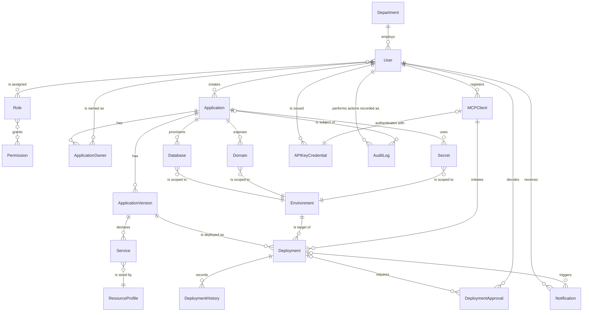

# 12. Data Requirements

## 1. Purpose & Scope

This document defines the conceptual data model for the Company AI Application Deployment Platform: the entities the platform must persist, why each exists, how they relate to one another, what states they move through, and how sensitive each is. It is a requirements / system-analysis artifact, not a database design — there are no SQL types, keys, or DDL here. Physical schema, storage engine choice, and indexing strategy are downstream implementation decisions for the delivery team, informed by this document and by `10_System_Architecture.md`.

This document **owns** the ENT-01 .. ENT-20 entity numbering used across the documentation baseline. Any other document that needs to refer to a data entity should cite it by its ENT-xx id and name as defined here, rather than redefining it.

## 2. Related Documents

| Document | Relationship to this document |
|---|---|
| `02_Functional_Requirements.md` | Owns FR-xxx functional requirements; this document's entities exist to satisfy those requirements. Referenced by name only. |
| `03_Non_Functional_Requirements.md` | Owns NFR-xxx (performance, availability, scalability, etc.); referenced for retention, throughput, and durability expectations. |
| `06_System_Requirements.md` | Owns MOD-01..MOD-19 module definitions; this document notes which module is primarily responsible for each entity. |
| `07_MCP_Requirements.md` | Owns the 12 MCP tool I/O schemas; several entities here (Application, Deployment, MCPClient) are read/written as a side effect of those tool calls. |
| `10_System_Architecture.md` | Owns the logical architecture and infrastructure evaluation; not repeated here. |
| `11_Security_Requirements.md` | Owns access control, encryption, and secret-handling requirements; the Data Classification section below cross-references it rather than redefining controls. |
| `13_API_Requirements.md` | Sibling document; the Business API operates on the entities defined here. |
| `17_Decision_Log.md` | Collects all TBD items raised throughout this document. |

## 3. Entity Relationship Overview

The diagram below shows all 20 entities and how they connect. It intentionally omits attributes and types — only entity names and relationship cardinality are shown, consistent with a conceptual/logical data model. `APIKey/Credential` is rendered as `APIKeyCredential` because ER diagram identifiers cannot contain a slash; the canonical name remains **APIKey/Credential (ENT-19)**.

Notes on relationships not fully expanded in the diagram for readability:
- **AuditLog (ENT-16)** is conceptually polymorphic — it can reference *any* entity as its subject (a User, an Application, a Secret, a Role change, etc.), not only Application. The diagram shows the User→AuditLog (actor) and Application→AuditLog (most common subject) edges as representative; see ENT-16 below for the full statement.
- **Notification (ENT-20)** can be triggered by other events besides a Deployment (e.g., a DeploymentApproval request, an AuditLog security alert); the Deployment→Notification edge is shown as the representative case.
- **ResourceProfile (ENT-12)** is largely reference/lookup data (tier definitions) shared across many Service records, hence the `}o--||` cardinality.

## 4. Data Classification

Entities are grouped into three sensitivity tiers. This grouping drives the access-control model owned by `11_Security_Requirements.md`; this section states *what* is sensitive and *why*, not *how* it is enforced (RBAC design, encryption-at-rest, field-level masking, etc. are defined there).

| Tier | Entities | Access implication |
|---|---|---|
| **Public/Internal** — catalog-level metadata, safe for broad internal visibility | ENT-05 Application (catalog fields only), ENT-07 ApplicationVersion (metadata only), ENT-11 Service, ENT-10 Environment, ENT-12 ResourceProfile | Readable by any authenticated employee via the Application Catalog (MOD-19); no per-record authorization needed beyond "is a logged-in company user." |
| **Internal-Restricted** — operational/business data scoped to owners, admins, and involved actors | ENT-01 User, ENT-02 Department, ENT-03 Role, ENT-04 Permission, ENT-06 ApplicationOwner, ENT-08 Deployment, ENT-09 DeploymentHistory, ENT-13 Database (connection metadata, excluding credentials), ENT-15 Domain, ENT-17 DeploymentApproval, ENT-18 MCPClient, ENT-20 Notification | Readable/writable only by the owning actor, the application's ApplicationOwner(s), and platform admin roles (IT Administrator, Platform Administrator); see role definitions in `11_Security_Requirements.md`. Not exposed through public catalog views. |
| **Internal-Restricted, audit-sensitive** — records *about* platform activity | ENT-16 AuditLog | Read access limited to Security Administrator, Platform Administrator, and Management/Auditor roles. Write path is system-only (see ENT-16 below); no actor may edit or delete entries. |
| **Confidential/Secret** — must never be exposed via logs, the MCP layer, or any general-purpose read API | ENT-14 Secret, ENT-19 APIKey/Credential | Values (not metadata) are stored only in a dedicated secret store per `11_Security_Requirements.md`; the Business API and MCP tools may reference a Secret/Credential by identifier/metadata but must never return its plaintext value in a response, log line, or AuditLog detail field. This is a hard constraint carried into `13_API_Requirements.md` and `07_MCP_Requirements.md`. |

## 5. Entity Catalog (ENT-01 .. ENT-20)

Each entity below is described by Purpose, Key Attributes (conceptual, no SQL types), Relationships, Lifecycle (where applicable), and Ownership/Sensitivity.

### ENT-01 — User

| | |
|---|---|
| **Purpose** | Represents any authenticated human actor in the platform — employees, application developers, IT/Platform/Security administrators, application owners, and auditors. A single entity type serves all seven actor roles; the distinction between actors is expressed through Role (ENT-03) assignment, not separate entity types. |
| **Key Attributes** | user_id, full_name, email, department, job_title, authentication_identity (SSO/IdP reference), assigned_roles, status (active / suspended / offboarded), created_at, last_login_at, last_modified_at |
| **Relationships** | One Department has many User. A User creates many Application. A User has many Role (many-to-many via assignment). A User is named in many ApplicationOwner records. A User registers many MCPClient sessions and is issued many APIKey/Credential. A User decides many DeploymentApproval. A User performs actions recorded as many AuditLog entries and receives many Notification. |
| **Lifecycle** | Provisioned (via IT onboarding / SSO sync) → Active → Suspended (temporary) → Offboarded/Deactivated (permanent, archived not hard-deleted). |
| **Ownership & Sensitivity** | Internal-Restricted (PII: name, email, department). Owned by MOD-01 Identity & Access Management. Access governed by `11_Security_Requirements.md`. |

### ENT-02 — Department

| | |
|---|---|
| **Purpose** | Represents the organizational unit (e.g., HR, Finance, Engineering) that an application or a user belongs to. Supports the `owner` field seen at the top of every `deployment.yaml` and provides a grouping for reporting and cost/ownership accountability. |
| **Key Attributes** | department_id, name, cost_center_code, parent_department (optional, for hierarchy), department_head (User reference), status, created_at |
| **Relationships** | One Department has many User. A Department is referenced as the owning department by many Application (via ApplicationOwner). |
| **Lifecycle** | Active → Inactive/Archived (rare; typically follows an HR org-structure change). |
| **Ownership & Sensitivity** | Internal-Restricted (organizational data, low individual-privacy sensitivity but still not public). Owned by MOD-01 Identity & Access Management. |

### ENT-03 — Role

| | |
|---|---|
| **Purpose** | Defines a named bundle of Permissions corresponding to one of the platform's actor archetypes (Application Developer, IT Administrator, Platform Administrator, Application Owner, Security Administrator, Management/Auditor) or a custom, platform-admin-defined role. |
| **Key Attributes** | role_id, name, description, scope (platform-wide / department / application-level), is_system_defined (built-in vs. custom), status, created_at |
| **Relationships** | A Role is assigned to many User (many-to-many). A Role grants many Permission (many-to-many). |
| **Lifecycle** | Active → Deprecated (system-defined roles are not deleted, only deprecated, to preserve historical AuditLog meaning). |
| **Ownership & Sensitivity** | Internal-Restricted. Owned by MOD-01 Identity & Access Management. Changes to Role definitions are themselves audit-logged (see ENT-16). |

### ENT-04 — Permission

| | |
|---|---|
| **Purpose** | The smallest unit of authorizable capability in the platform (e.g., "deploy to production," "view logs," "manage secrets," "approve deployment," "delete application"). Roles are composed of Permissions. |
| **Key Attributes** | permission_id, name, description, resource_type (application / deployment / secret / domain / audit-log / …), action (view / create / deploy / approve / delete / rotate / …), created_at |
| **Relationships** | A Permission is granted by many Role (many-to-many). |
| **Lifecycle** | Active → Deprecated (as platform capabilities evolve; permissions are versioned conceptually, not deleted, to keep historical AuditLog entries meaningful). |
| **Ownership & Sensitivity** | Internal-Restricted (defines the authorization surface itself). Owned by MOD-01 Identity & Access Management. The permission catalog is itself a security-relevant asset per `11_Security_Requirements.md`. |

### ENT-05 — Application

| | |
|---|---|
| **Purpose** | The central entity of the platform: one record per application registered by an employee, corresponding to one `deployment.yaml` contract lineage (e.g., "overtime"). Everything else in the system — versions, deployments, services, secrets, domains — hangs off an Application. |
| **Key Attributes** | application_id, name, description, owning_department, created_by, created_at, current_lifecycle_status, current_version_reference, source_repository_reference, tags/labels, catalog_visibility |
| **Relationships** | Created by one User. Has many ApplicationOwner. Has many ApplicationVersion. Provisions many Database. Exposes many Domain. Uses many Secret. Is referenced as subject in many AuditLog entries. |
| **Lifecycle** | Follows the fixed **Application Lifecycle**: Draft → Validated → Build → Deploying → Running → Suspended → Failed → Rolled Back → Archived → Deleted (see Project Context / owned in detail by `02_Functional_Requirements.md`). |
| **Ownership & Sensitivity** | Public/Internal at the catalog-metadata level (name, owner, status, stack) — browsable via the Application Catalog (MOD-19). Owned by MOD-02 Application Registry. |

### ENT-06 — ApplicationOwner

| | |
|---|---|
| **Purpose** | Join entity recording who is accountable for a given Application — the business owner(s) and technical contact(s) — distinct from `created_by` (who registered it), since ownership can be reassigned or shared. |
| **Key Attributes** | application_owner_id, application_reference, user_reference, ownership_role (primary owner / secondary contact / technical owner), assigned_at, assigned_by, status (active / revoked) |
| **Relationships** | Belongs to one Application. References one User. |
| **Lifecycle** | Assigned → Active → Reassigned/Revoked. |
| **Ownership & Sensitivity** | Internal-Restricted. Owned by MOD-02 Application Registry. Ownership changes are audit-logged. |

### ENT-07 — ApplicationVersion

| | |
|---|---|
| **Purpose** | A specific, immutable snapshot of an Application's `deployment.yaml` contract plus its build artifact (container image reference), created each time the application is (re)built. Deployments always deploy a specific ApplicationVersion, never "the application" in the abstract. |
| **Key Attributes** | version_id, application_reference, version_label, deployment_yaml_snapshot_reference, build_artifact_reference, created_by (User or "Claude Code agent on behalf of User"), created_at, status, change_summary |
| **Relationships** | Belongs to one Application. Declares many Service. Is deployed as many Deployment (the same version can be deployed to multiple environments, or redeployed after a rollback elsewhere). |
| **Lifecycle** | Building → Validated → Published/Active → Superseded → Archived. |
| **Ownership & Sensitivity** | Public/Internal at the metadata level (version label, creation date, change summary). The underlying build artifact reference is Internal-Restricted. Owned by MOD-05 Build Engine and MOD-02 Application Registry. |

### ENT-08 — Deployment

| | |
|---|---|
| **Purpose** | One execution/instance of deploying a specific ApplicationVersion into a specific Environment — the operational record of "this version is/was running here." This is what `deploy_application`, `get_deployment_status`, and `rollback_application` (MCP tools, detailed in `07_MCP_Requirements.md`) operate on. |
| **Key Attributes** | deployment_id, application_version_reference, environment_reference, initiated_by (User or MCPClient), initiation_method (manual / AI-agent-initiated), status, requested_at, started_at, completed_at, approval_reference (if required), result (success / failed / rolled back) |
| **Relationships** | Deploys one ApplicationVersion. Targets one Environment. Is initiated by one MCPClient (or directly by a User via Admin Portal). Requires zero-or-more DeploymentApproval. Records many DeploymentHistory events. Triggers zero-or-more Notification. |
| **Lifecycle** | Follows the fixed **Deployment Lifecycle**: Request → Authentication → Authorization → Validation → Security Check → Build → Image Scan → Registry → Deployment → Health Check → Traffic Activation → Monitoring → Completed (with Failure/Rollback branches at any stage). |
| **Ownership & Sensitivity** | Internal-Restricted. Owned by MOD-03 Deployment Manager / MOD-06 Deployment Controller. |

### ENT-09 — DeploymentHistory

| | |
|---|---|
| **Purpose** | An append-only sequence of state-transition events for a Deployment, giving full traceability of what happened, when, and why — the basis for rollback decisions and post-incident review. Distinct from the platform-wide AuditLog (ENT-16), which covers *all* actor actions across *all* entities; DeploymentHistory is deployment-specific operational history. |
| **Key Attributes** | history_id, deployment_reference, event_type/state_transition, previous_state, new_state, event_timestamp, actor (system / user / agent), detail_message |
| **Relationships** | Belongs to one Deployment. |
| **Lifecycle** | No lifecycle of its own — each record is created once and never updated (append-only), analogous to AuditLog but scoped to deployment events specifically. |
| **Ownership & Sensitivity** | Internal-Restricted. Owned by MOD-03 Deployment Manager / MOD-12 Logging. Must be tamper-evident; write path is system-only. |

### ENT-10 — Environment

| | |
|---|---|
| **Purpose** | Represents a deployment target tier (dev, staging, production) for an Application, carrying environment-level policy such as whether production approval is required and default visibility. |
| **Key Attributes** | environment_id, name (dev / staging / production), application_reference (or platform-shared scope), approval_required_flag, default_visibility, status |
| **Relationships** | Is targeted by many Deployment. Scopes many Database, Domain, and Secret. |
| **Lifecycle** | Provisioned → Active → Decommissioned. |
| **Ownership & Sensitivity** | Public/Internal (which environments exist and their policy flags are not secret). Owned by MOD-03 Deployment Manager. |

### ENT-11 — Service

| | |
|---|---|
| **Purpose** | One runtime component declared inside an ApplicationVersion's `deployment.yaml` — e.g., the `frontend` (React) or `api` (Go, port 8080) block in the example contract. Multiple Service records compose one Application. |
| **Key Attributes** | service_id, application_version_reference, service_name (frontend / api / worker), runtime/stack, port, scaling_min, scaling_max, resource_profile_reference, status |
| **Relationships** | Declared by one ApplicationVersion. Is sized by one ResourceProfile. |
| **Lifecycle** | Defined → Built → Deployed → Running → Stopped/Removed (mirrors the owning Deployment's state for the "Deployed" onward stages). |
| **Ownership & Sensitivity** | Public/Internal (stack/runtime/port are catalog-level facts). Owned by MOD-02 Application Registry / MOD-06 Deployment Controller. Note: scale-to-zero (min:0) applies to stateless web/API/worker Service types, not to static frontends or the Database entity — consistent with the platform's supported-stack policy. |

### ENT-12 — ResourceProfile

| | |
|---|---|
| **Purpose** | Reference/lookup data defining the platform's resource tiers (e.g., "small," "medium," "large") and what each tier means in terms of CPU/memory/replica bounds. Referenced by `resources.tier` in `deployment.yaml`. |
| **Key Attributes** | resource_profile_id, tier_name, cpu_allocation, memory_allocation, default_max_replicas, description, status |
| **Relationships** | Sizes many Service. |
| **Lifecycle** | Active → Deprecated (admin-managed reference data; rarely deleted, only superseded). |
| **Ownership & Sensitivity** | Public/Internal (published tier definitions). Owned by MOD-07 Resource Manager. |

### ENT-13 — Database

| | |
|---|---|
| **Purpose** | Represents a logical database instance provisioned for an Application in a given Environment (e.g., the PostgreSQL instance for "overtime" in production). Holds connection *metadata*, never credentials (see ENT-14 Secret for the password/connection-string value). |
| **Key Attributes** | database_id, application_reference, environment_reference, engine_type (postgres), size_tier, connection_metadata_reference (non-secret), status, provisioned_at |
| **Relationships** | Provisioned by one Application. Is scoped to one Environment. |
| **Lifecycle** | Requested → Provisioning → Available → Suspended → Deprovisioned. |
| **Ownership & Sensitivity** | Internal-Restricted (existence/metadata of a database is not itself secret, but access is scoped to the application's owning team and platform admins). Owned by MOD-09 Database Manager. Actual credentials live exclusively in ENT-14 Secret. |

### ENT-14 — Secret

| | |
|---|---|
| **Purpose** | A sensitive credential or configuration value belonging to an Application in a given Environment — database passwords, third-party API keys, TLS material, etc. The platform stores only a reference/version pointer here; the plaintext value lives in a dedicated secret store, never in this record or in any log. |
| **Key Attributes** | secret_id, application_reference, environment_reference, secret_name, secret_type (db-credential / api-key / tls-cert / other), current_version_pointer (opaque reference into the secret store, not the value), rotation_policy_reference, created_at, last_rotated_at, status |
| **Relationships** | Used by one Application. Is scoped to one Environment. |
| **Lifecycle** | Created → Active → Rotated (repeats) → Revoked/Expired. |
| **Ownership & Sensitivity** | **Confidential/Secret.** Owned by MOD-08 Secret Manager. Must never be exposed via logs, AuditLog detail fields, the MCP layer, or any general Business API read response — only opaque metadata/references are ever returned. See `11_Security_Requirements.md` for storage/encryption controls. |

### ENT-15 — Domain

| | |
|---|---|
| **Purpose** | Represents the DNS/route mapping through which an Application in a given Environment is reachable, and its visibility setting (internal vs. external), matching the `domain.visibility` field in `deployment.yaml`. |
| **Key Attributes** | domain_id, application_reference, environment_reference, hostname, visibility (internal / external), tls_status, status, created_at |
| **Relationships** | Exposed by one Application. Is scoped to one Environment. |
| **Lifecycle** | Requested → Active → Suspended → Released. |
| **Ownership & Sensitivity** | Internal-Restricted (external-visibility domains carry more scrutiny than internal-only ones; see `11_Security_Requirements.md` for the policy governing who may set `visibility: external`). Owned by MOD-10 Domain Manager. |

### ENT-16 — AuditLog

| | |
|---|---|
| **Purpose** | The immutable, platform-wide record of every security- and operationally-relevant action taken by any actor (human or AI agent) — logins, application creation, deployments, approvals, secret rotations, permission changes, deletions, etc. This is the system's accountability backbone and is conceptually polymorphic: its subject can be any other entity in this catalog. |
| **Key Attributes** | audit_log_id, actor_reference, actor_type (user / AI-agent / system), action, subject_type, subject_reference, timestamp, source_context (e.g., MCPClient/session reference), outcome (success / failure / denied), detail |
| **Relationships** | Performed by one User (or system/agent actor). Its subject may be any other entity (Application shown in the ER diagram as the representative case; in practice also User, Role, Secret, Deployment, DeploymentApproval, etc.). |
| **Lifecycle** | Created once, **never updated or deleted** — strictly append-only. Eventually archived (moved to cold/long-term storage) per the retention policy in Section 6, but never mutated in place. |
| **Ownership & Sensitivity** | Internal-Restricted, audit-sensitive. Owned by MOD-14 Audit. Read access limited to Security Administrator, Platform Administrator, and Management/Auditor roles per `11_Security_Requirements.md`. Must never contain Secret/Credential plaintext values in its detail field. |

### ENT-17 — DeploymentApproval

| | |
|---|---|
| **Purpose** | Records the approval decision required before a production Deployment proceeds (per the platform rule that production deploys require approval while dev may auto-deploy). |
| **Key Attributes** | approval_id, deployment_reference, environment_reference, requested_by, approver, decision (approved / rejected / pending / expired), decision_reason, requested_at, decided_at |
| **Relationships** | Required by one Deployment. Decided by one User (the approver). |
| **Lifecycle** | Requested → Pending → Approved / Rejected → (Expired, if not actioned within a policy window). |
| **Ownership & Sensitivity** | Internal-Restricted. Owned by MOD-03 Deployment Manager. Approval decisions are also mirrored into AuditLog. |

### ENT-18 — MCPClient

| | |
|---|---|
| **Purpose** | Represents a registered instance/session of the Company Deployment MCP server acting on behalf of a specific User (e.g., a given employee's Claude Code session). Lets the platform distinguish "this deployment was initiated by an AI agent acting for User X" from a direct Admin Portal action, and lets IT/Platform Administrators audit and revoke agent access independently of the user's own login session. |
| **Key Attributes** | mcp_client_id, associated_user, client_name/instance_identifier, registered_at, last_active_at, status (active / revoked / expired), credential_reference |
| **Relationships** | Registered by one User. Initiates many Deployment. Authenticates with one APIKey/Credential. |
| **Lifecycle** | Registered → Active → Revoked/Expired. |
| **Ownership & Sensitivity** | Internal-Restricted. Owned by MOD-16 MCP Server / MOD-01 Identity & Access Management. |

### ENT-19 — APIKey/Credential

| | |
|---|---|
| **Purpose** | A platform-issued credential (API key, OAuth/service token) used to authenticate a User, MCPClient, or other service caller against the Business API. Distinct from Secret (ENT-14), which belongs to and configures a deployed *Application*; this entity authenticates callers *to the platform itself*. |
| **Key Attributes** | credential_id, owner_reference (User or MCPClient/service account), credential_type (API key / OAuth token / service token), scope/permission_reference, issued_at, expires_at, last_used_at, status (active / revoked / expired) |
| **Relationships** | Issued to one User. Optionally used by one MCPClient to authenticate. |
| **Lifecycle** | Issued → Active → Rotated (repeats) → Revoked/Expired. |
| **Ownership & Sensitivity** | **Confidential/Secret.** Owned by MOD-08 Secret Manager / MOD-01 Identity & Access Management. Same handling constraints as ENT-14 Secret: value never logged, never returned by a general read API, never exposed through the MCP layer. |

### ENT-20 — Notification

| | |
|---|---|
| **Purpose** | A message delivered to a User about a platform event relevant to them — deployment completion/failure, an approval request awaiting their decision, a security alert, etc. |
| **Key Attributes** | notification_id, recipient_reference, notification_type (deployment status / approval request / failure alert / security alert), related_subject_type, related_subject_reference, message, channel (email / portal / chat), status (unread / read / dismissed), created_at |
| **Relationships** | Received by one User. Triggered by one Deployment (representative case; may also be triggered by a DeploymentApproval request or an AuditLog-detected security event). |
| **Lifecycle** | Created → Sent → Read/Acknowledged → Archived/Purged. |
| **Ownership & Sensitivity** | Internal-Restricted (may reference application/deployment details in its message body). Owned by MOD-15 Notification. |

## 6. Retention & Lifecycle

Exact numeric retention periods are largely implementation/compliance decisions outside this document's authority and are marked **TBD** below for collection in `17_Decision_Log.md`. The *principle* governing each category is stated so implementation teams have a clear intent to size against.

| Category | Entities | Retention principle | Exact period |
|---|---|---|---|
| Identity & Organization | ENT-01 User, ENT-02 Department, ENT-03 Role, ENT-04 Permission | Retained while active; offboarded Users are deactivated and retained (not hard-deleted) so historical AuditLog/DeploymentHistory attribution remains meaningful. | TBD (subject to HR data-retention policy) |
| Application & Version | ENT-05 Application, ENT-06 ApplicationOwner, ENT-07 ApplicationVersion, ENT-11 Service, ENT-12 ResourceProfile, ENT-13 Database (metadata), ENT-15 Domain | Retained for the life of the Application; on reaching Archived/Deleted in the Application Lifecycle, records are archived (soft-retained for traceability), not immediately purged. | TBD |
| Deployment Operations | ENT-08 Deployment, ENT-09 DeploymentHistory, ENT-17 DeploymentApproval | Retained long enough to support rollback decisions and post-incident analysis; DeploymentHistory in particular needs a materially longer retention than "current state" tables since it is the rollback/forensics record. | TBD (a multi-year retention is a reasonable planning assumption; final figure TBD) |
| Secrets & Credentials | ENT-14 Secret, ENT-19 APIKey/Credential | **Never** retained in plaintext history — only the current pointer/version is kept live; superseded versions are destroyed by the secret store per rotation policy, not archived. Rotation cadence itself is TBD. | TBD (rotation interval and post-revocation grace period) |
| Audit & Compliance | ENT-16 AuditLog | Long retention driven by compliance/regulatory need; must be immutable/append-only for its entire retention window and is never purged early even if its subject entity is deleted. | TBD (commonly multi-year in comparable enterprise platforms; final figure owned by compliance policy, to be captured in `17_Decision_Log.md`) |
| Operational/Transient | ENT-18 MCPClient, ENT-20 Notification | Shorter-lived: MCPClient session/credential validity follows token-expiry policy in `11_Security_Requirements.md`; Notification is retained for a limited "recent activity" window then archived or purged. | TBD |

## 7. Open Items (TBD)

- Exact retention periods for every category in Section 6.
- Secret/Credential rotation cadence and post-revocation grace period.
- Whether Department requires deeper hierarchy modeling (multi-level org trees) beyond a single `parent_department` reference.
- Whether DeploymentApproval supports multi-approver/quorum workflows for production, or single-approver only, for v1.
- Whether Notification requires a dedicated per-channel delivery-status sub-record (e.g., email bounce tracking) or if `status` is sufficient for v1.

All items above are collected for resolution in `17_Decision_Log.md`.
