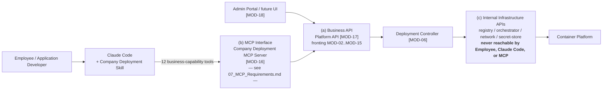

# 13. API Requirements

## 1. Purpose & Scope

This document defines the high-level API capability requirements for the platform's **Business API** — the Platform API layer that sits between the platform's core services and its two consumers: the MCP server (acting on behalf of employees using Claude Code) and any current or future Admin Portal / UI. It states what the Business API must be able to do, who may call it and how, and the interface-style, auth, idempotency, error-handling, and versioning expectations that apply.

This document does **not**:
- Define the per-tool input/output schema of the 12 MCP tools — that is owned by `07_MCP_Requirements.md`. This document treats the MCP layer as a consumer of the Business API and references the tool doc rather than repeating it.
- Define the logical system architecture or infrastructure evaluation — that is owned by `10_System_Architecture.md`.
- Specify a concrete API contract (no OpenAPI/Swagger file, no request/response JSON bodies, no SQL/DDL, no source code). All endpoints shown are **illustrative/representative examples**, not a final API contract.
- Detail the Internal Infrastructure API layer between the Deployment Controller and the Container Platform. That layer is deliberately out of scope here — see Section 3 for why.

## 2. Related Documents

| Document | Relationship to this document |
|---|---|
| `02_Functional_Requirements.md` | Owns FR-xxx; capability groups below exist to satisfy those requirements. Referenced by name. |
| `03_Non_Functional_Requirements.md` | Owns NFR-xxx (performance, scalability, availability/reliability); referenced qualitatively for rate-limit/quota and response-time expectations. |
| `06_System_Requirements.md` | Owns MOD-01..MOD-19; this document notes which module backs each capability group. |
| `07_MCP_Requirements.md` | Owns full per-tool I/O schema for the 12 MCP tools; referenced throughout Section 6. |
| `10_System_Architecture.md` | Owns the logical architecture and infra evaluation. |
| `11_Security_Requirements.md` | Owns authentication/authorization mechanics; this document states *that* auth is required per group, not *how* it is implemented. |
| `12_Data_Requirements.md` | Owns the entity model (ENT-01..ENT-20) that Business API operations read and write. |
| `17_Decision_Log.md` | Collects all TBD items raised throughout this document. |

## 3. Layered API Architecture

The platform has **three distinct API layers**, and keeping their boundaries clear is a first-class requirement in its own right — it is what lets the platform enforce authorization and policy independently of the AI agent, as stated in the project's guiding principles.

| Layer | What it is | Who may call it |
|---|---|---|
| **(a) Business API** (this document) | The Platform API surface for application lifecycle and deployment operations — registration, validation, deploy, status, logs, rollback, etc. Backed primarily by MOD-17 Platform API, fronting MOD-02 through MOD-15. | The MCP Server (MOD-16), acting on behalf of an authenticated employee; and the Admin Portal (MOD-18) / any future UI, acting on behalf of an authenticated admin or owner. |
| **(b) MCP Interface** | The AI-agent-facing tool layer exposing exactly the 12 high-level business-capability tools (`get_platform_info`, `get_supported_stacks`, `get_deployment_requirements`, `create_application`, `validate_application`, `deploy_application`, `get_application_status`, `get_deployment_status`, `get_application_logs`, `get_application_metrics`, `rollback_application`, `restart_application`, `delete_application`). The MCP server itself is a Business API client — it translates each tool call into one or more Business API calls. Full schema owned by `07_MCP_Requirements.md`; not repeated here. | Claude Code, on behalf of the Employee/Application Developer. Never raw infra ops — this is the entire reason the layer exists. |
| **(c) Internal Infrastructure APIs** | The layer between the Deployment Controller (MOD-06) and the Container Platform — image registry, orchestrator/scheduler APIs, network/ingress control, secret-store APIs, etc. | The Deployment Controller and other trusted internal platform services **only**. |

**Hard boundary requirement:** Employees, Claude Code, and the MCP server must **never** reach layer (c) directly, under any circumstance, including error/debug paths. This is a security and blast-radius control, not just a convenience abstraction — it is what allows the Platform to independently enforce authorization/policy (per project context) regardless of what the AI agent requests. Layer (c) is intentionally not detailed further in this document; its design belongs to `10_System_Architecture.md` and to internal Deployment Controller implementation.

### 3.1 Layer & flow diagram

## 4. Interface Style Requirements

The Business API must not be prematurely locked to a single protocol style; the requirement is stated at the level of interaction pattern, with a concrete protocol choice deferred as an implementation decision.

| Requirement | Statement |
|---|---|
| Synchronous reads & short validations | Operations that complete quickly and produce an immediate, complete answer (list/get application, deployment validation, status/health/version reads, environment/domain info) must be exposed as a synchronous request/response API. |
| Asynchronous long-running operations | Operations that trigger multi-stage backend work (deploy, rollback, restart, delete) must be exposed as "accepted, tracking reference issued" calls, with progress observable either via a status-polling endpoint (`get_deployment_status`-style) or an event/webhook/notification mechanism (feeding ENT-20 Notification), or both. The Deployment Lifecycle's many stages (Request → … → Completed, with Failure/Rollback branches) make a single blocking synchronous call unsuitable for these operations. |
| Consistency across consumers | Both the MCP server and any Admin/UI consumer must observe the same underlying operation state through the same status/event mechanism — there is exactly one source of truth for "is this deployment done," not a separate one per consumer. |

**Protocol choice (implementation detail, TBD):** This document does not lock the concrete wire protocol. **Recommendation, not a locked decision:** REST over HTTP/JSON, with the async pattern implemented as status polling (simple, easy to reason about, low operational risk for an internal platform at v1 scale) is a reasonable low-risk starting point. GraphQL (flexible querying, useful if the Admin Portal needs rich cross-entity reads) and gRPC (efficient service-to-service, useful if the MCP server and Business API are both internal Go/Node services) are viable alternatives if a strong need emerges. Final protocol selection is deferred to `17_Decision_Log.md`.

## 5. Business API Capability Groups

Each group below states Purpose, illustrative (non-final) endpoints, Actors, Auth requirement, Idempotency notes, Error-handling expectations, and Rate-limit/quota expectations. "Actors" distinguishes callers who may reach the Business API **directly** (typically via the Admin Portal, under their own session) from those who reach it **only via the MCP Interface** on their behalf (Employee and Claude Code never call the Business API directly — see Section 3).

### 5.1 Application Registration & Management

| | |
|---|---|
| **Purpose** | Register a new Application (ENT-05), retrieve/list catalog entries, update ownership/metadata. Backs `create_application` and application-browsing MCP tools; also backs the Admin Portal's catalog view (MOD-19). |
| **Illustrative endpoints** | `POST /applications`, `GET /applications`, `GET /applications/{id}`, `PATCH /applications/{id}` |
| **Actors** | Employee/Claude Code — only via MCP (`create_application` and related reads). Application Owner, Platform Administrator, IT Administrator — direct, via Admin Portal. Management/Auditor — direct, read-only. |
| **Auth requirement** | Authenticated caller (MCP service identity acting on behalf of an employee, or an Admin Portal user session); every write additionally authorized against MOD-01 Identity & Access Management, independent of the calling agent. |
| **Idempotency** | `POST /applications` should accept an idempotency key (or enforce natural uniqueness on name+owner) so a retried agent call cannot silently double-register an application. `GET`/`PATCH` are naturally idempotent. |
| **Error handling** | Structured validation errors (invalid `deployment.yaml` shape, unsupported stack — cross-reference `get_supported_stacks`) as 4xx with a machine-readable code; `409 Conflict` on duplicate registration. Errors must be business-meaningful when surfaced through the MCP layer — no raw infra stack traces. |
| **Rate-limit/quota** | Per-client/per-user write quota to prevent automated over-registration, per the Performance and Scalability categories in `03_Non_Functional_Requirements.md`; exact thresholds TBD there. |

### 5.2 Deployment Validation

| | |
|---|---|
| **Purpose** | Validate an Application's `deployment.yaml` / current draft against the supported stack matrix, platform policy, and resource constraints, before build/deploy is attempted. Backs `validate_application` (MCP) and MOD-04 Validation Engine. |
| **Illustrative endpoints** | `POST /applications/{id}/validate` |
| **Actors** | Employee/Claude Code — only via MCP. Platform Administrator/IT Administrator — direct, for troubleshooting. |
| **Auth requirement** | Authenticated caller with read access to the application's configuration. |
| **Idempotency** | Fully idempotent — a read-only evaluation with no side effect on Application/Deployment state (though the call itself may still be recorded in AuditLog). |
| **Error handling** | Returns a structured validation *result* (pass/fail + list of violations) for ordinary, client-fixable validation failures rather than raising a hard error; genuine errors (auth failure, malformed request) use the standard error schema. |
| **Rate-limit/quota** | Lightweight synchronous call; still subject to abuse-prevention quotas. Response-time expectations owned by the Performance category in `03_Non_Functional_Requirements.md`. |

### 5.3 Deployment Execution & Status

| | |
|---|---|
| **Purpose** | Trigger a build+deploy of a validated ApplicationVersion into a target Environment, and track the resulting long-running Deployment (ENT-08) through the Deployment Lifecycle. Backs `deploy_application` and `get_deployment_status`. |
| **Illustrative endpoints** | `POST /applications/{id}/deploy`, `GET /applications/{id}/deployments/{deploymentId}`, `GET /applications/{id}/deployments/{deploymentId}/status` |
| **Actors** | Employee/Claude Code — only via MCP, for both dev (may auto-deploy) and production (requires DeploymentApproval) targets. Platform Administrator/IT Administrator — direct status reads, and direct trigger for operational/incident scenarios. |
| **Auth requirement** | Strong auth; production-targeted deploys additionally pass through Authorization and Security Check stages of the Deployment Lifecycle before Build begins — enforced by the platform independently of what the calling agent asserts. |
| **Idempotency** | `POST /deploy` should accept an idempotency key / dedupe concurrent requests for the same application+version+environment, so a retried agent call cannot double-trigger the Deployment Engine. Status reads are naturally idempotent. |
| **Error handling** | Immediate response should be a lightweight "accepted, deployment reference issued" outcome, with errors at this call limited to pre-flight failures (auth, invalid current state — e.g., a deploy already in progress). Downstream/build-time failures are reported via the status/polling mechanism and Notification (ENT-20), not by blocking the original call. |
| **Rate-limit/quota** | Per-application/environment concurrency limit (no overlapping deploys to the same target) plus per-client throughput limit, per the Scalability and Reliability/Availability categories in `03_Non_Functional_Requirements.md`; exact numeric limits TBD. |

### 5.4 Application Status / Health

| | |
|---|---|
| **Purpose** | Retrieve current Application Lifecycle state and runtime health for an application/environment. Backs `get_application_status`. |
| **Illustrative endpoints** | `GET /applications/{id}/status`, `GET /applications/{id}/environments/{envId}/health` |
| **Actors** | Employee/Claude Code — only via MCP. Application Owner, Platform Administrator, IT Administrator, Management/Auditor — direct, read-only. |
| **Auth requirement** | Read-scoped auth; Management/Auditor role is read-only across the board. |
| **Idempotency** | Read-only; always idempotent. |
| **Error handling** | `404` for an application/environment that either doesn't exist or that the caller isn't authorized to view (do not distinguish the two in the response, to avoid leaking existence to unauthorized callers — cross-reference `11_Security_Requirements.md`). |
| **Rate-limit/quota** | Higher allowance than write operations, but still bounded to prevent polling storms (e.g., a misbehaving agent retry loop); guidance qualitatively owned by the Performance/Scalability categories in `03_Non_Functional_Requirements.md`. |

### 5.5 Logs & Metrics Access

| | |
|---|---|
| **Purpose** | Retrieve application logs and runtime/resource metrics. Backs `get_application_logs` and `get_application_metrics`, and MOD-12 Logging / MOD-13 Monitoring. |
| **Illustrative endpoints** | `GET /applications/{id}/logs`, `GET /applications/{id}/metrics` |
| **Actors** | Employee/Claude Code — only via MCP, scoped to applications they're authorized on. Application Owner, Platform/IT Administrator, Security Administrator (security-relevant log review), Management/Auditor (aggregate metrics reporting) — direct. |
| **Auth requirement** | Must enforce data-scoping so a caller only ever retrieves logs/metrics for applications they are authorized to view. **Hard requirement carried from `12_Data_Requirements.md`:** Secret (ENT-14) and APIKey/Credential (ENT-19) values must never appear in returned log content — log emission must already be redacted upstream. |
| **Idempotency** | Read-only, idempotent; supports pagination/time-range windowing. |
| **Error handling** | Standard error schema; a temporarily unavailable logging/monitoring backend must return an explicit "partial/unavailable" indicator rather than silently returning an empty result. |
| **Rate-limit/quota** | Bounded time-range/result-volume per call to protect MOD-12/MOD-13 backends; quotas owned by the Performance category in `03_Non_Functional_Requirements.md`. |

### 5.6 Rollback

| | |
|---|---|
| **Purpose** | Revert an Application/Environment to a previously known-good ApplicationVersion/Deployment. Backs `rollback_application`. |
| **Illustrative endpoints** | `POST /applications/{id}/rollback` |
| **Actors** | Employee/Claude Code — only via MCP, subject to the same production-approval policy as forward deploys. Platform Administrator/Application Owner — direct, notably for incident response. |
| **Auth requirement** | Same elevated scrutiny as forward production deploys — Authorization and Security Check stages apply. |
| **Idempotency** | Should be idempotent against the target version: re-issuing the same rollback request while one is already in flight must not stack duplicate rollbacks — return a conflict/"already rolling back" response instead of queuing a second one. |
| **Error handling** | `409` if no eligible prior version/deployment exists, or a deployment/rollback is already in progress. Outcome tracked through the same DeploymentHistory/status mechanism as forward deploys. |
| **Rate-limit/quota** | Same protection class as Deployment Execution (5.3). |

### 5.7 Restart

| | |
|---|---|
| **Purpose** | Restart a running Application/Service without changing its deployed version. Backs `restart_application`. |
| **Illustrative endpoints** | `POST /applications/{id}/restart`, `POST /applications/{id}/services/{serviceId}/restart` |
| **Actors** | Employee/Claude Code — only via MCP. Platform Administrator/IT Administrator — direct, for operational support. |
| **Auth requirement** | Standard write-auth; lower risk than a full deploy, but still authorized and audit-logged. |
| **Idempotency** | Repeated restart calls in quick succession should be safely coalesced (no-op or queued), not compounded into multiple concurrent restarts. |
| **Error handling** | Standard error schema; `409` if the application is not in a restartable state (e.g., mid-deploy). |
| **Rate-limit/quota** | Throttled to prevent restart-loop abuse; qualitatively owned by the Reliability/Availability category in `03_Non_Functional_Requirements.md`. |

### 5.8 Delete

| | |
|---|---|
| **Purpose** | Decommission an Application, per the Application Lifecycle's Archived/Deleted states, cascading or archiving dependent resources per `12_Data_Requirements.md` retention guidance. Backs `delete_application`. |
| **Illustrative endpoints** | `DELETE /applications/{id}` |
| **Actors** | Application Owner, Platform Administrator — direct. Employee/Claude Code — only via MCP, and only when authorized as owner; treated as the highest-scrutiny MCP-triggerable operation. Security Administrator — may enforce holds/blocks. |
| **Auth requirement** | Highest-scrutiny destructive operation; expected to require an explicit confirmation/approval step rather than a bare, single-call delete — exact approval workflow TBD, analogous to DeploymentApproval for production deploys. |
| **Idempotency** | Deleting an already-deleted/archived application should return a consistent success/no-op, not an error — but every attempt (successful or not) must still be recorded in AuditLog. |
| **Error handling** | `409` if the application has active production traffic or dependent resources requiring an explicit force-flag or prior teardown; error response must clearly explain the blocking condition. |
| **Rate-limit/quota** | Low-frequency, destructive-operation-class quota; prioritizes audit completeness over throughput. |

### 5.9 Version Listing

| | |
|---|---|
| **Purpose** | List/retrieve ApplicationVersion (ENT-07) history for an application — build/version history, distinct from runtime DeploymentHistory. |
| **Illustrative endpoints** | `GET /applications/{id}/versions`, `GET /applications/{id}/versions/{versionId}` |
| **Actors** | Employee/Claude Code — via MCP. Application Owner, Platform Administrator, Management/Auditor — direct, read-only. |
| **Auth requirement** | Read-scoped, same application-level authorization as status reads. |
| **Idempotency** | Read-only, idempotent. |
| **Error handling** | Standard error schema; `404` for an unknown version. |
| **Rate-limit/quota** | Standard read quota per the Performance category in `03_Non_Functional_Requirements.md`. |

### 5.10 Environment / Domain Info

| | |
|---|---|
| **Purpose** | Retrieve Environment (ENT-10) configuration and Domain (ENT-15) routing info for an application — where it runs and how it's reached. |
| **Illustrative endpoints** | `GET /applications/{id}/environments`, `GET /applications/{id}/environments/{envId}`, `GET /applications/{id}/domains` |
| **Actors** | Employee/Claude Code — via MCP. Application Owner, Platform/IT Administrator, Management/Auditor — direct, read-only. |
| **Auth requirement** | Read-scoped; a Domain's `visibility` (internal/external) governs additional access scrutiny per `11_Security_Requirements.md`. |
| **Idempotency** | Read-only, idempotent. |
| **Error handling** | Standard error schema. |
| **Rate-limit/quota** | Standard read quota. |

### 5.11 Platform Reference & Capability Discovery

| | |
|---|---|
| **Purpose** | Expose platform capability info, the supported-stack matrix (frontend/backend/database/cache options), and deployment-requirement/policy metadata, so Claude Code can plan a valid `deployment.yaml` before ever calling registration. Backs `get_platform_info`, `get_supported_stacks`, and `get_deployment_requirements`. |
| **Illustrative endpoints** | `GET /platform/info`, `GET /stacks`, `GET /deployment-requirements` |
| **Actors** | Employee/Claude Code — via MCP (primary consumer). Effectively low-sensitivity reference data — any authenticated actor, including Admin Portal, may also read it directly. |
| **Auth requirement** | Low-sensitivity read; still requires an authenticated platform session, not anonymous access. |
| **Idempotency** | Read-only, idempotent, cacheable. |
| **Error handling** | Standard error schema; should rarely error except on auth failure. |
| **Rate-limit/quota** | High allowance / cacheable; low priority for throttling. |

### 5.12 Admin / Reporting Reads

| | |
|---|---|
| **Purpose** | Cross-application, platform-wide reporting for administrators and auditors — e.g., every application/deployment platform-wide, the audit trail, and the pending-approval queue. |
| **Illustrative endpoints** | `GET /applications` (admin-scoped, platform-wide listing — distinct from an owner's own-application view in 5.1), `GET /deployments` (cross-application), `GET /audit-logs`, `GET /deployment-approvals` (pending queue) |
| **Actors** | Platform Administrator, IT Administrator, Security Administrator (audit-logs specifically), Management/Auditor — direct, read-only. **Not** reachable via the MCP Interface at all — the 12 MCP tools are deliberately scoped to an employee's own applications, not platform-wide administrative reporting. |
| **Auth requirement** | Elevated administrative RBAC roles only; audit-log reads specifically restricted per the Security Administrator/Auditor role definitions in `11_Security_Requirements.md`. |
| **Idempotency** | Read-only, idempotent. |
| **Error handling** | Standard error schema; strict `403` for any non-admin caller. |
| **Rate-limit/quota** | Reporting-class quota (larger, paginated payloads tolerated); owned by the Performance/Scalability categories in `03_Non_Functional_Requirements.md`. |

## 6. Capability Group → MCP Tool Cross-Reference

This table makes the layer boundary from Section 3 concrete: every MCP tool is backed by one or more Business API capability groups, and the Business API has some groups (5.12, and the admin-write half of 5.1) that no MCP tool ever exposes. Full MCP tool I/O detail is owned by `07_MCP_Requirements.md`; this is a mapping only.

| MCP Tool | Business API capability group(s) |
|---|---|
| `get_platform_info` | 5.11 Platform Reference & Capability Discovery |
| `get_supported_stacks` | 5.11 Platform Reference & Capability Discovery |
| `get_deployment_requirements` | 5.11 Platform Reference & Capability Discovery |
| `create_application` | 5.1 Application Registration & Management |
| `validate_application` | 5.2 Deployment Validation |
| `deploy_application` | 5.3 Deployment Execution & Status |
| `get_application_status` | 5.4 Application Status / Health |
| `get_deployment_status` | 5.3 Deployment Execution & Status |
| `get_application_logs` | 5.5 Logs & Metrics Access |
| `get_application_metrics` | 5.5 Logs & Metrics Access |
| `rollback_application` | 5.6 Rollback |
| `restart_application` | 5.7 Restart |
| `delete_application` | 5.8 Delete |
| *(no MCP tool)* | 5.9 Version Listing, 5.10 Environment/Domain Info — Admin Portal only for v1, unless a future MCP tool is added (TBD) |
| *(no MCP tool — by design)* | 5.12 Admin / Reporting Reads |

## 7. API Versioning & Backward Compatibility

The Business API has two structurally different consumers — the MCP server and the Admin Portal/UI — that will not necessarily upgrade in lockstep. This drives explicit versioning and compatibility requirements:

| Requirement | Statement |
|---|---|
| Versioning scheme | The Business API must carry an explicit version identifier (e.g., a URI prefix such as `/v1/...`, or a version header). **Recommendation, not locked:** URI-prefix versioning (`/v1/`) is simplest to reason about and to route/deploy independently per version for an internal platform; final choice is an implementation-phase decision, TBD in `17_Decision_Log.md`. |
| Backward compatibility, additive changes | New optional fields, new endpoints, and new capability groups must be addable without breaking existing MCP server or Admin Portal integrations — additive changes should not require a version bump. |
| Backward compatibility, breaking changes | Any change that removes/renames a field, changes a field's meaning, or changes error semantics is breaking and requires a new major version, released alongside (not instead of) the prior version for a transition window. Exact deprecation-window length is TBD. |
| Decoupling from MCP tool contracts | The MCP server acts as a translation layer between its own stable tool contracts (owned by `07_MCP_Requirements.md`) and the Business API. A Business API version change should not force a simultaneous breaking change to the 12 MCP tool schemas — the MCP server absorbs the difference — so that Claude Code's tool-calling experience stays stable across Business API evolution. |
| Contract testing | Given two independent consumers, the Business API should be covered by contract tests (or an equivalent compatibility-verification mechanism) exercised by both the MCP server's and the Admin Portal's expected call patterns before a new version rolls out. Tooling/process detail is an implementation-phase decision. |
| Deprecation communication | Deprecated versions/endpoints must be announced with a defined sunset date communicated to both consuming teams; exact lead time is TBD. |

## 8. Open Items (TBD)

- Concrete wire protocol for the Business API (REST/GraphQL/gRPC) — recommendation given in Section 4, not locked.
- API versioning scheme (URI vs. header) — recommendation given in Section 7, not locked.
- Exact rate-limit/quota numeric thresholds per capability group — owned by `03_Non_Functional_Requirements.md`.
- Approval workflow mechanics for Delete (5.8) — single-approver vs. multi-approver, consistent with the open DeploymentApproval question in `12_Data_Requirements.md`.
- Whether Version Listing (5.9) and Environment/Domain Info (5.10) ever gain a dedicated MCP tool, or remain Admin-Portal-only.
- Deprecation-window length and version-sunset lead time for Section 7.

All items above are collected for resolution in `17_Decision_Log.md`.
