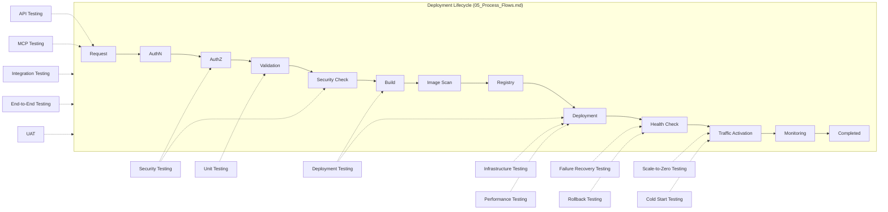
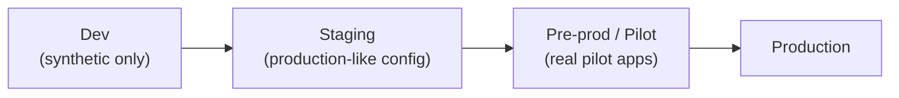

# 14 — Test Strategy

## Company AI Application Deployment Platform

| Field | Value |
|---|---|
| Document ID | DOC-14 |
| Version | 0.1 |
| Status | Draft — Documentation Baseline |
| Prepared by | admin@sti-th.com (Senior SDLC Specialist / QA Architect) |
| Last updated | 2026-08-28 |
| Applies to | Testing of the platform itself (MCP Server, Platform API, Deployment Engine, and supporting modules) |
| Related documents | 02_Functional_Requirements.md, 03_Non_Functional_Requirements.md, 04_Business_Rules.md, 05_Process_Flows.md, 06_System_Requirements.md, 07_MCP_Requirements.md, 09_SDLC.md, 10_System_Architecture.md, 11_Security_Requirements.md, 13_API_Requirements.md, 15_Traceability_Matrix.md, 16_Risk_Register.md, 17_Decision_Log.md |

---

## 1. Purpose and Scope

This document defines the testing strategy for the Company AI Application Deployment Platform: what is tested, at what level, with what techniques, and who is responsible. It governs the **Testing**, **Security Testing**, **Integration Testing**, and **UAT** phases of 09_SDLC.md, and remains the reference standard for regression testing during Maintenance and Continuous Improvement.

This is a **strategy document**: it defines objectives, scope, techniques, example scenarios, and tooling *capabilities* needed — it does not contain source code, Kubernetes/K3s manifests, or executable test scripts. Where a specific tool or vendor is not yet confirmed, it is marked **TBD** and tracked in 17_Decision_Log.md; only tooling *categories* that are safe to name regardless of vendor (e.g., "a Go unit testing framework," "a load-testing tool") are used.

Numeric NFR targets (cold-start latency, idle-to-scale-zero window, throughput, availability) are **not redefined here** — they are owned by 03_Non_Functional_Requirements.md and referenced by name. This document defines how those targets are *verified*, not what their values are.

### 1.1 Guiding Principles

1. **The platform is the security boundary, not the agent.** Every security-relevant test must verify enforcement happens independently of what Claude Code, the Company Deployment Skill, or the employee client asserts.
2. **Shift-left.** Unit, API, and MCP contract tests run continuously in CI from early Development; Security Testing is a continuous discipline, not a single late-phase event, even though it also has a formal gate before Integration Testing (per 09_SDLC.md).
3. **Test with synthetic fixtures, never real employee data or production secrets** (see Section 15, Test Data Strategy).
4. **Every test type maps to a lifecycle stage or a cross-cutting concern**, so failures are traceable back to 02_Functional_Requirements.md / 03_Non_Functional_Requirements.md / 06_System_Requirements.md via 15_Traceability_Matrix.md.
5. **Abstraction must hold under test, not just under happy-path demonstration.** Tests must actively try to reach infrastructure-level operations through the MCP/API surface and confirm they cannot.

### 1.2 Coverage Map

---

## 2. Unit Testing

**Objective**
Verify individual functions/components within each module behave correctly in isolation — especially deployment.yaml parsing/validation logic, MCP tool handlers, and lifecycle state-transition logic.

**Scope**
Code-level logic inside MOD-01…MOD-19 implementations (e.g., Validation Engine schema checks, Deployment Manager state machine transitions, Secret Manager access-scoping logic). External system calls (container platform, registry, IdP) are mocked/stubbed, not exercised.

**Test Levels / Techniques**
White-box unit tests per implementation language (Go, Node.js, Python, React/TypeScript, as applicable per module); table-driven tests for schema validation rules; boundary testing for numeric fields (scaling.min/max, resource tiers).

**Example Scenarios**
- A deployment.yaml with `scaling.min > scaling.max` is rejected by the Validation Engine parser.
- A deployment.yaml with an unsupported runtime (e.g., `runtime: java`) fails schema validation with a structured error code, not a generic exception.
- The Deployment Manager state machine rejects an invalid transition (e.g., `Completed → Build`).
- Secret Manager unit logic refuses to return a secret scoped to a different `app.name` than the caller's.

**Tooling Approach**
Standard unit test frameworks per implementation language, selected during Technical Design (e.g., Go's built-in testing package, a JavaScript/TypeScript test runner, a Python test framework); code coverage measurement integrated into CI. Coverage threshold: TBD (17_Decision_Log.md).

**Entry / Exit Criteria**
- Entry: module code compiles and is unit-testable in isolation from external dependencies.
- Exit: defined coverage threshold met and all unit tests pass in CI on every merge.

**Responsible Role**
Platform Engineering (authors), QA/Test Engineer (coverage/quality oversight)

---

## 3. Integration Testing

**Objective**
Verify that modules correctly integrate with each other and with external dependencies to execute a complete deployment lifecycle.

**Scope**
Cross-module interactions (e.g., MOD-03 Deployment Manager ↔ MOD-05 Build Engine ↔ MOD-06 Deployment Controller ↔ MOD-11 Health Check Manager) and integration with external systems (identity provider, container platform, image registry, DNS/domain — products TBD).

**Test Levels / Techniques**
Component integration tests in a staging-like environment; contract testing between modules and against the deployment.yaml schema; consumer-driven contract tests for the MCP Server ↔ Platform API boundary.

**Example Scenarios**
- A validated deployment.yaml for a React + Go + PostgreSQL application (as in the reference example in 10_System_Architecture.md) flows correctly from Validation Engine through Build Engine, Image Scan, Registry, Deployment Controller, to Health Check Manager.
- Domain Manager provisions an internal-only route when `domain.visibility: internal` is set, and does not expose the service externally without explicit configuration and approval.
- Resource Manager applies a `resources.tier: small` limit to a service declared with `scaling.min: 0` / `scaling.max: 3`.
- Database Manager provisions a PostgreSQL instance and wires connection secrets only to the `api` service that declared `database: postgres`, not to unrelated services.

**Tooling Approach**
A contract-testing tool capable of validating module boundaries and the deployment.yaml schema across producer/consumer changes; a CI-orchestrated integration suite running against ephemeral or shared staging infrastructure.

**Entry / Exit Criteria**
- Entry: Unit Testing exit criteria met for all modules in scope; staging environment available.
- Exit: all in-scope integration scenarios pass; no open critical/high defects.

**Responsible Role**
QA/Test Engineer (lead), Platform Engineering (support), DevOps Architect (environment)

---

## 4. API Testing

**Objective**
Verify the Company Platform API's request/response contracts, error handling, and versioning behave correctly independent of any specific caller (MCP Server, Administration Portal, or a future direct integration).

**Scope**
Company Platform API endpoints (MOD-17), including authentication, input validation, error responses, and status/async semantics — see 13_API_Requirements.md for the capability catalog.

**Test Levels / Techniques**
Schema-based contract tests against the published API specification; negative testing (malformed input, missing/expired auth, oversized payloads); status-code and error-body conformance tests; backward-compatibility tests across API versions.

**Example Scenarios**
- A `create_application`-equivalent request with a valid deployment.yaml returns a well-formed application identifier and a "created" status.
- A malformed deployment.yaml (e.g., missing `app.name`) returns a structured validation error, not a raw parser exception or stack trace.
- An expired or invalid credential on any Platform API call returns an unauthorized-equivalent response without leaking internal error detail.
- A status query for a non-existent or unauthorized deployment ID returns a not-found/forbidden response rather than an internal error.

**Tooling Approach**
An API contract/schema validation tool driven from the published API specification (13_API_Requirements.md); an automated API test suite executed in CI against a running Platform API instance.

**Entry / Exit Criteria**
- Entry: Platform API deployed to a test environment with a stable contract.
- Exit: all published endpoints have passing contract tests; no undocumented breaking changes.

**Responsible Role**
QA/Test Engineer (lead), Platform Engineering (API implementation support)

---

## 5. MCP Testing

**Objective**
Verify the Company Deployment MCP exposes **only** the approved high-level business-capability tools, that authorization is **independently re-checked by the platform** rather than trusted from the agent, that tool calls behave correctly under retries/timeouts/async polling, and that every tool call is fully audited.

**Scope**
MOD-16 MCP Server tool surface: `get_platform_info`, `get_supported_stacks`, `get_deployment_requirements`, `create_application`, `validate_application`, `deploy_application`, `get_application_status`, `get_deployment_status`, `get_application_logs`, `get_application_metrics`, `rollback_application`, `restart_application`, `delete_application` — as specified in 07_MCP_Requirements.md.

**Test Levels / Techniques**
Tool-contract testing (input/output schema per tool); adversarial/boundary testing simulating a misbehaving or compromised agent; idempotency testing via repeated identical calls; async/status-poll behavior testing; audit-log verification testing.

**Example Scenarios**
- **No infrastructure leakage:** no MCP tool, and no parameter of any tool, allows a caller to perform a low-level infrastructure operation (direct container exec, a raw orchestrator command, arbitrary filesystem access, Docker-socket access). Any attempt to smuggle such a request through a tool's free-text or parameter fields is rejected — and rejected by the Platform API layer itself, not merely filtered at the MCP layer.
- **Authorization is independently re-checked:** an MCP tool call carrying an agent-asserted role or permission claim (e.g., a request that implies "acting as Platform Administrator") is independently re-validated by MOD-01 Identity & Access Management against the *actual authenticated identity*; a mismatched or elevated claim is rejected regardless of what the agent asserts. This is tested by constructing calls where the agent's stated context and the platform's authenticated session deliberately disagree.
- **Idempotency of deploy_application:** calling `deploy_application` twice in succession with the same application version and idempotency key (simulating a client retry after a timeout) results in exactly one deployment being triggered, not two, and both calls return a consistent result.
- **Timeout / async status-poll behavior:** `deploy_application` returns promptly with an async handle/status reference rather than blocking until the deployment finishes; `get_deployment_status` correctly reflects in-progress → completed/failed transitions across repeated polls, and a poll issued after a client-side timeout still returns a consistent, non-corrupted status.
- **Complete audit coverage:** every one of the 13 MCP tools, on both success and failure, produces a corresponding MOD-14 audit log entry capturing actor identity, tool name, parameters (with secrets redacted), timestamp, and outcome.
- **Cross-application access denial:** `get_application_logs` / `get_application_metrics` for an application the caller does not own is rejected even though the tool call itself is well-formed.

**Tooling Approach**
A tool-contract/schema testing harness for the MCP protocol layer; a scriptable "hostile agent" test client capable of sending malformed, elevated-claim, or replayed requests; audit-log assertion tooling that cross-checks tool invocations against MOD-14 records.

**Entry / Exit Criteria**
- Entry: MCP Server deployed against a test Platform API with representative policy configuration.
- Exit: 100% of published tools have passing contract, authorization-bypass, idempotency, and audit-coverage tests; zero tools found to expose infrastructure-level operations.

**Responsible Role**
Security Team (authorization/isolation scenarios, accountable), QA/Test Engineer (contract/idempotency/async scenarios, lead), Platform Engineering (support)

---

## 6. Security Testing

**Objective**
Verify the platform's independently-enforced security controls hold under adversarial conditions — cross-application isolation, rejection of unsupported/dangerous configurations, and mandatory approval gates — regardless of what the AI agent or employee client claims or attempts.

**Scope**
Cross-cutting across MOD-01 IAM, MOD-04 Validation Engine, MOD-06 Deployment Controller, MOD-07 Resource Manager, MOD-08 Secret Manager, MOD-09 Database Manager, MOD-14 Audit, and container runtime policy enforcement — aligned to 11_Security_Requirements.md's threat model.

**Test Levels / Techniques**
Isolation testing (multi-tenant boundary probing); policy-as-code / admission-control testing; negative and abuse-case testing; static and dependency vulnerability scanning; review of least-privilege container defaults.

**Example Scenarios**
- **Cross-application secret/database isolation:** Application A cannot read, list, or infer the existence of Application B's secrets or database credentials, even when both applications are owned by the same employee or team.
- **Unsupported stack rejected pre-deployment:** a deployment.yaml specifying an unsupported stack (e.g., `runtime: java`, or `database: mysql`) is rejected by the Validation Engine before any Build stage is reached — verified by confirming no build/image artifact is ever produced for the rejected request.
- **Privileged/host-access requests blocked:** a deployment.yaml or MCP tool call that attempts to request a privileged container, a host filesystem mount, or Docker/container-socket access is rejected at the Validation / Security Check stage, with no code path that lets it reach the Deployment Engine.
- **Production approval enforced:** a `create_application`/`deploy_application` request targeting a production environment proceeds only after an explicit, recorded approval step; without approval, the pipeline halts before the Deployment stage, and the halt itself is audited.

**Tooling Approach**
Policy-as-code testing aligned to the platform's admission/validation rules; container image vulnerability scanning integrated into the Image Scan lifecycle stage; a periodic isolation/penetration-test-style exercise (internal or third-party — scope and vendor TBD, see 17_Decision_Log.md).

**Entry / Exit Criteria**
- Entry: Validation Engine and policy enforcement points implemented per Technical Design.
- Exit: no open critical/high security findings; all specified isolation, rejection, and approval-gate scenarios pass; Security Team formal sign-off recorded (see 09_SDLC.md, Phase 8).

**Responsible Role**
Security Team (lead, accountable), QA/Test Engineer (execution support)

---

## 7. Deployment Testing

**Objective**
Verify that the deployment lifecycle stages (Build → Image Scan → Registry → Deployment → Health Check → Traffic Activation) execute correctly and consistently across the supported stack matrix.

**Scope**
MOD-05 Build Engine, MOD-06 Deployment Controller, MOD-11 Health Check Manager, and their orchestration by MOD-03 Deployment Manager.

**Test Levels / Techniques**
Scenario-driven pipeline execution tests; matrix testing across supported stack combinations (frontend × backend × database × cache presence/absence); repeated-deploy consistency tests (deploying the same application twice yields equivalent, reproducible results).

**Example Scenarios**
- A React frontend + Go API + PostgreSQL application builds, passes image scan, registers, deploys, passes health check, and receives traffic within a single pipeline run.
- A Vue frontend + Node.js API + Redis cache application (no database) deploys correctly, confirming the pipeline correctly handles an optional component being absent.
- A deployment declared with `scaling.min: 0` does not receive traffic activation until the first request triggers scale-up (cross-referenced with Scale-to-Zero and Cold Start Testing below).
- Redeploying an application with an updated image version produces a new versioned deployment without disrupting the currently serving version until the new version's health checks pass.

**Tooling Approach**
Pipeline/workflow test orchestration against a CI-driven build-and-deploy flow (CI runner tooling TBD); matrix test execution across the supported-stack combinations described in the Test Data Strategy (Section 16).

**Entry / Exit Criteria**
- Entry: Build Engine and Deployment Controller integrated in a test environment.
- Exit: all supported stack combinations in the fixture matrix deploy successfully at least once, with reproducibility confirmed on repeat runs.

**Responsible Role**
DevOps Architect (lead), Platform Engineering (support), QA/Test Engineer (execution)

---

## 8. Infrastructure Testing

**Objective**
Verify that the underlying Container Platform and supporting infrastructure correctly enforce the resource, scaling, and domain-visibility contracts declared in deployment.yaml.

**Scope**
Container Platform configuration, MOD-07 Resource Manager, MOD-09 Database Manager provisioning, MOD-10 Domain Manager, and network policy/isolation at the infrastructure layer.

**Test Levels / Techniques**
Infrastructure configuration validation (policy/compliance checks); resource-limit enforcement testing; network policy testing (namespace/tenant isolation); domain/routing verification for internal vs. external visibility.

**Example Scenarios**
- An application configured with `resources.tier: small` cannot consume beyond its allotted CPU/memory envelope, and exceeding it triggers the platform's defined resource-limit behavior rather than degrading neighboring applications.
- Network policy prevents an application's frontend service from directly reaching another application's database, even within the same cluster/namespace.
- A service declared `domain.visibility: internal` is unreachable from outside the corporate network boundary; a service explicitly marked external is reachable only through the platform's sanctioned ingress path.
- Underlying node/cluster capacity changes (scale-out/scale-in) do not disrupt already-running applications' declared scaling bounds.

**Tooling Approach**
Infrastructure policy/compliance validation tooling appropriate to the chosen Container Platform (product TBD, see 10_System_Architecture.md's infrastructure evaluation and 17_Decision_Log.md); network policy test tooling; periodic infrastructure configuration drift checks.

**Entry / Exit Criteria**
- Entry: target Container Platform environment provisioned per Technical Design.
- Exit: all resource, network-isolation, and domain-visibility scenarios pass in a staging-like environment before being exercised under production-like load in Integration Testing.

**Responsible Role**
DevOps Architect (lead), IT Administrator (support), Security Team (network isolation review)

---

## 9. Performance Testing

**Objective**
Verify the platform meets its performance-related non-functional targets (throughput, latency of Platform API/MCP calls, concurrent deployment handling) under representative and peak load.

**Scope**
Platform API, MCP Server, and Deployment Manager throughput under concurrent request load. Explicitly **out of scope**: the runtime performance of individual deployed applications, which is the Application Owner's concern, not the platform's.

**Test Levels / Techniques**
Load testing (sustained representative concurrency); stress testing (beyond expected peak, to find the breaking point); soak testing (sustained load over an extended duration to catch resource leaks).

**Example Scenarios**
- A representative number of concurrent `create_application`/`deploy_application` requests (per the concurrency targets in 03_Non_Functional_Requirements.md) completes within the target response-time bounds without request failures.
- The Platform API sustains its target request rate for an extended soak period without memory or connection-pool degradation.
- A burst of `get_deployment_status` polling from many concurrently-deploying applications does not degrade Platform API responsiveness for unrelated requests.

**Tooling Approach**
A load/performance testing tool capable of scripting Platform API and MCP tool-call sequences at scale; results benchmarked against 03_Non_Functional_Requirements.md targets.

**Entry / Exit Criteria**
- Entry: Integration Testing exit criteria met in a production-like environment.
- Exit: measured throughput/latency meet or exceed 03_Non_Functional_Requirements.md targets; no unbounded resource growth observed during soak testing.

**Responsible Role**
DevOps Architect (lead), Platform Engineering (support), QA/Test Engineer (execution)

---

## 10. Scale-to-Zero Testing

**Objective**
Verify that eligible stateless workloads correctly scale down to zero instances after an idle period, and that ineligible workload types are correctly excluded from this behavior.

**Scope**
Stateless web/API/worker services declared with `scaling.min: 0`. Explicitly **excluded** by platform design: static frontends and databases.

**Test Levels / Techniques**
Idle-period simulation testing; behavioral verification against the idle-timeout target in 03_Non_Functional_Requirements.md; exclusion-rule verification testing.

**Example Scenarios**
- An API service with `scaling.min: 0` and no traffic for the configured idle period (per 03_Non_Functional_Requirements.md) scales down to zero running instances, verified via the application/status and metrics tooling.
- A static React frontend service is never scaled to zero regardless of idle duration, confirming the exclusion rule holds.
- A PostgreSQL database is never scaled to zero regardless of idle duration, confirming database workloads are excluded from scale-to-zero behavior.
- A worker service with intermittent, non-request-driven activity is correctly evaluated for idle scale-down using its defined idleness signal, not just inbound HTTP traffic.

**Tooling Approach**
Synthetic traffic generation / idle-simulation tooling capable of driving an application idle and then querying platform status/metrics interfaces to confirm instance-count transitions.

**Entry / Exit Criteria**
- Entry: Resource Manager and Deployment Controller scale-to-zero logic implemented.
- Exit: all eligible workload types verified to scale to zero within the configured idle window; all excluded workload types (static frontends, databases) verified to never scale to zero.

**Responsible Role**
Platform Engineering (lead), QA/Test Engineer (execution), DevOps Architect (NFR target verification)

---

## 11. Cold Start Testing

**Objective**
Verify that a scaled-to-zero application correctly and promptly resumes serving traffic on the first new request, within the platform's acceptable cold-start window as defined in 03_Non_Functional_Requirements.md.

**Scope**
The scale-up path from zero instances to serving-ready, for eligible stateless workloads.

**Test Levels / Techniques**
First-request latency measurement; cold-start-path tracing across Deployment Controller → Health Check Manager → Traffic Activation; repeated cold-start consistency testing.

**Example Scenarios**
- The first request to a scaled-to-zero API service triggers scale-up and receives a successful response within the cold-start latency target defined in 03_Non_Functional_Requirements.md.
- Concurrent first-requests arriving during the same cold-start window are queued/handled correctly and do not trigger redundant, duplicate scale-up actions.
- Cold-start latency is measured and trended over repeated cycles to detect regression against the 03_Non_Functional_Requirements.md target.
- A cold-start attempt whose new instance fails its health check does not expose a partially-ready instance to traffic — this scenario is shared with Failure Recovery Testing (Section 12) and Rollback Testing (Section 13).

**Tooling Approach**
A synthetic request/latency measurement tool capable of triggering a controlled scale-from-zero event and timing time-to-first-successful-response; trend dashboards comparing results against the 03_Non_Functional_Requirements.md cold-start target over time.

**Entry / Exit Criteria**
- Entry: Scale-to-Zero Testing exit criteria met.
- Exit: measured cold-start latency meets the 03_Non_Functional_Requirements.md target across all supported backend runtimes, with no duplicate-scale-up defects observed.

**Responsible Role**
Platform Engineering (lead), DevOps Architect (NFR verification), QA/Test Engineer (execution)

---

## 12. Failure Recovery Testing

**Objective**
Verify the platform detects and correctly recovers from failures at each stage of the deployment lifecycle without requiring manual intervention for common failure modes.

**Scope**
Failure/rollback branches of the deployment lifecycle (Build failure, Image Scan failure, Deployment failure, Health Check failure) across MOD-03, MOD-05, MOD-06, MOD-11, and MOD-15 Notification.

**Test Levels / Techniques**
Fault injection testing (simulated build failure, simulated unhealthy instance, simulated registry unavailability); dependency-outage testing; notification/alerting verification.

**Example Scenarios**
- A newly deployed instance that fails its post-deployment health check automatically triggers rollback to the last known-good version without manual intervention, and traffic is never activated to the failing version.
- A Build Engine failure (e.g., a compilation error) halts the pipeline before the Registry/Deployment stages and surfaces a clear, actionable status via the deployment-status interface.
- An Image Scan failure (e.g., a critical vulnerability detected) blocks progression to Registry/Deployment, consistent with Security Testing expectations.
- A transient container platform/registry outage during Deployment is retried according to a defined retry policy rather than immediately failing the deployment.
- MOD-15 Notification correctly alerts the Application Owner/Employee when an automatic rollback or pipeline failure occurs.

**Tooling Approach**
A fault-injection capability targeted at pipeline stages and dependency calls; assertions against application/deployment status transitions and notification delivery.

**Entry / Exit Criteria**
- Entry: Deployment Testing exit criteria met.
- Exit: all defined failure-injection scenarios result in the expected automatic recovery or clean failure state, with no application left in an inconsistent or partially-deployed state.

**Responsible Role**
Platform Engineering (lead), QA/Test Engineer (execution), DevOps Architect (recovery design verification)

---

## 13. Rollback Testing

**Objective**
Verify both automatic (health-check-triggered) and manual (`rollback_application`) rollback paths correctly restore an application to its last known-good version, and that every rollback is fully audited.

**Scope**
MOD-03 Deployment Manager and MOD-06 Deployment Controller rollback logic; the `rollback_application` MCP tool.

**Test Levels / Techniques**
Scenario-based rollback execution testing; audit-log verification testing; version-history correctness testing.

**Example Scenarios**
- A deployment that fails its health check is automatically rolled back to the immediately preceding known-good version, and the application's status correctly reflects the restored version.
- An Application Owner invoking the `rollback_application` MCP tool against a previously-deployed version successfully restores that version, including correct routing/traffic activation to the restored instances.
- Attempting `rollback_application` when no known-good prior version exists returns a clear, well-formed error rather than leaving the application in an undefined state.
- Every automatic and manual rollback event produces a corresponding MOD-14 audit log entry capturing trigger type (automatic vs. manual), initiating actor (system or named user), source and target versions, and timestamp.

**Tooling Approach**
Scenario-driven test scripts exercising both the automatic health-check-failure path and direct `rollback_application` MCP calls; audit-log assertion tooling shared with MCP Testing (Section 5).

**Entry / Exit Criteria**
- Entry: Failure Recovery Testing's automatic-rollback scenarios pass.
- Exit: manual rollback path verified functionally correct and fully audited; no open defects in version-restoration accuracy.

**Responsible Role**
Platform Engineering (lead), QA/Test Engineer (execution), Security Team (audit completeness review)

---

## 14. UAT

**Objective**
Confirm with real Employees/pilot users and Application Owners that the platform supports realistic end-to-end deployment needs and is acceptable for general availability, per 09_SDLC.md's UAT phase.

**Scope**
The full employee-facing journey: authoring/refining a deployment.yaml with Claude Code's assistance, invoking deployment via the Company Deployment Skill/MCP, monitoring status, and — for production — navigating the approval workflow.

**Test Levels / Techniques**
Scenario-based pilot usage with representative applications across the supported-stack matrix; structured feedback capture; acceptance-criteria checklist validation against 01_BRD.md goals.

**Example Scenarios**
- A pilot employee deploys a new dev-environment application end-to-end using only conversational interaction with Claude Code, without needing to understand underlying container platform concepts.
- An Application Owner successfully completes the production approval workflow for a pilot application and observes the deployment proceed only after approval is recorded.
- A pilot employee's request for an unsupported stack is met with a clear, actionable rejection message rather than a confusing failure.
- Pilot users' reported deployment lead time and self-service satisfaction are compared against the current-state baseline captured in 01_BRD.md's AS-IS process.

**Tooling Approach**
Structured feedback collection (surveys/interviews) rather than automated tooling; UAT scenarios are executed manually by pilot users against the real platform in a production-like environment.

**Entry / Exit Criteria**
- Entry: Integration Testing and Security Testing exit criteria met; pilot users and applications selected.
- Exit: UAT acceptance criteria met, or deviations formally accepted by Product Owner/Management, per 09_SDLC.md.

**Responsible Role**
Employees/pilot users (execution), Product Owner (accountable), QA/Test Engineer (facilitation)

---

## 15. End-to-End Testing

**Objective**
Verify the complete platform behaves correctly as an integrated whole across the entire deployment lifecycle and across all actor journeys, combining functional, security, performance, and recovery expectations into representative real-world scenarios.

**Scope**
Full-system scenarios spanning all 19 modules, all 7 platform actors (01_BRD.md), and the complete lifecycle from Request through Completed (and failure/rollback branches), executed in a production-like environment.

**Test Levels / Techniques**
Scenario-driven end-to-end regression suites; cross-actor journey testing (e.g., an Employee's request is blocked by a Security Administrator's policy, corrected, approved by an Application Owner, and completes); release-gate regression testing before each production release.

**Example Scenarios**
- Full lifecycle for a new application: Employee describes intent to Claude Code → Company Deployment Skill generates deployment.yaml → `validate_application` passes → `create_application` → `deploy_application` → Build → Image Scan → Registry → Deployment → Health Check → Traffic Activation → Monitoring shows healthy status, with a complete audit trail from end to end.
- A production deployment attempt without approval halts correctly; after Application Owner approval, the same request completes successfully.
- A multi-service application (frontend + api + database + cache) deploys, scales one service to zero on idle, cold-starts correctly on new traffic, and is later rolled back manually — all within one continuous regression scenario.
- The regression suite, re-run before each production release, confirms no previously-fixed defect has reoccurred.

**Tooling Approach**
An end-to-end test orchestration suite composing the tooling used by MCP, API, Deployment, and Security Testing into full scenario runs; scheduled execution in CI as a release gate.

**Entry / Exit Criteria**
- Entry: all preceding test types' exit criteria met for the release candidate.
- Exit: full end-to-end regression suite passes with no open critical/high defects; sign-off recorded as part of the Deployment phase go-live checklist (09_SDLC.md).

**Responsible Role**
QA/Test Engineer (lead, accountable); Platform Engineering, DevOps Architect, and Security Team as contributing roles

---

## 16. Test Environment Strategy

| Tier | Purpose | Data Used | Access | Primary Test Types |
|---|---|---|---|---|
| **Dev** | Fast, ephemeral iteration for engineers; may be per-branch or per-developer | Synthetic fixtures only | Platform Engineering, unrestricted | Unit Testing, early API/MCP contract checks |
| **Staging** (production-like) | Mirrors production topology, policy configuration, and network isolation as closely as practical | Synthetic fixture applications (Section 17) | Restricted to QA/Test Engineer, DevOps Architect, Security Team | Integration Testing, Security Testing, Deployment Testing, Infrastructure Testing, Performance Testing, Scale-to-Zero Testing, Cold Start Testing, Failure Recovery Testing, Rollback Testing, End-to-End Testing |
| **Pre-production / Pilot** (production-like, limited real users) | Near-identical to production; hosts a small number of real pilot teams' applications under supervision | Real pilot applications (non-sensitive), no production secrets from other systems | Employees/pilot users, Product Owner, QA/Test Engineer | UAT |
| **Production** | Live platform | Real employee applications and data | All platform actors, per RBAC | Ongoing smoke/synthetic checks and Monitoring (09_SDLC.md, Phase 12) only — no destructive or exploratory testing |

Notes:
- The exact number and naming of environments beyond dev/staging/production (e.g., a dedicated QA tier, a separate pilot tier vs. reusing staging) is **TBD** — see 17_Decision_Log.md.
- Staging must track production's policy/security configuration (RBAC rules, network isolation, approval-workflow enforcement) closely enough that Security Testing results transfer; configuration drift between staging and production is itself a risk tracked in 16_Risk_Register.md.
- No tier below Production ever holds real production secrets or real employee-owned data beyond what pilot users knowingly contribute during UAT.

---

## 17. Test Data Strategy

All testing below Production uses **synthetic applications**, never real employee code, data, or credentials. Synthetic fixture applications are version-controlled alongside the deployment.yaml schema and refreshed whenever the schema or the supported-stack matrix changes.

### 17.1 Fixture Principles

- Fixtures cover representative combinations across the v1 supported-stack matrix (Frontend: React / Next.js / Vue; Backend: Go / Node.js / Python; Database: PostgreSQL or none; Cache: Redis or none) — not necessarily the full cartesian product, but enough to exercise every individual supported technology at least once and every structurally distinct pipeline path (with/without database, with/without cache, frontend-only, backend-only/worker) at least once.
- A small set of **negative fixtures** intentionally violate policy (unsupported runtime, privileged-container request, missing required field) purely to exercise rejection paths.
- Fixtures never contain real secrets; any credential-shaped field is a clearly-labeled synthetic placeholder.
- Each fixture is small enough to build and deploy quickly, keeping the fixture suite fast enough to run in CI on every merge for Deployment Testing and Integration Testing.

### 17.2 Fixture Matrix

| Fixture ID | Composition | Purpose |
|---|---|---|
| FIX-01 | React frontend + Go API + PostgreSQL, `scaling: 0-3`, `domain.visibility: internal` | Baseline "happy path" fixture matching the reference deployment.yaml example; used across Deployment, Integration, and End-to-End Testing |
| FIX-02 | Next.js frontend + Node.js API + PostgreSQL + Redis | Full-stack fixture including cache, exercises all four component types together |
| FIX-03 | Vue frontend + Python API, no database | Confirms the pipeline correctly handles an optional database being absent |
| FIX-04 | Static frontend only (React), no backend/database | Confirms static frontends are excluded from Scale-to-Zero behavior |
| FIX-05 | Backend-only worker (Go), `scaling.min: 0`, non-HTTP-driven idleness signal | Confirms worker-type services are correctly evaluated for Scale-to-Zero and Cold Start using their own idleness signal |
| FIX-06 | Database-only fixture (PostgreSQL) with no application services | Confirms databases are excluded from Scale-to-Zero regardless of activity |
| FIX-07 | Production-tier fixture, `domain.visibility: external`, targets a production environment | Used for approval-workflow and production-gate testing (Security Testing, End-to-End Testing) |
| FIX-08 | Minimal/edge fixture with only required fields populated, all optional fields defaulted | Confirms schema defaults are applied correctly |
| FIX-N1 (negative) | `runtime: java` (unsupported backend) | Confirms unsupported-stack rejection pre-deployment |
| FIX-N2 (negative) | `database: mysql` (unsupported database) | Confirms unsupported-stack rejection pre-deployment |
| FIX-N3 (negative) | Requests a privileged container / host filesystem mount / container-socket access | Confirms dangerous-configuration rejection at Validation / Security Check |
| FIX-N4 (negative) | `scaling.min > scaling.max` | Confirms schema-level validation rejection |

### 17.3 Fixture Governance

- Fixtures are owned jointly by QA/Test Engineer (test suitability) and Platform Engineering (schema conformance), and updated whenever 04_Business_Rules.md or the supported-stack matrix in 06_System_Requirements.md changes.
- New supported stacks (post-MVP) require a corresponding new positive fixture before the addition is considered test-complete.
- Fixture inventory and mapping to test types is tracked in 15_Traceability_Matrix.md alongside functional requirement coverage.

---

## 18. Test Type Summary

| Test Type | Primary Environment | Responsible Role (Lead) | Feeds SDLC Phase |
|---|---|---|---|
| Unit Testing | Dev | Platform Engineering | Development |
| Integration Testing | Staging | QA/Test Engineer | Integration Testing |
| API Testing | Dev / Staging | QA/Test Engineer | Testing |
| MCP Testing | Staging | QA/Test Engineer + Security Team | Testing / Security Testing |
| Security Testing | Staging | Security Team | Security Testing |
| Deployment Testing | Staging | DevOps Architect | Testing / Integration Testing |
| Infrastructure Testing | Staging | DevOps Architect | Integration Testing |
| Performance Testing | Staging (production-like) | DevOps Architect | Integration Testing |
| Scale-to-Zero Testing | Staging | Platform Engineering | Integration Testing |
| Cold Start Testing | Staging | Platform Engineering | Integration Testing |
| Failure Recovery Testing | Staging | Platform Engineering | Integration Testing |
| Rollback Testing | Staging | Platform Engineering | Integration Testing |
| UAT | Pre-production / Pilot | Employees/pilot users | UAT |
| End-to-End Testing | Staging | QA/Test Engineer | Testing / Integration Testing / pre-Deployment gate |

---

## 19. Open Items

The following are explicitly unresolved and tracked in 17_Decision_Log.md rather than assumed:

- Unit test coverage threshold (minimum acceptable percentage).
- CI/build tooling and load-testing tool selection.
- Vendor/scope for the periodic penetration-test-style exercise referenced in Section 6.
- Exact number/naming of test environment tiers beyond dev/staging/production.
- Whether a dedicated performance/soak-testing environment is separate from staging or time-shared with it.
